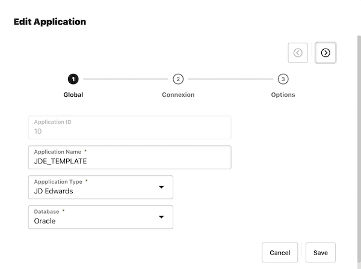
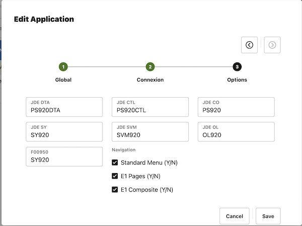

## Global Settings <!-- omit in toc -->

  

    Table of contents
  

  {: .text-delta }

- [1. Applications](#1-applications)
  - [1.1. Global Settings](#11-global-settings)
  - [1.2. Connections](#12-connections)
  - [1.3. Options](#13-options)
    - [1.3.1. JD Edwards](#131-jd-edwards)
    - [1.3.2. Database / Custom Application](#132-database--custom-application)
    - [1.3.3. LDAP](#133-ldap)
- [2. Users](#2-users)
- [3. Query](#3-query)
- [4. DWH](#4-dwh)

## 1. Applications

* Native connector for JD Edwards (Oracle, DB2 or MS-SQL)
* Native connector for Oracle Database
* Native connector for Microsoft Active Directory
* All databases accessibles with jdbc can be set

{: width="600"}

Click on add or edit to set a new datasource or modify an existing datasource and follow the wizard

### 1.1. Global Settings

{: width="450"}

Parameters:
{: .underline}

| Parameter        | Description                | Comments                                                 |
|------------------|----------------------------|----------------------------------------------------------|
| Application ID   | Unique ID                  | Automatic increment number used in all table joins       |
| Application Name | Name of your application   |                                                          |
| Application Type | Native or custom connector | JD Edwards, Database, LDAP, Weblogic, Custom Application |
| Database         | Type of database           | Oracle, MySQL, IBM DB2, Microsoft SQL Server, LDAP       |

### 1.2. Connections

{: width="450"}

Some parameters could be hidden depending on the type of the application

| Parameter | Description           | Comments                                                                   |
|-----------|-----------------------|----------------------------------------------------------------------------|
| Host      | Database server       |                                                                            |
| Port      | Database port         |                                                                            |
| Database  | Service Name          | Service Name and not SID for Oracle later than 12.2                        |
| User      | Login to database     | login could have read-only rights but with access to dictionary or catalog |
| Password  | Password for the user |                                                                            |

### 1.3. Options

Parameters differs depending on the type of the application

#### 1.3.1. JD Edwards

{: width="450"}

| Parameter           | Description                                       | Comments                                  |
|---------------------|---------------------------------------------------|-------------------------------------------|
| JDE DTA             | Business Data                                     | PRODDTA                                   |
| JDE CTL             | Control Tables                                    | PRODCTL                                   |
| JDE CO              | Central Objects                                   | PD920                                     |
| JDE SY              | System Tables                                     | SY920                                     |
| JDE SVM             | Server Map                                        | SVM920                                    |
| JDE OL              | Object Librarian                                  | OL920                                     |
| F00950              | Security table location (sometimes not in SYSTEM) | SY920                                     |
| Standard Menu (Y/N) | Collect Tasks Menus                               |                                           |
| E1 Pages (Y/N)      | Collect E1 Pages                                  | Before Tools Release 9.2 and E1 composite |
| E1 Composite (Y/N)  | Collect E1 Composite Pages                        | After Tools Release 9.2                   |

####  1.3.2. Database / Custom Application

NONE

####  1.3.3. LDAP

| Parameter    | Description              | Comments                                           |
|--------------|--------------------------|----------------------------------------------------|
| LDAP Context | Search                   | OU=Utilisateurs,DC=nomana-it,DC=fr                 |
| LDAP Filter  | Filtering type of object | (&(objectClass=user))                              |
| LDAP Exclude | Exclude node             | OU=Applications,OU=Utilisateurs,DC=nomana-it,DC=fr |

## 2. Users

## 3. Query

## 4. DWH
