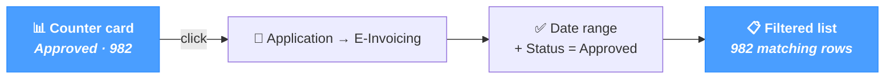

# Dashboard

The **Dashboard** is the NomaUBL home page. It opens by default after login and gives an at-a-glance view of the platform: invoice counters by status, integration-error count, and quick-action shortcuts to the most-used pages.

The page applies regardless of source system — JD Edwards, SAP, NetSuite or a custom ERP. The numbers come from the local NomaUBL database, so they reflect what NomaUBL has processed and persisted, not directly what the source system or the Plateforme Agréée holds.

---

## Invoice overview

### Date range filter

A date range filter sits above the counter grid. It restricts the *Invoice overview* counters to invoices whose **last update** falls within the selected window. The filter offers presets:

| Preset | Window |
|---|---|
| **Today** | Today only. |
| **Yesterday** *(default)* | The previous full day. |
| **Last 7 days** | The last seven full days, ending yesterday. |
| **This month** | The current month from day 1 to today. |
| **Last month** | The previous full month. |
| **Custom range** | Pick the **From** and **To** dates manually. |

The filter only affects the invoice counters; the integration-error count is always the full unmatched-errors total.

### Counter cards

Each card carries:

- The **status label** (e.g. *Approved*, *Rejected*, *Pending*) — text from the *statuses* reference list.
- The **count** of invoices in that status for the chosen window.
- A **coloured border** that hints at the status family.
- A **Total** card always sits first, summing every status in the window.

Visual preview of a typical row:

Total

1,247

Approved

982

Pending

184

Disputed

52

Rejected

29

#### Border colour legend

| Colour | Family | Examples |
|---|---|---|
|  **Green** | Approved / Deposited / Validated | `200` Submitted, `201` Acknowledged, `206` Partially approved |
|  **Blue** | Pending / In-progress | `9906` Pending PA import, `203` Under processing |
|  **Orange** | Warning / Partial / E-mail | `207` Disputed, `208` Suspended |
|  **Red** | Error / Rejected / Refused | `210` Refused, `213` Rejected, `9907` PA rejected |
|  Default | Other statuses | Anything not matched by the rules above |

### Click-through

Clicking a counter card navigates to *Application → E-Invoicing* with the corresponding filter pre-applied:

| Card clicked | Filter applied on E-Invoicing |
|---|---|
| **Total** | Date range only (no status filter). |
| Any **status** card | Date range + that specific status code. |

Click-through is enabled only on full-licence installations; on restricted licences, the cards display the numbers but do not navigate.

---

## Integration errors

A single counter card titled **Unmatched validation errors** sits below the invoice grid. It counts every entry in the validation table (`F564236`) that has no matching row in the invoice header table (`F564231`) — these are typically transformation errors that prevented the invoice header from ever being created.

The number is global (no date filter) and the border is always red. Clicking the card jumps to *Application → Integration Errors*. A non-zero count is highlighted with a red value to signal that something needs attention.

---

## Quick actions

Three shortcut buttons sit at the bottom of the page.

| Button | Behaviour |
|---|---|
| **Create invoice** | Opens the *new invoice* modal directly on the dashboard — same modal as on the E-Invoicing page. After saving, the user is redirected to *Application → E-Invoicing*. |
| **Status Reference** | Navigates to *References → Status Reference* — the catalogue of every lifecycle status code. |
| **Reason Codes** | Navigates to *References → Reason Codes* — the catalogue of every refusal / rejection / irregularity reason code. |

The *Create invoice* button is disabled on restricted licences; the two reference shortcuts work on every licence.

---

## Tips & best practices

- **Set the date range to match operational needs.** *Yesterday* is a sensible default for a morning monitoring routine; *This month* fits a finance overview. *Custom range* covers month-end reconciliation or specific incident windows.
- **A red border on a status card is a quick health indicator.** Statuses on the error side of the lifecycle pile up the most when an integration breaks; the border colour makes the spike visible without reading the labels.
- **Watch the integration-error counter.** A non-zero value means at least one invoice never made it past validation — investigate via *Application → Integration Errors* before the next batch run.
- **Click-through saves a navigation step.** The same view in *Application → E-Invoicing* with manual filter application takes 3–4 clicks; the dashboard cards land there in one.
- **Bookmark the dashboard.** It is the natural daily landing page; bookmarks survive session expiry, so the next sign-in lands on the same view.
