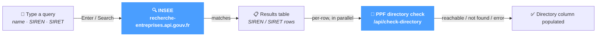

# E-Directory

The **E-Directory** screen is the user-facing search tool for finding a French company in the **INSEE registry** (`recherche-entreprises.api.gouv.fr`) and checking whether the matching SIREN / SIRET entries are **reachable on the PPF directory** for electronic invoice delivery.

Use this page when:

- you need to look up a customer's exact SIREN / SIRET before issuing an invoice;
- you want to confirm a buyer is registered on the Plateforme Publique de Facturation (PPF) and ready to receive an electronic invoice;
- you are debugging an addressing rejection (e.g. `REJ_ADR`) and need to verify the directory state for a specific identifier.

The page applies regardless of source system — JD Edwards, SAP, NetSuite or a custom ERP.

The two underlying lookups are independent and have different roles:

- **INSEE search** — verifies that the company exists and pulls its name, address, administrative state. Free public API, no credentials needed.
- **PPF directory check** — verifies that the SIREN / SIRET is registered as a recipient on the Plateforme Publique de Facturation. Uses the credentials configured in *Configuration → System → e-directory*.

See the [Configuration → System → e-directory](../configuration/system/edirectory.md) page for the broader context — credentials, search roles and the PPF / INSEE distinction.

---

## How a search runs

The two lookups happen in sequence: INSEE first to populate the rows, then a parallel PPF check per row. The user sees the table fill in two passes.

---

## Search section

A single input + button at the top of the page.

| Element | Behaviour |
|---|---|
| **Search field** | Free-text query: company name, partial name, SIREN, SIRET, or any combination. Press **Enter** or click **Search** to submit. |
| **Search** button | Triggers the INSEE lookup. Disabled while a search is in progress and when the field is empty. |

The query is sent to `recherche-entreprises.api.gouv.fr` server-side; the API returns matching companies with their full establishment data.

---

## Results table

After the search, the table populates with one row per match. Each row corresponds to either a SIREN (the legal entity) or a SIRET (a specific establishment of the entity).

| Column | Description |
|---|---|
| **Type** | Coloured badge — `SIREN` (blue, the legal entity) or `SIRET` (grey, a specific establishment). |
| **Identifier** | The 9-digit SIREN or 14-digit SIRET. |
| **Name** | Legal name (`nom_raison_sociale`). |
| **Address** | Full postal address of the establishment. |
| **State** | `Active` (green) when the establishment is administratively active; `C` (red) when ceased. |
| **Directory** | Result of the PPF directory check — see below. |

### Directory check states

The Directory column is populated automatically right after the search lands — one PPF call per row. While calls are in flight, rows display a spinner. Each row eventually resolves to one of:

✓Reachable— Registered on the PPF, ready to receive electronic invoices.

✗Not found— Not in the PPF directory; an invoice would return a routing error (REJ_ADR).

⚠Error— The PPF call failed (network, credentials). The API message is shown next to the icon.

⟳Loading— PPF call in flight; the row will resolve to one of the states above.

---

## Result count

Above the table, a small label indicates the number of results returned by INSEE for the query (e.g. `12 results`).

---

## Tips & best practices

- **Search by name first, then narrow down.** INSEE returns the legal entity (SIREN) and its establishments (SIRET) — picking the right SIRET avoids the common "right SIREN, wrong establishment" mistake when issuing invoices.
- **A red Not found is not always permanent.** A buyer may not yet be registered on the PPF; ask them to register before re-trying. The directory state changes daily as more companies subscribe to the PPF.
- **Cross-check the active state.** A `Ceased` establishment cannot receive an invoice even if it appears in the PPF directory. Always check the State column before trusting an electronic-address mapping.
- **For batch lookups, prefer the API.** The page does one search at a time. To validate a directory of customers in one pass, call `/api/insee-search` and `/api/check-directory` directly — see *References → API Reference* for the schemas.
- **A directory error often means a credentials issue.** Repeated `Error` states on rows that should resolve typically come from misconfigured PPF credentials in *Configuration → System → e-directory* — fix them there before rerunning a search.
