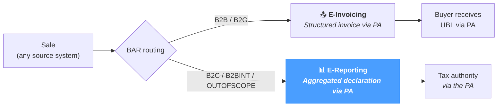

# E-Reporting

The **E-Reporting** screen is the operational entry point for the **e-reporting workflow** of NomaUBL — the declaration track of the French *Réforme de la Facturation Électronique* (RFE). Where *E-Invoicing* sends a structured invoice to the recipient's Plateforme Agréée, *E-Reporting* sends an **aggregated declaration** to the tax authority through the same PA — covering the transactions that fall *outside* the e-invoicing flow:

- **B2C transactions** — sales to private individuals.
- **Intra-EU B2B transactions** — sales to a buyer in another EU member state.
- **Export and other out-of-scope transactions** — sales to non-EU buyers, intra-group internal flows, etc.

For these transactions the buyer never receives a structured invoice via the PA; the seller still declares the turnover so the tax authority can compute the VAT obligation. NomaUBL groups the relevant transactions, builds the corresponding XML, submits it to the PA and tracks its lifecycle.

The page applies regardless of source system — JD Edwards, SAP, NetSuite or a custom ERP.

---

## Where e-reporting fits

E-reporting is the **declaration-only** track of the French reform — the e-invoicing flow handles the structured B2B invoice, while e-reporting covers everything that does not go through that flow but still needs to be reported for VAT.

The BAR routing rule defined in *UBL Defaults → Document Type / BAR Routing* drives the split — set it correctly upstream and the right transactions land here automatically.

---

## Two flux, four document types

The French e-reporting specification defines **two flux** for outgoing declarations and **four document types** that describe whether a report is an initial submission or a correction.

| Flux | Scope | Content shape |
|---|---|---|
| **`10.1`** | **B2C** invoice detail | One `<Invoice>` element per B2C invoice in the period. |
| **`10.3`** | **B2BINT / OUTOFSCOPE** aggregated | Aggregated `<Transactions>` blocks grouped by *(VAT category, rate, currency)*. |

| Code | Meaning | Typical use |
|---|---|---|
| **`IN`** | **Initial** | First declaration for the period — the default. |
| **`RE`** | **Replacement** | Replaces a previously submitted report for the same period after a correction. |
| **`CO`** | **Cancellation** | Cancels a previously submitted report (e.g. submitted by mistake). |
| **`MO`** | **Modification** | Adjusts specific lines of a previous report without full replacement. |

Reports follow a configurable **frequency** — `MONTHLY` (calendar month, default), `DECADAL` (1-10, 11-20, 21-end of month) or `WEEKLY` (ISO Monday → Sunday) — defined in the *e-reporting* template of `config.json`.

---

## Toolbar

The toolbar above the table combines three free-text filters with two quick actions.

  

    Company
    Flux
    Status
    ↻ Refresh
    
    Generate report
  

| Field | What it matches |
|---|---|
| **Company** | The company code (`Kco`) the report is bound to (e.g. `00070`). |
| **Flux** | The flux code — `10.1` (B2C) or `10.3` (B2BINT). |
| **Status** | Free-text match on the lifecycle status code or label. |
| **Refresh** | Re-runs the current query without changing filters. |
| **Generate report** | Opens the *Generate dialog* — described below. Hidden on read-only sessions. |

---

## Reports list

The table shows one row per report. Default sort: most recent `RGDOC` first. Click any column header to sort by that column; click any row to open the **Detail modal**.

  

    
ID

Flux

Company

Type

Period

    
Invoices

Status

PA UUID

Created

  

  

    
1042

10.1

00070

IN

2026-04-01 → 2026-04-30

    
142

    
200 Submitted

    
a1b2c3d4…f9e8

    
2026-05-02 09:30

  

  

    
1041

10.3

00070

IN

2026-04-01 → 2026-04-30

    
38

    
200 Submitted

    
f6a7b8c9…d4e5

    
2026-05-02 09:31

  

  

    
1040

10.1

00070

RE

2026-03-01 → 2026-03-31

    
12

    
9906 Pending PA

    
—

    
2026-04-15 14:22

  

  

    
1039

10.3

00080

IN

2026-03-01 → 2026-03-31

    
27

    
213 Rejected

    
9d8e7f6a…2b1c

    
2026-04-02 11:15

  

### Default columns

| Column | Description |
|---|---|
| **ID** | Internal report identifier (`RGDOC`). Auto-incremented. |
| **Flux** | `10.1` (B2C detail) or `10.3` (B2BINT aggregated). |
| **Company** | Company code (`Kco`) the report applies to. |
| **Type** | Document type — `IN` / `RE` / `CO` / `MO`. |
| **Period** | Declaration period — `start → end` (ISO 8601). |
| **Invoices** | Number of source invoices included in the report. |
| **Status** | Lifecycle status badge — code + label, coloured by family. |
| **PA UUID** | Universally-unique identifier returned by the PA after acceptance. Truncated to `8…8`; full value visible on hover. |
| **Created** | Generation timestamp. |

A page-size selector at the bottom defaults to 50 rows per page; values up to 500 are accepted. The total count of matching reports is shown next to the pagination controls.

### CSV export

The standard `Export` button in the toolbar exports the current view (filters applied) as a CSV file named `ereporting.csv`.

---

## Detail modal

Clicking a row opens a modal with three tabs along the top: **Header**, **Invoices**, **History**. The modal title shows the report's `Flux / Kco / Rgdoc` triplet.

  

    
Report detail — 10.1 / 00070 / 1042

    

      ⬇ Download XML
      Resend to PA
      ✕
    

  

  

    
Header

    
Invoices (142)

    
History (3)

  

  
Tab content — depends on the active tab

### Header tab *(default)*

Field grid summarising the report identity and submission outcome.

| Field | Description |
|---|---|
| **RGDOC** | Internal report identifier. |
| **FLUX** | `10.1` or `10.3`. |
| **KCO** | Company code. |
| **Type** | `IN` / `RE` / `CO` / `MO`. |
| **Period start / Period end** | ISO 8601 dates of the declaration window. |
| **Sender** | Transmitter matricule, list ID `0238` — typically the entity registered with the PA. |
| **Issuer** | Legal issuer's identifier, list ID `0002` (SIREN). |
| **PA UUID** | Identifier returned by the PA on acceptance. Empty until the report has been accepted. |
| **Status** | Current lifecycle status — code + label. |
| **Status message** | Last message received from the PA — typically the rejection reason for failed submissions. |
| **Invoices** | Number of source invoices included in the report. |
| **Created** | Generation timestamp. |

### Invoices tab

Tabular view of every source invoice included in the report. The columns map directly to the underlying e-invoicing record so the report and its sources can be cross-referenced.

| Column | Description |
|---|---|
| **Number** | Invoice number — UBL `BT-1` when set, otherwise `DOC/DCT/KCO`. |
| **Date** | Issue date (`BT-2`). |
| **BAR** | BAR routing code carried by the invoice (`B2C`, `B2BINT`, `OUTOFSCOPE`, …). |
| **Customer** | Buyer party name. |
| **HT** | Total amount excluding VAT. |
| **VAT** | Total VAT amount. |
| **TTC** | Total amount including VAT. |
| **CCY** | ISO 4217 currency code. |

The list reflects the rows persisted at generation time — re-running a report (`RE`) does not retroactively reshape the prior `IN` view.

### History tab

The **lifecycle** of the report — every status it has been in, append-only, in submission order.

| Column | Description |
|---|---|
| **#** | Sequence number — `1` is the initial state at generation, subsequent rows are events from the PA. |
| **Status** | Status code + label (e.g. `9906 Pending PA import`, `200 Submitted`, `213 Rejected`). |
| **Message** | Free-text message returned by the PA — typically the rejection reason or acceptance note. |
| **Date** | Event timestamp. |

The lifecycle is read-only here; the only action is **Resend to PA** at the modal header, which appends a new event after a successful resubmission.

### Header actions

| Button | Behaviour |
|---|---|
| **Download XML** | Downloads the formatted XML of the report (filename pattern `ereporting-<flux>-<kco>-<rgdoc>.xml`). The XML is pretty-printed when possible, with a fallback to the raw stored content. |
| **Resend to PA** | Re-submits the existing report XML to the Plateforme Agréée. Useful after a transient PA error. Hidden on read-only sessions. The lifecycle is updated with the new submission outcome. |
| **Close** *(✕)* | Closes the modal without modification. |

---

## Generate dialog

Opens from **Generate report** in the toolbar. Builds and submits one or several reports for a chosen company / flux / period combination.

  

    
Generate e-reporting

    ✕
  

  

    

      
Company (kco)

      
00070

      
Leave blank to apply to all configured companies.

    

    

      
Flux to generate

      

        10.1
        10.3
      

    

    

      
Document type

      

        IN
        RE
        CO
        MO
      

    

    

      

        
Period start

        
2026-04-01

      

      

        
Period end

        
2026-04-30

      

    

    

      📅 Compute period
    

  

  

    Cancel
    Generate
  

| Field | Description |
|---|---|
| **Company (kco)** | Restricts the generation to a single company. Leave blank to apply to **all** companies declared in the *e-reporting* template. |
| **Flux to generate** | Multi-select between `10.1` and `10.3`. Both are selected by default — the generator emits one report per active flux. |
| **Document type** | One of `IN` (initial), `RE` (replacement), `CO` (cancellation), `MO` (modification). The default is `IN`. |
| **Period start / end** | ISO 8601 dates that delimit the declaration window. |
| **Compute period** | Auto-fills *Period start* / *Period end* with the next due window using the configured frequency (`MONTHLY` / `DECADAL` / `WEEKLY`). |
| **Cancel** | Closes the dialog without generating. |
| **Generate** | Builds the XML for each selected flux, persists the report row, and submits to the PA. The list refreshes on success. |

After a successful run, the new reports appear at the top of the list with a `9906` (Pending PA import) status that progresses to `200 Submitted` once the PA acknowledges receipt.

---

## Tips & best practices

- **Set the BAR routing first.** The list of invoices that ends up in flux 10.1 / 10.3 is driven by *UBL Defaults → Document Type / BAR Routing*. A misclassified invoice will be missed by *both* tracks — ensure every document type maps to one of `B2B`, `B2G`, `B2C`, `B2BINT`, `OUTOFSCOPE` before the first run.
- **Use *Compute period* rather than manual dates.** It honours the frequency configured in the *e-reporting* template, so the suggested window matches the regulatory deadline (previous full month for `MONTHLY`, previous decade for `DECADAL`, previous ISO week for `WEEKLY`).
- **`IN` first, then `RE` for corrections.** A late-arriving invoice or a corrected amount calls for a `RE` report covering the same period — never re-issue an `IN` for a period that has already been declared.
- **Reserve `CO` for full cancellation.** Use it when an entire period has been declared in error; the `RE` track handles partial corrections.
- **The PA UUID is the receipt.** It is empty between submission and acceptance (status `9906`), and final once the PA acknowledges (status `200`). Use it as the legal proof of the declaration when responding to an audit.
- **Resend after a transient PA error, not after a Schematron rejection.** A `213` status with a Schematron error in the *Status message* points at a structural defect — fix the upstream BAR or invoice data and generate a fresh `RE`, do not blindly resend.
- **The Invoices tab is a snapshot.** It records the source invoices as they were at generation time. Edits to those invoices afterwards do not retroactively alter the submitted report — they appear in the next `RE` if material.
