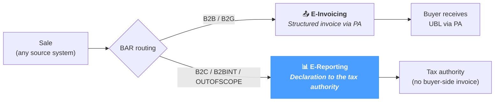

# E-Reporting

The **E-Reporting** screen is the entry point for the upcoming **e-reporting workflow** of NomaUBL — declarations that the seller must transmit to the tax authority for transactions that fall *outside* the e-invoicing flow:

- **B2C transactions** — sales to private individuals.
- **Intra-EU B2B transactions** — sales to a buyer in another EU member state.
- **Export and other out-of-scope transactions** — sales to non-EU buyers, intra-group internal flows, etc.

For these transactions the buyer does not receive a structured invoice via the Plateforme Agréée; the seller still declares the turnover so the tax authority can compute the VAT obligation. NomaUBL groups the relevant transactions and produces the declaration.

The page applies regardless of source system — JD Edwards, SAP, NetSuite or a custom ERP.

---

## Where e-reporting fits

E-reporting is the **declaration-only** track of the French reform — the e-invoicing flow handles the structured B2B invoice, while e-reporting covers everything that does not go through that flow but still needs to be reported for VAT.

The BAR routing rule defined in *UBL Defaults → Document Type / BAR Routing* drives the split — set it correctly today and the data is ready for the upcoming e-reporting page.

---

## Current state

The screen currently displays a placeholder message — **E-Reporting functionalities coming soon**. The full e-reporting workflow (transaction selection, declaration formatting, submission to the PPF, lifecycle tracking) is being implemented; this page will be expanded as the feature ships.

In the meantime:

- **B2C / OUTOFSCOPE transactions are already routed correctly** by the configuration of *UBL Defaults → Document Type / BAR Routing*. Setting a document's BAR to `B2C` or `OUTOFSCOPE` excludes it from the regular PA submission flow — those transactions accumulate in the database for the upcoming e-reporting declaration.
- **The `B7` / `S7` profile codes** in *UBL Defaults → Business Process Type* mark invoices "with e-reporting (VAT already collected)" — the typical pattern for B2C invoices that still need a textual record but no PA submission.
- **Transactions with BAR = `B2C`** can be filtered via the BAR routing dropdown on *Application → E-Invoicing*. They appear with their lifecycle, but no PA-side import or status retrieval applies.

---

## Tips & best practices

- **Configure the routing now, even before the page ships.** Setting BAR routing rules and the appropriate Cadre de facturation (`B7` / `S7`) on the relevant document types means the data is already correctly classified when the e-reporting feature goes live — no retroactive cleanup needed.
- **Watch the release notes.** The e-reporting workflow is part of the broader French e-invoicing reform; expect this page to evolve as the regulation refines its requirements (currently scheduled for the September 2026 wave for large enterprises).
- **Do not use *Set status → DB* on B2C invoices** to mark them as "reported". The future e-reporting declaration will compute its own state — manual local-only statuses risk being overwritten on the next sync.
