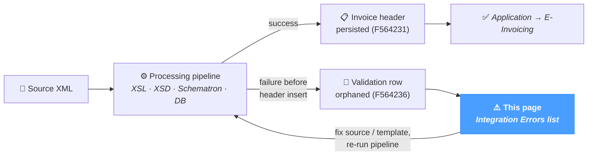

# Integration Errors

The **Integration Errors** screen lists every validation error that **prevented an invoice from being created**. These are entries stored in the validation table (`F564236`) that have **no matching row in the invoice header table** (`F564231`) — the transformation failed before the invoice header could be persisted, so the document never entered the regular E-Invoicing list.

Typical causes of an integration error:

- A malformed source XML the XSL transformation could not consume.
- A required UBL field that was missing or unreadable from the source data.
- An XSD or Schematron failure so severe (`FATAL`) that the pipeline aborted before reaching the database insert step.

The page applies regardless of source system — JD Edwards, SAP, NetSuite or a custom ERP.

This page is the **systematic monitoring view** for these failures. The dashboard's *Unmatched validation errors* counter card is the at-a-glance entry; this page is where each row is investigated.

---

## Where these errors come from

A successful run lands the invoice in the regular *E-Invoicing* list. A failure that fires before the header insert step leaves only a validation row — that is what this page surfaces. After fixing the source data or the template, re-running the pipeline either creates the header (the row vanishes from this view) or fires another orphan (still listed).

---

## Toolbar

The toolbar at the top of the table combines free-text search and severity filters.

### Search

A single input matches against the document keys:

| Field searched |
|---|
| `DOC` (document number) |
| `DCT` (document type) |
| `KCO` (company code) |

The search is server-side and updates the list as the user types.

### Severity chips

A row of chips lets the user filter by severity:

All
FATAL
ERROR
WARNING
INFO

| Chip | Meaning |
|---|---|
| **All** | No filter — shows every severity. |
| **FATAL** | Pipeline-aborting error — the invoice could not be processed at all. |
| **ERROR** | Blocking error — the invoice would have been rejected by the PA. |
| **WARNING** | Non-blocking issue — informational; the invoice could be processed but with caveats. |
| **INFO** | Informational events. |

Clicking a chip applies the corresponding filter; clicking it again removes it. Only one severity can be selected at a time.

### Refresh

A circular-arrow button to the right re-runs the current query without changing filters.

---

## Error list

The table shows one row per validation error. Default sort: by document key ascending.

| Column | Description |
|---|---|
| **Doc** | Document number from the source data. |
| **Dct** | Document type. |
| **Kco** | Company code. |
| **Seq** | Sequence number — the order in which validation rules fired during the failed run. |
| **Severity** | Coloured badge — FATAL / ERROR / WARNING / INFO. |
| **Source** | Validation engine that produced the entry — typically `XSD`, `Schematron`, or a NomaUBL pipeline component (`PROCESS`, `XSL`). |
| **Rule** | Rule identifier or XPath that triggered the entry (e.g. `BR-FR-12`, `cbc:CustomizationID`). |
| **Message** | Human-readable description of the failure. |

Pagination shows 50 rows per page by default; the total count of matching entries is shown next to the pagination controls.

### Export

A small **Export** button in the toolbar exports the current view (filters applied) as a CSV file named `integration-errors.csv`.

---

## How to investigate

The page itself is read-only — investigation is done by combining the information here with the upstream pipeline:

1. **Filter by FATAL or ERROR.** These rows actually blocked the invoice. WARNING / INFO rows are mostly noise for the operator who needs to act.
2. **Read the rule and the message.** A Schematron rule like `BR-FR-12` points to a specific French extension rule; the message usually quotes the failing element. Cross-reference with the [Reason Codes](../references/reason-codes.mdx) page.
3. **Open the source XML in *UBL Tools → XML Viewer*** for the `DOC + DCT + KCO` triplet — the file lives in `dirInput/<template>/`. Reading the source confirms whether the failure is data-side (missing field) or template-side (XSL bug).
4. **Re-run the pipeline once the source is fixed.** Use *Processing → XML* with `Mode = SINGLE` (or `AUTO`) and the corrected file. Once the invoice is successfully persisted, it will move from this page to the regular *E-Invoicing* list — and the integration error is automatically removed from this view (the rule that hides errors with a matching header takes care of it).

---

## Tips & best practices

- **Watch the FATAL chip first.** A non-zero FATAL count means the pipeline aborted — no invoice was created at all. ERROR rows mean the invoice was rejected by validation but may have left a partial record.
- **A green Integration Errors counter on the Dashboard means a clean ingestion run.** Check it as part of the morning routine; a non-zero value before processing the day's batches is the canonical "investigate first" signal.
- **Use the search to scope by company.** When the spike is concentrated on one customer or one company code, searching by `KCO` narrows the list quickly. Often a single source-side change triggers many lines.
- **The Severity column is the order to work through.** FATAL first (those block everything), then ERROR (they block the specific invoice), then WARNING / INFO if the operator wants to clean up advisory entries.
- **Errors auto-disappear after a successful re-import.** Re-run the corrected file via *Processing → XML*; once the invoice header is created, the row vanishes from this view (the underlying entry stays in `F564236` for audit, but it is no longer "unmatched").
- **For systemic patterns, fix the template, not the data.** Repeated identical errors across many invoices usually point to a template / XSL bug. Open *UBL Tools → XSL Editor* and adjust the mapping rather than correcting each source XML by hand.
