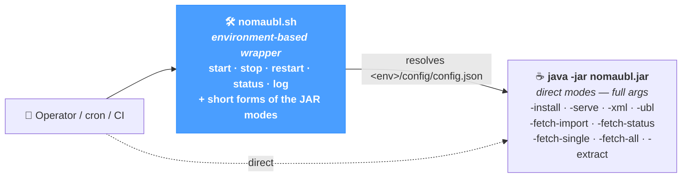

# Command Line

NomaUBL ships with a complete **command-line interface** that mirrors every operational action available in the web UI — installing an environment, starting the HTTP server, running an XML or UBL processing batch, polling the Plateforme Agréée, extracting from JD Edwards. The CLI is the natural choice for **system installations**, **cron / scheduler integrations**, **CI pipelines** and any **headless environment** without web access.

The CLI applies regardless of source system — JD Edwards, SAP, NetSuite or a custom ERP — although a few subcommands (`extract`, BIP / FTP sources of `fetch-single` / `fetch-all`) are JD-Edwards-specific.

---

## Two ways to invoke

NomaUBL exposes two equivalent layers — a **service-control wrapper** (`nomaubl.sh`) and the **direct JAR modes** (`java -jar nomaubl.jar -…`). The wrapper resolves the configuration file from a short *environment name* and adds `start` / `stop` / `restart` / `status` / `log` operations on top of the JAR.



| Layer | When to use |
|---|---|
| **`nomaubl.sh`** *(wrapper)* | Day-to-day operations on a server hosting one or several environments. Manages a PID file per instance, takes the **environment name** instead of the full config path, exposes `start` / `stop` / `restart` / `status` / `log`. |
| **`java -jar nomaubl.jar`** *(direct)* | Shipping NomaUBL inside a container, integrating into a CI pipeline, or any context that already manages process lifecycle. Takes the **absolute path** to `config.json`. |

The wrapper resolves its config from `<script_dir>/<env>/config/config.json` — i.e. the JAR sits next to one or more environment directories, each holding a `config/config.json`.

---

## Service control with `nomaubl.sh`

Lay out the JAR and one environment per service instance, then drive each one by its short name:

<div style={{border: '1px solid rgba(255,255,255,0.1)', borderRadius: '10px', padding: '16px', margin: '20px 0', background: 'rgba(255,255,255,0.02)', fontFamily: 'monospace', fontSize: '12px', lineHeight: '1.7'}}>
  <div style={{opacity: 0.6, marginBottom: '6px'}}>/opt/nomaubl/</div>
  <div style={{paddingLeft: '14px', borderLeft: '1px solid rgba(255,255,255,0.08)', marginLeft: '6px'}}>
    <div>📦 <b>nomaubl.jar</b></div>
    <div>🛠 <b>nomaubl.sh</b></div>
    <div>📂 fonts/ &nbsp;<span style={{opacity: 0.5}}>· shared</span></div>
    <div>📂 images/ &nbsp;<span style={{opacity: 0.5}}>· shared</span></div>
    <div>📂 demo/ &nbsp;<span style={{opacity: 0.5, color: '#4a9eff'}}>· environment</span></div>
    <div style={{paddingLeft: '20px', opacity: 0.85}}>📂 config/ → config.json, xdo.cfg, …</div>
    <div style={{paddingLeft: '20px', opacity: 0.85}}>📂 input/, process/, ubl/, single/, …</div>
    <div>📂 uat/ &nbsp;<span style={{opacity: 0.5, color: '#4a9eff'}}>· environment</span></div>
    <div>📂 prod/ &nbsp;<span style={{opacity: 0.5, color: '#4a9eff'}}>· environment</span></div>
  </div>
</div>

| Subcommand | Effect |
|---|---|
| **`start <env> [port]`** | Spawn `java -jar nomaubl.jar -serve <env>/config/config.json <port>` in the background. Default port is `8090`. The PID is stored in `nomaubl-<env>.pid`; stdout / stderr are appended to `nomaubl-<env>.log`. Refuses to start if the PID file points to a live process. |
| **`stop <env>`** | Send `SIGTERM` to the recorded PID; waits up to 10 s, then `SIGKILL` if still running. Cleans up the PID file. |
| **`restart <env> [port]`** | Convenience: `stop` then `start`. |
| **`status [env]`** | With an env name, reports `running` (with PID) or `not running`. With no argument, lists every `nomaubl-*.pid` and prints the state of each instance — and prunes stale PID files for processes that are no longer alive. |
| **`log <env>`** | Tail the log file (`tail -f nomaubl-<env>.log`). |

Beyond service control, the wrapper exposes **short forms** of the JAR's processing and synchronisation modes:

| Wrapper command | JAR equivalent |
|---|---|
| `nomaubl.sh xml <env> <template> <file> [type] [flags]` | `java -jar nomaubl.jar -xml <env>/config/config.json <template> <file> <type> [flags]` |
| `nomaubl.sh ubl <env> <file\|dir> [flags]` | `java -jar nomaubl.jar -ubl <env>/config/config.json <file\|dir> [flags]` |
| `nomaubl.sh fetch-import <env>` | `java -jar nomaubl.jar -fetch-import <env>/config/config.json` |
| `nomaubl.sh fetch-status <env>` | `java -jar nomaubl.jar -fetch-status <env>/config/config.json` |
| `nomaubl.sh fetch-single <env> <processType> [template] <source> <args…> [type] [flags]` | `java -jar nomaubl.jar -fetch-single …` |
| `nomaubl.sh fetch-all <env> <processType> [template] <source> [type] [flags]` | `java -jar nomaubl.jar -fetch-all …` |
| `nomaubl.sh extract <env> <jobNumber> [flags]` | `java -jar nomaubl.jar -extract <env>/config/config.json <jobNumber> [flags]` |
| `nomaubl.sh install <targetDir>` | `java -jar nomaubl.jar -install <targetDir>` |

The remainder of the page describes each direct JAR mode in detail.

---

## `-help` — usage banner

Emit the built-in help banner and exit. Accepted as `-help`, `--help` or `-h`. Invoking the JAR without any argument has the same effect.

```bash
java -jar nomaubl.jar -help
```

---

## `-install <targetDir>` — environment setup

Provision a NomaUBL **environment** under `targetDir` plus the **shared resources** (fonts, images) one level up. Skips the configuration files (`config.json`, `xdo.cfg`, `config-documents.json`, `config-lists.json`) when they already exist, so re-running the install on an existing environment is safe — it only rebuilds the directory layout and refreshes the embedded XSL framework.

| Argument | Description |
|---|---|
| **`targetDir`** | Path of the environment to create. The directory itself is the environment (e.g. `/opt/nomaubl/demo`); its **parent** receives the shared `fonts/` and `images/` directories. Created if missing. |

**Layout produced**

```text
parent/                        ← shared across environments
  fonts/                       ← fonts copied from the JAR
  images/                      ← left empty for project assets
targetDir/                     ← one environment
  burst/    config/    input/
  process/  single/   subtmpl/
  template/ ubl/      xslt/    .versions/
```

**Configuration files installed inside `targetDir/config/`**

| File | Source | Behaviour |
|---|---|---|
| `config.json` | `config/config-template.json` (in JAR) | `appHome` resolved to the parent absolute path; `envName` resolved to `targetDir`'s basename. All other paths keep their `%APP_HOME%` / `%ENV%` placeholders, resolved at runtime. |
| `xdo.cfg` | `config/xdo.cfg` (in JAR) | `%APP_HOME%` and `%ENV%` substituted with absolute values — Oracle XDO does not resolve placeholders. |
| `config-documents.json` | `config/config-template-documents.json` | Copied as-is. |
| `config-lists.json` | `config/config-template-lists.json` | Copied as-is. |

**Example**

```bash
java -jar nomaubl.jar -install /opt/nomaubl/demo
# → creates /opt/nomaubl/demo (env) + /opt/nomaubl/{fonts,images} (shared)
```

---

## `-serve <configFile> [port]` — embedded HTTP server

Start the embedded HTTP server (web UI + REST API) and the **background scheduler**. The process keeps running until killed; HttpServer threads are daemon, so `Thread.currentThread().join()` is used to keep the JVM alive.

| Argument | Description |
|---|---|
| **`configFile`** | Absolute path to `config.json`. |
| **`port`** | TCP port (default `8080`). |

The scheduler reads the following keys from the **global** template of `config.json` to drive periodic jobs:

| Key | Effect |
|---|---|
| **`fetchImportInterval`** | Minutes between `-fetch-import` sweeps. `0` disables the job. |
| **`fetchStatusInterval`** | Minutes between `-fetch-status` sweeps. `0` disables the job. |
| **`fetchAllInterval`** | Minutes between `-fetch-all` runs. `0` disables the job. |
| **`fetchAllParams`** | JSON object holding the batch parameters — same shape as the body of `POST /api/fetch-invoices/run-batch`. Keys: `processType` (`xml` \| `ubl`), `template`, `mode` (`AUTO` \| `SINGLE` \| `BURST` \| `UBL`), `source` (`directory` \| `bip`), `extractMode` (`input` \| `output` \| `both`), `replaceMode`, `validateOnly`, `sendToPA` (`Y` \| `N`), `noSend`, `language`. |

**Example**

```bash
java -jar nomaubl.jar -serve /opt/nomaubl/demo/config/config.json 8090
# → HTTP server on :8090 + scheduler driven by global properties
```

---

## `-xml` — XML source processing

Pipeline that processes a JDE-style XML source: optional XSLT transformation, RTF → XSL conversion, PDF generation, UBL generation + validation, optional database persistence and PA submission.

```text
-xml <configFile> <template> <fileName> <type> [--verbose] [--replace] [--no-send] [--no-db]
```

| Argument | Description |
|---|---|
| **`configFile`** | Absolute path to `config.json`. |
| **`template`** | Template name in the configuration (e.g. `invoices`, `credit_notes`). |
| **`fileName`** | Input XML file name **without extension**. The file is expected at `<dirInput>/<fileName>.xml`. |
| **`type`** | Processing type — see below. |

**Processing types**

| Value | Effect |
|---|---|
| **`AUTO`** | Resolve the type per document from the *Document Types* configuration. The default for spools mixing several document types. |
| **`SINGLE`** | One PDF per source file — used for single-document templates. |
| **`BURST`** | Split the source into multiple sub-documents driven by `burstKey` and process them in parallel (`numProc`). |
| **`UBL`** | UBL-only — no PDF, no template required. |

**Optional flags** — order-independent, may follow the type:

| Flag | Effect |
|---|---|
| `--verbose` | Print processing messages on stdout. |
| `--replace` | Overwrite an existing record / output, regardless of the `replaceDocument` template setting. |
| `--no-send` | Skip submission to the Plateforme Agréée. |
| `--no-db` | Skip the database write step. Implies `--no-send`. |

**Examples**

```bash
java -jar nomaubl.jar -xml /opt/nomaubl/demo/config/config.json \
                      invoices INV-2026-001 AUTO --verbose --replace
```

---

## `-ubl` — UBL XML processing

Validate and persist UBL invoice files already produced upstream — single file or full directory. The filename must match `DOC_DCT_KCO[_ubl].xml` (e.g. `12345_RI_00070.xml`).

```text
-ubl <configFile> <file|dir> [--verbose] [--replace] [--validate] [--send] [--no-send]
```

| Argument | Description |
|---|---|
| **`configFile`** | Absolute path to `config.json`. |
| **`file \| dir`** | Either one UBL XML file or a directory containing `*.xml` files. When a directory is given, every XML file is processed in alphabetical order; a final summary line reports `N processed: K OK, M failed`. |

**Optional flags**

| Flag | Effect |
|---|---|
| `--verbose` | Print per-file processing messages on stdout. |
| `--replace` | Delete an existing header / lines / VAT record before insert. |
| `--validate` | XSD + Schematron only — no DB insert, no PA send (forces `--no-send`). |
| `--send` | Force submission to the PA, overriding the configured default. |
| `--no-send` | Skip submission to the PA. |

**Example**

```bash
java -jar nomaubl.jar -ubl /opt/nomaubl/demo/config/config.json \
                      /opt/nomaubl/demo/ubl/ --verbose
```

---

## `-fetch-import` and `-fetch-status` — synchronisation sweeps

Two read-only sweeps against the Plateforme Agréée — typically scheduled via `fetchImportInterval` / `fetchStatusInterval` rather than launched manually.

| Mode | Effect |
|---|---|
| **`-fetch-import <configFile>`** | Re-poll the PA for invoices stuck in status `9906 — Pending PA import`. Each invoice that has now been ingested by the PA gets its lifecycle advanced. |
| **`-fetch-status <configFile>`** | Retrieve the lifecycle of every active invoice and persist new events (status badges, rejection reasons, expected actions) — same code path as the *Sync → Retrieve Statuses* page. |

```bash
java -jar nomaubl.jar -fetch-import /opt/nomaubl/demo/config/config.json
java -jar nomaubl.jar -fetch-status /opt/nomaubl/demo/config/config.json
```

---

## `-fetch-single` — extract one document, then process it

Equivalent of the *Application → Extract and Process* page. Extracts a single document from a source channel, drops the resulting XML into `dirInput`, then immediately runs the XML or UBL pipeline on it.

```text
-fetch-single <configFile> <processType> [<template>] <source> <sourceArgs…> [<type>] [flags…]
```

| Argument | Description |
|---|---|
| **`configFile`** | Absolute path to `config.json`. |
| **`processType`** | `xml` (run the JDE-XML pipeline after extraction) or `ubl` (run the UBL pipeline). |
| **`template`** | Required when `processType=xml`; **omitted** when `processType=ubl`. |
| **`source`** | Extraction channel — see table below. |
| **`sourceArgs`** | Source-specific arguments. |
| **`type`** | Processing type for `xml` (`AUTO` \| `SINGLE` \| `BURST` \| `UBL`). Not used for `ubl`. |

**Source channels**

| Source | Arguments | Description |
|---|---|---|
| **`archive <doc> <dct> <kco>`** | Document number, document type, company code. | Pull the source from the JDE archive directory. |
| **`ftp <report> <version> <language> <job>`** | Report code, version, language, JDE job number. | Download via FTP / SFTP. |
| **`bip <jobNumber>`** | JDE BIP job number. | Read from the BIP Print Queue (`F95630` / `F95631`). |

**Optional flags**

| Flag | Effect |
|---|---|
| `--verbose` `--replace` `--no-send` | Same as `-xml`. |
| `--validate` `--send` | Apply only when `processType=ubl`. |
| `--input` *(default)* `--output` `--both` | BIP extraction mode — input XML, output documents, or both. |

**Examples**

```bash
# Single XML pull from the archive, AUTO routing
java -jar nomaubl.jar -fetch-single /opt/nomaubl/demo/config/config.json \
                      xml invoices archive 12345 RI 00070 AUTO --verbose

# Single BIP job, UBL pipeline, validate-only
java -jar nomaubl.jar -fetch-single /opt/nomaubl/demo/config/config.json \
                      ubl bip 19 --validate
```

---

## `-fetch-all` — batch extract + process

Equivalent of the *Application → Fetch Input* page. Extract **every** matching document from a source, then process them all. Returns exit code `1` if at least one document failed.

```text
-fetch-all <configFile> <processType> [<template>] <source> [<type>] [flags…]
```

| Argument | Description |
|---|---|
| **`source`** | `directory` — scan `dirInput` (xml) or `dirInput/ubl` (ubl) for ready-to-process files. <br/>`bip` — pull every new BIP job whose number is greater than `lastBipJobNumber` (persisted in the *global* template after each successful run). |

For each `bip` job the wrapper resolves the **per-job template** from the BIP report filters when one is defined; otherwise it falls back to the `template` CLI argument. After a successful run, `lastBipJobNumber` in `config.json` is updated to the highest job number processed, so the next sweep only picks up new jobs.

**Examples**

```bash
# Process every XML waiting in the input directory
java -jar nomaubl.jar -fetch-all /opt/nomaubl/demo/config/config.json \
                      xml invoices directory AUTO --verbose

# Drain new BIP jobs into UBL, validate + send
java -jar nomaubl.jar -fetch-all /opt/nomaubl/demo/config/config.json \
                      ubl bip --send
```

---

## `-extract` — JDE BIP raw extraction

Low-level extraction from the JD Edwards BIP Print Queue (`F9563110` header, `F95630` input XML, `F95631` output files). Same engine as `fetch-single … bip`, but **without** running the processing pipeline afterwards — useful to drop a job's payload into a directory for off-line inspection.

```text
-extract <configFile> <jobNumber> [--input|--output|--both] [--type <outputType>] [--lang <language>] [outputDir]
```

| Argument | Description |
|---|---|
| **`jobNumber`** | JDE job number (`RJJOBNBR`). |
| **`--input`** *(default)* | Extract the input XML only. |
| **`--output`** | Extract the generated output files only. |
| **`--both`** | Extract input + output. |
| **`--type <val>`** | Filter output files by type — `XML`, `PDF`, `EXCEL`, `HTML`, `RTF`, `PPT`, `ETEXT`. |
| **`--lang <val>`** | Filter by language code (e.g. `FR`). |
| **`outputDir`** | Optional output directory — defaults to `global.dirInput`. |

**Example**

```bash
java -jar nomaubl.jar -extract /opt/nomaubl/demo/config/config.json 19 \
                      --both --type PDF --lang FR /tmp/jde-19/
```

---

## Flags reference

A consolidated view of every CLI flag — which modes accept it, what it does.

| Flag | Modes | Effect |
|---|---|---|
| **`--verbose`** | `xml`, `ubl`, `fetch-single`, `fetch-all` | Print processing messages on stdout. |
| **`--replace`** | `xml`, `ubl`, `fetch-single`, `fetch-all` | Overwrite the existing record (delete-then-insert for `ubl`; respects `replaceDocument` semantics for `xml`). |
| **`--validate`** | `ubl`, `fetch-single`, `fetch-all` | Validate only — no DB insert, no PA send. Implies `--no-send`. |
| **`--send`** | `ubl`, `fetch-single`, `fetch-all` | Force PA submission, overriding the configured default. |
| **`--no-send`** | `xml`, `ubl`, `fetch-single`, `fetch-all` | Skip PA submission. |
| **`--no-db`** | `xml` | Skip the database write step. Implies `--no-send`. |
| **`--input`** *(default)* | `extract`, `fetch-single` (bip), `fetch-all` (bip) | BIP extraction — input XML only. |
| **`--output`** | `extract`, `fetch-single` (bip), `fetch-all` (bip) | BIP extraction — output documents only. |
| **`--both`** | `extract`, `fetch-single` (bip), `fetch-all` (bip) | BIP extraction — input + output. |
| **`--type <t>`** | `extract` | Filter output files by type — XML, PDF, EXCEL, HTML, RTF, PPT, ETEXT. |
| **`--lang <l>`** | `extract` | Filter by language code. |

---

## Tips & best practices

- **Schedule sweeps via the `-serve` background scheduler rather than cron.** Configuring `fetchImportInterval` and `fetchStatusInterval` in the *global* template gives a single point of truth and survives an environment restart; running the same sweeps via cron risks overlapping with the in-process scheduler.
- **`fetch-all` is idempotent on `directory` source, append-only on `bip`.** A `directory` rerun re-picks files that are still in `dirInput` — typically nothing once they have been processed and removed. A `bip` rerun only fetches jobs newer than `lastBipJobNumber`, so a successful previous run is never repeated.
- **Use `--validate` when promoting UBL files between environments.** It exercises XSD + Schematron without writing to the DB or contacting the PA — a safe smoke test before flipping the real run.
- **Place `fetchAllParams` in the *global* template once, not on every cron entry.** The scheduler builds its batch run from this single JSON object, mirroring the *Configuration → System → Fetch Invoices* page.
- **Reserve `-extract` for inspection or recovery.** `fetch-single` and `fetch-all` already extract internally; the standalone `-extract` mode is for dropping a BIP job's payload onto disk for off-line review or replay.
- **Run `-install` on a fresh directory and edit `config/config.json` afterwards.** The installer never overwrites an existing `config.json`, so a stale config from a previous attempt will silently win — start from an empty `targetDir` to be sure.
