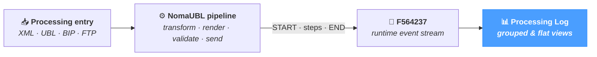

# Processing Log

The **Processing Log** screen is the audit-trail viewer for the NomaUBL **runtime log table** (`F564237`). Every job that goes through the platform — XML transformation, UBL generation, validation, BIP extraction, FTP download — emits a stream of events: a `START`, intermediate steps (transformation, conversion, render…), and an `END` with a final outcome (`SUCCESSFUL` or a fatal-error message).

The page exposes that stream in two complementary views — a **grouped** view that pairs every `START` with its matching `END` so each job appears as one row with a status and a duration, and a **flat** view that lists every individual event for forensic-grade tracing. The page applies regardless of source system — JD Edwards, SAP, NetSuite or a custom ERP.

---

## Where the events come from

Every NomaUBL processing path writes its trace into `F564237` through the same logger. The key fields are populated at runtime: the **file** being processed, the **mode** (`AUTO`, `SINGLE`, `BURST`, `UBL`, `PROCESS`), the source **template**, the current **step** (`START`, `END`, or a method name such as `TRANSFORM_XSL`, `CONVERT_RTF`, `RUN_TASKS`), the **message** and the **timestamp**. The grouping engine on this page reconstructs jobs from those raw events on the fly.

The log is **append-only** — events are written by the pipeline and never modified. The page is read-only.

---

## Two views, one dataset

| View | When to use |
|---|---|
| **Grouped** *(default)* | Day-to-day monitoring. Each job is one row with its status (OK / ERROR / PARTIAL), duration and the last message. Expanding a row reveals every intermediate step. |
| **Flat** | Forensic analysis when grouping would hide useful context — e.g. inspecting the order of events during a hung job, or chasing a stray `WARNING` between two unrelated runs. One row per event. |

The toggle at the top of the toolbar switches between the two; the choice is persisted in the browser (`processing-log:grouped` in `localStorage`) so the next session opens on the same view.

---

## Toolbar

The toolbar above the table combines a view toggle, a free-text search, two dropdown filters, a date range and a refresh button.

  

    

      Grouped
      Flat
    

    🔎 Search file name…
    All templates ▾
    All modes ▾
    📅 Yesterday → Today
    
    ↻ Refresh
  

| Control | Behaviour |
|---|---|
| **Grouped / Flat toggle** | Switches the data presentation. Persisted per-browser. |
| **Search file name** | Substring match against the `file` column (e.g. `12345_RI_00070`). Empty disables the filter. |
| **Templates** | Dropdown populated dynamically from the `document` templates declared in `config.json`. *All templates* removes the filter. |
| **Modes** | Dropdown of the well-known processing modes — `AUTO`, `SINGLE`, `BURST`, `UBL`, `PROCESS`. *All modes* removes the filter. |
| **Date range** | Restricts to events whose timestamp falls within the chosen window. Default preset: *Yesterday → Today*. The standard presets (*Today*, *Yesterday*, *Last 7 days*, *This month*, *Last month*, *Custom range*) all apply. |
| **Refresh** | Re-runs the current query without changing filters. |

When grouped, the page over-fetches (`pageSize × 4`, capped at 200) so START / END pairs and intermediate steps land on the same page and the grouping engine has the full job in hand.

---

## Grouped view — one row per job

Each row represents one **(file, mode, template) job**, reconstructed from its raw events. The row carries the job's status, flow shape, duration and last message. Click any row to expand and see every intermediate step.

  

    

Date

File

Mode

Template

Flow

Duration

Status

Message

  

  

    
▸

    
2026-04-29 14:08:42

    
12345_RI_00070

    
SINGLE

    
invoices

    
START → END

    
1.2s

    
OK

    
SUCCESSFUL

  

  

    
▸

    
2026-04-29 13:54:11

    
spool_R12_2026_120

    
BURST

    
invoices

    
START → END

    
42s

    
OK

    
SUCCESSFUL — 248 invoices

  

  

    
▸

    
2026-04-29 11:22:05

    
12347_RN_00070

    
UBL

    
credit_notes

    
START → END

    
340ms

    
FATAL ERROR

    
FATAL ERROR : Schematron BR-CL-21 failed

  

  

    

      2026-04-29 11:22:05
      START
      —
      Job started
    

    

      2026-04-29 11:22:05
      TRANSFORM_XSL
      —
      XSLT applied — 1 document, 8 lines
    

    

      2026-04-29 11:22:05
      VALIDATE_UBL_ERROR
      —
      BR-CL-21 — Tax category code MUST be from UNCL5305
    

    

      2026-04-29 11:22:05
      END
      —
      FATAL ERROR : Schematron BR-CL-21 failed
    

  

  

    
▸

    
2026-04-29 09:14:18

    
12348_RI_00070

    
AUTO

    
invoices

    
START → ?

    
—

    
PARTIAL

    
RUN_TASKS — splitting 1 of 4

  

### Columns

| Column | Description |
|---|---|
| **▸** | Chevron — shown when the job has at least one intermediate step or is an orphan. Click anywhere on the row to expand. |
| **Date** | Sort timestamp — `END` time when known, otherwise `START` or the first intermediate step. |
| **File** | The file or job key being processed (typically `DOC_DCT_KCO`). Mono-spaced; full value visible on hover. |
| **Mode** | Coloured badge — `SINGLE` (blue), `BURST` (purple), `UBL` / `UBL_VALIDATE` (green), `BOTH` (orange), other modes (neutral). |
| **Template** | The source template that drove the run (e.g. `invoices`, `credit_notes`). |
| **Flow** | Indicates the START / END pairing — `START → END` for complete jobs, `START → ?` when no END is found, `? → END` when an END appears with no matching START, or `—` for free-floating intermediate steps. |
| **Duration** | Computed from `END − START`. Formatted compactly: `120ms` / `1.2s` / `1m 23s`. Empty when one of the bounds is missing. |
| **Status** | The job outcome — see below. |
| **Message** | The end-of-job message, or the last intermediate step's message when the END is missing. Truncated; full value on hover. |

### Status badges

| Variant | When | Visual cue |
|---|---|---|
| **OK** | Both `START` and `END` present, no error in the message or any intermediate step. | Green badge. |
| **ERROR** | The `END` message matches `ERROR / FAIL / EXCEPTION / FATAL`, **or** any intermediate step does. The badge label is the upper-cased end message. | Red badge, the row's background is tinted red. |
| **PARTIAL** | The `START` or `END` is missing on the current page (orphan job), or only intermediate steps were found. | Orange badge, the row's background is tinted orange. |

### Expanded steps

Clicking an expandable row opens a **step area** below it that lists every event tied to that job in chronological order:

- The synthetic `START` row repeats the start timestamp and a generic *"Job started"* message.
- Every intermediate event is listed with its method (`TRANSFORM_XSL`, `CONVERT_RTF`, `RUN_TASKS`, `VALIDATE_UBL_ERROR`, …) and free-text message — error methods are coloured red.
- The `END` row repeats the end timestamp and the final message.
- For **PARTIAL** jobs, an italic note reminds you that the START or END is on a different page.

The same area is what makes the grouped view a one-click drill-down for triage — the headline tells you *what* happened, the expanded list tells you *where* in the pipeline.

---

## Flat view — one row per event

Switching to **Flat** turns off grouping and falls back to the underlying event stream. Sorting, paging and CSV export operate on individual events, which is the right shape for archival queries and detailed investigations.

  

    
Date / Time

File

Mode

Template

Step

Message

  

  

    
2026-04-29 14:08:43

    
12345_RI_00070

    
SINGLE

    
invoices

    
END

    
SUCCESSFUL

  

  

    
2026-04-29 14:08:43

    
12345_RI_00070

    
SINGLE

    
invoices

    
RUN_SINGLE

    
PDF rendered (1 doc, 142 KB)

  

  

    
2026-04-29 14:08:42

    
12345_RI_00070

    
SINGLE

    
invoices

    
START

    
Processing SINGLE — template=invoices, file=12345_RI_00070

  

  

    
2026-04-29 11:22:05

    
12347_RN_00070

    
UBL

    
credit_notes

    
VALIDATE_UBL_ERROR

    
BR-CL-21 — Tax category code MUST be from UNCL5305

  

### Columns

| Column | Description |
|---|---|
| **Date / Time** | Event timestamp. Default sort: descending. |
| **File** | The file the event belongs to. |
| **Mode** | Coloured badge — same palette as the grouped view. |
| **Template** | The source template. |
| **Step** | The method label — coloured badge: `START` (blue), `END` (green), anything matching `ERROR / FAIL` (red), `WARN` (orange), other steps (neutral). |
| **Message** | Free-text message attached to the event. Truncated; full value on hover. Not sortable. |

The standard `Export` button writes the current view (filters applied, sort respected) to `processing-log.csv`.

---

## How jobs are reconstructed

The grouping engine walks the events in **ascending** time order and uses the triplet `file | mode | template` as the **job key**. Knowing the algorithm helps interpret edge cases:

| Event | Effect |
|---|---|
| `START` on a key with no open job | Opens a new job. |
| `START` on a key that already has an open job | Flushes the previous job as **PARTIAL** and opens a fresh one. |
| `END` on a key with an open job | Closes the job, computes the duration, sets the status (OK or ERROR depending on the END message). |
| `END` on a key with no open job | Emits a **PARTIAL** orphan with no START. |
| Any other method on a key with an open job | Attaches as an intermediate step. Sets `hasError = true` if the method or message matches `ERROR / FAIL / EXCEPTION / FATAL`. |
| Any other method on a key with no open job | Emits a **PARTIAL** orphan composed of just that step. |

Open jobs that never see an `END` on the current page are flushed as **PARTIAL** at the end of the walk.

The detection regex is intentionally broad — any method or message containing `ERROR`, `FAIL`, `EXCEPTION` or `FATAL` (case-insensitive) marks the job as errored, even if the formal `END` message is benign.

---

## Tips & best practices

- **Stay on Grouped for daily monitoring.** A scan of the *Status* column tells you, at a glance, what failed yesterday and what completed cleanly. Save *Flat* for forensic queries.
- **PARTIAL after a date filter is usually a paging artefact.** A job whose START is on day 1 and END on day 2 will look orphaned on either day's view alone — widen the date range before assuming a real failure.
- **Filter by mode to focus a triage session.** During an incident on the BIP path, restricting to `BURST` cuts out the noise of unrelated `SINGLE` runs and keeps every related step grouped on a single page.
- **The error label on the row is the END message, uppercased.** It is the same string the ERP / PA team will quote in a ticket — copying it from this page is the fastest way to surface the canonical failure reason.
- **Expand before quoting a job.** The headline says *what* failed; the expanded steps say *where* in the pipeline (transform vs. convert vs. validate vs. send). Always include the failing step in any incident report.
- **The log is append-only.** No row can be edited or deleted from this page — use *File Versions* or the database directly for any retroactive cleanup work.
