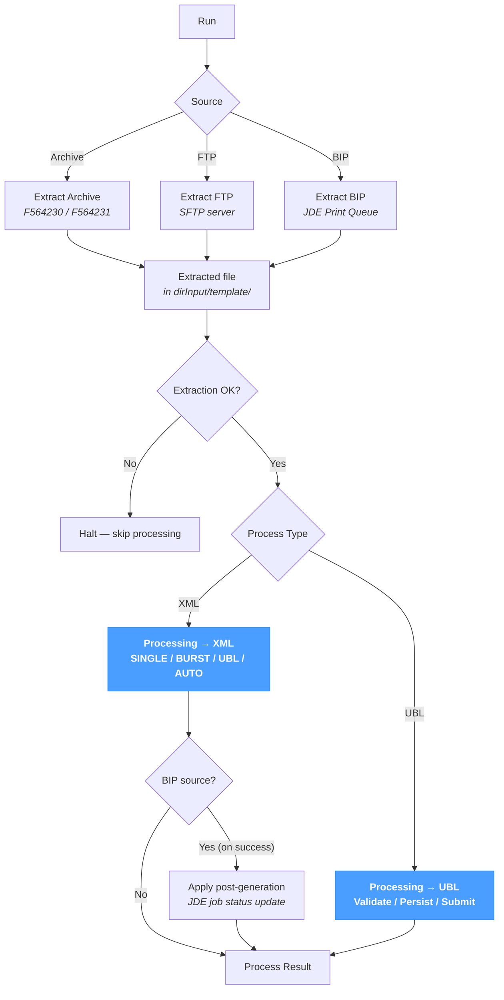

# Extract and Process

The **Extract and Process** screen runs an **extraction** followed by a **processing** step in a single click. It is the runtime equivalent of running one of the *Extract* pages and then the matching *Processing* page back-to-back, with the same parameters surfaced on a single form.

The extraction half offers the same three sources documented under *Extract*:

- [Extract Archive](../extract/extract-archive.md) — pull an archived document from the NomaUBL database (`F564230` source XML or `F564231` generated UBL) by document key.
- [Extract FTP](../extract/extract-ftp.md) — download a file from an SFTP server using the JDE-style report / version / language / job key.
- [Extract BIP](../extract/extract-bip.md) — extract a JD Edwards BIP Print Queue job (input XML, rendered output, or both).

The processing half offers the same two pipelines documented under *Processing*:

- [Processing → XML](./xml.md) — transform a source XML to UBL (or render PDF), then validate, persist and optionally submit. The `AUTO` / `SINGLE` / `BURST` / `UBL` modes apply.
- [Processing → UBL](./ubl.md) — validate, persist and optionally submit a file already in UBL 2.1 format.

The page applies regardless of source system — JD Edwards, SAP, NetSuite or a custom ERP — except for the BIP source, which is JD Edwards-specific.

---

## Pipeline at a glance

The chain runs in two steps. The extraction step writes a file to `dirInput/<template>/`; on success, the matching processing pipeline picks it up. Any failure on the extraction step stops the chain — the processing step is skipped and only the **Extraction Result** carries a message.

---

## Source

The **Source** selector at the top picks one of the three extraction channels. The form below adapts to the chosen source.

### Archive

Pulls an archived document by its database key.

| Field | Description |
|---|---|
| **DOC** | Document number — primary key of the archived document. |
| **DCT** | Document type code (e.g. `RI`, `RN`). |
| **KCO** | Company code (e.g. `00070`). |

The extracted file is written to `dirInput/<template>/` (with `%TEMPLATE%` resolved) under the name `<DOC>_<DCT>_<KCO>.xml` (or `_ubl.xml` if the source side is UBL). See [Extract Archive](../extract/extract-archive.md) for the full reference.

### FTP

Downloads a file from the configured SFTP server.

| Field | Description |
|---|---|
| **Report** | JDE-style report name (e.g. `R42565`). |
| **Version** | Report version (e.g. `XJDE0001`). |
| **Language** | Language code (e.g. `FR`). |
| **Job** | JDE job number. |

The extracted file is written to `dirInput/<template>/<REPORT>_<VERSION>_<LANG>_<JOB>.xml`. See [Extract FTP](../extract/extract-ftp.md) for the full reference.

### BIP

Extracts a job from the JDE BIP Print Queue.

| Field | Description |
|---|---|
| **Job Number** | JDE BIP job number (`RJJOBNBR`). |
| **Language** | Optional BIP language filter. |
| **Extract Mode** | `Extract Input (XML)`, `Extract Output` or `Extract Both`. See [Extract BIP](../extract/extract-bip.md) for the semantics of each. |

The extracted file's base name (`<report>_<version>_<job>`) is reused as the input for the processing step.

---

## Processing

Below the source selector, the **Process Type** picks between the two pipelines.

### Process Type = XML

Equivalent to running the [Processing → XML](./xml.md) page on the just-extracted file.

| Field | Description |
|---|---|
| **Template** | Document template — required. Drives the XSL pipeline and the validation rule set. |
| **Mode** | `AUTO`, `SINGLE`, `BURST` or `UBL`. See [Processing → XML — Modes](./xml.md#modes). |
| **Replace** | `Skip` keeps existing invoices untouched; `Overwrite` re-imports them. |
| **Send to PA** | `Use settings` (default) or `Skip sending`. |

After a successful run, when the source is **BIP**, an additional **Apply post-generation** call updates the JDE job status — typically marking the BIP job as processed.

### Process Type = UBL

Equivalent to running the [Processing → UBL](./ubl.md) page on the just-extracted file. The extracted file must already be UBL — typical when:

- the **Archive** source is set with the UBL flavour;
- the upstream system emits UBL directly;
- the **BIP** source is set with `Extract Output` and the JDE report emits UBL XML as its output (not PDF). In that case the UBL files retrieved from `F95631` are picked up directly by the UBL pipeline — no XSL transformation runs.

| Field | Description |
|---|---|
| **Mode** | `Process & Validate` (full pipeline) or `Validate only`. |
| **Replace Mode** | `Overwrite existing` (default) or `Skip`. |
| **Send to PA** | `Use settings`, `Force send` or `Skip sending`. |

The UBL file must follow the `DOC_DCT_KCO.xml` filename convention; see [Processing → UBL](./ubl.md#filename-convention).

#### Combinations not supported

| Source | Process Type | Status |
|---|---|---|
| BIP, *Extract Mode = Both* | UBL | Not supported — the extracted set contains both XML and rendered output, which cannot be processed as UBL. |
| BIP, *Extract Mode = Both* with multiple output rows | XML | Rejected — the extraction produces several files, the XML pipeline expects a single file per run. |

A clear error appears in the **Process Result** section when one of these combinations is attempted.

---

## Results

The screen splits the outcome into two sections:

- **Extraction Result** — the message returned by the extraction API; populated first.
- **Process Result** — the structured log table from the processing step (same columns as on the *XML* and *UBL* pages: Severity / Module / Submodule / Message); populated only when the extraction succeeded and the processing actually ran.

If the extraction fails, the processing step is skipped — the chained run halts on the first failure.

---

## Tips & best practices

- **Use *Extract and Process* for single ad-hoc runs.** The page combines two operations on one screen, so retrieving and processing one document needs a single click. For repeated unattended runs, prefer *Sync → Fetch Input* — it iterates the same pipeline in batch.
- **Match the Process Type to the extraction output.** The combinations table above lists the unsupported pairs; cross-check the BIP extract mode against the chosen process type before clicking Run.
- **For a BIP-driven workflow, leave the Process Type at XML.** It runs `Apply post-generation` on success, which updates the JDE job status — without it, the same job will be re-extracted on the next run.
- **The Extract Result keeps the raw API output.** When something goes wrong on the extraction side (missing job, file not found, SFTP credentials), the message returned by the extract API is the canonical diagnostic — read it before re-running.
- **Skip sending while iterating on a template.** Both halves expose the option (`No send` / `Skip sending`) — use it during template development to avoid producing duplicate PA submissions across iterations.
