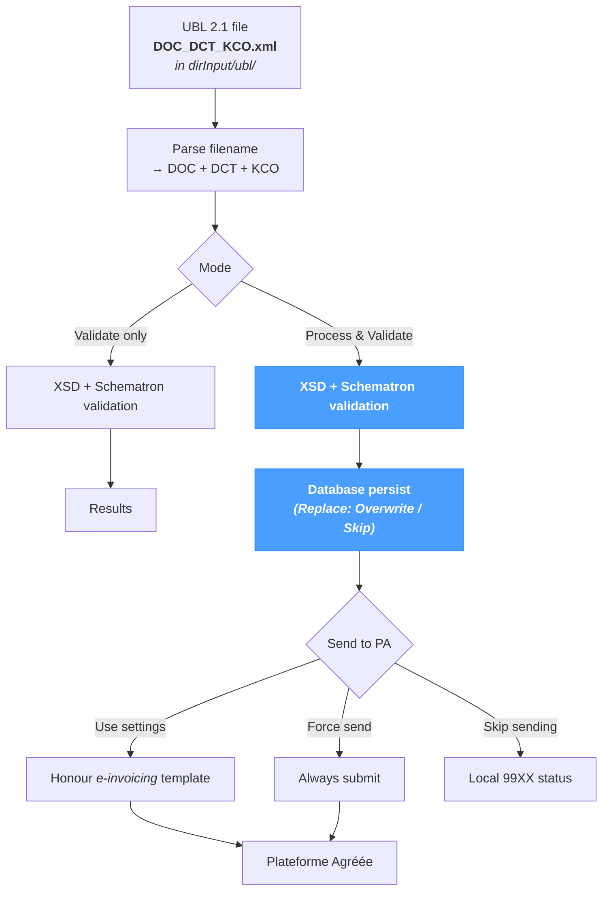

# UBL

The **UBL** processing screen runs a file **already in UBL 2.1 format** through NomaUBL's validation, persistence and submission pipeline. No XSL transformation is involved — the file is consumed as-is. Use this page when:

- the upstream system emits UBL natively (no NomaUBL transformation needed);
- a UBL document was generated elsewhere (the *XML* page in a previous run, an external tool, a Process API call) and now needs to be persisted and / or submitted.

The page applies regardless of source system — JD Edwards, SAP, NetSuite or a custom ERP — as long as the input is a well-formed UBL 2.1 document.

For lighter use cases:

- *UBL Tools → Validate* runs validation only, without writing to the database or submitting.
- *UBL Tools → XML Viewer* opens any XML for inspection or light editing.
- *Sync → Fetch Input* runs the same pipeline in batch over the UBL directory.

---

## Pipeline at a glance

No XSL transformation runs — the file is consumed as-is. Only the validation, persistence and submission steps execute.

---

## Filename convention

The filename must follow the **`DOC_DCT_KCO.xml`** pattern, where:

| Token | Meaning |
|---|---|
| `DOC` | Document number (e.g. `12345`). |
| `DCT` | Document type code (e.g. `RI`, `RN`). |
| `KCO` | Company code (e.g. `00070`). |

Example: `12345_RI_00070.xml`. The pipeline parses the database key directly from the filename — files that don't follow this convention are rejected at parse time.

The file lives in the **UBL directory** — `dirInput/ubl/` (the `dirInput` global path resolved with all placeholders, then a fixed `ubl` subdirectory). No template is involved at this stage; the input is already UBL.

---

## Input

| Field | Description |
|---|---|
| **File** | Use **Upload** to send a local `.xml` file to the UBL directory, or **Browse** to pick an existing file from the server. The selected file's full server-side path appears under **Selected**. |
| **Mode** | `Process & Validate` runs the full pipeline (validate + persist + optional submit); `Validate only` runs validation alone (no DB, no submit). |
| **Replace Mode** | `Overwrite existing` (the default here) re-imports the invoice if it already exists in the database; `Skip` leaves the existing record untouched. |
| **Send to PA** | `Use settings` honours the e-invoicing template; `Force send` always submits regardless of settings; `Skip sending` never submits. |

In `Validate only` mode, the **Replace Mode** and **Send to PA** options are hidden — they have no effect when nothing is persisted or submitted.

A **Clear** button next to the run button removes the current selection without running the pipeline.

---

## Pipeline

When `Process & Validate` is selected, the pipeline runs in sequence:

1. **Parse** — read the UBL document and extract the database key (DOC + DCT + KCO) from the filename.
2. **Validate** — XSD schema and Schematron business rules.
3. **Persist** — insert invoice header, lines, VAT subtotals, lifecycle and validation results in the NomaUBL database (subject to **Replace Mode**).
4. **Submit** — optionally send the UBL to the configured Plateforme Agréée (subject to **Send to PA**).

In `Validate only` mode, only step 2 runs — no DB write, no submission.

### Replace Mode

| Value | Behaviour |
|---|---|
| **Overwrite existing** *(default)* | The existing invoice header, lines, VAT and lifecycle are deleted and re-imported. The default for this page because UBL files are typically updated in place during template iteration. |
| **Skip** | The existing invoice is left untouched; the run logs a duplicate-skipped message. |

Overwriting also resets the lifecycle to its initial state — any PA-side history is decoupled from the local record. Reserve `Overwrite` for genuine re-imports, not for incremental updates after a PA submission.

### Send to PA

| Value | Behaviour |
|---|---|
| **Use settings** | Honours the **sendToPA** flag of the *e-invoicing* template. |
| **Force send** | Submits to the PA regardless of the e-invoicing template's setting. Useful when the global setting disables submission for the environment but a specific document needs to be pushed. |
| **Skip sending** | Runs validation and persistence locally without submitting. The invoice ends up in a local `99XX` status — the exact code depends on the validation outcome (success, warnings or errors). A subsequent **Resend** action from *Application → Invoices* can submit it later. See the [Status Reference](../references/status-reference.mdx) for the meaning of each code. |

---

## Results

After processing completes, the **Results** section displays:

- A green status line summarising the outcome — `<filename>: <status message>` on success, an error message otherwise.
- A **structured log table** with one row per validation result. Each row carries:

| Column | Description |
|---|---|
| **Severity** | `FATAL`, `ERROR`, `WARNING` or `INFO`. `FATAL` and `ERROR` block submission to the PA; `WARNING` and `INFO` are informational. |
| **Module** | Validation engine — `XSD` (schema check), `Schematron` (business rules) or `PROCESS` (pipeline-level events). |
| **Submodule** | Specific rule identifier or filename. |
| **Message** | Human-readable explanation of the failure, warning or progress event. |

A run with no `ERROR` / `FATAL` row is considered successful even if `WARNING` rows are present — warnings do not block submission.

---

## Tips & best practices

- **The UBL directory is fixed.** Files always go to `dirInput/ubl/`, regardless of the template — this page never carries a template selector.
- **Stick to the `DOC_DCT_KCO.xml` filename convention.** Diverging from it breaks the database key parser; the file is uploaded but cannot be processed.
- **Use `Validate only` to test a UBL document before committing.** No database write, no PA submission — only the validation engines run. Useful when troubleshooting a Schematron failure on an externally-generated UBL.
- **`Force send` is the manual override.** When the global setting disables submission (e.g. in a non-production environment) but a specific document needs to reach the PA, `Force send` is the right escape hatch — log the reason in the lifecycle.
- **Avoid `Overwrite` after a PA submission.** A submitted invoice carries a PA-side identity; overwriting locally desynchronises the local record from the PA. Use *Application → Invoices → Resend* if a re-submission is genuinely needed.
- **For batch UBL processing, prefer *Sync → Fetch Input*.** It iterates the same `dirInput/ubl/` directory and applies the same pipeline per file.
