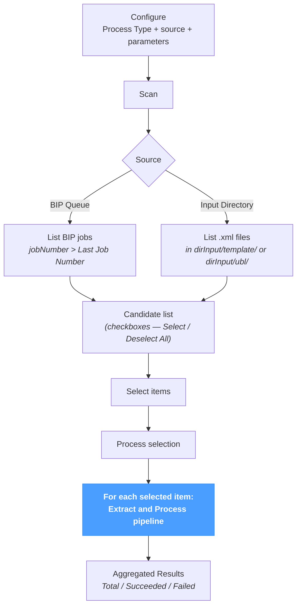

# Fetch Input

The **Fetch Input** screen is the **batch automation** of [*Processing → Extract and Process*](../processing/extract-and-process.md). It scans a directory of files or the BIP Print Queue, lists every candidate, and runs the same Extract → Process pipeline on every selected item.

The page applies regardless of source system — JD Edwards, SAP, NetSuite or a custom ERP — except for the BIP source, which is JD Edwards-specific.

The per-item semantics (mode resolution, validation, persistence, PA submission, BIP post-generation) are documented on [*Extract and Process*](../processing/extract-and-process.md). This page documents only what is specific to batch operation: the scan-then-select flow, the source modes, the **Last Job Number** incremental retrieval, and the aggregated results.

---

## Pipeline at a glance

The flow is **two-step**: a Scan call lists candidates without running any processing; the user then ticks the items to keep and clicks Process. The processing step iterates over the selection, applying the Extract and Process pipeline per item.

---

## Processing Options

The first section configures **how each selected item is processed**. The semantics match [*Extract and Process — Processing*](../processing/extract-and-process.md#processing); this page just exposes the same controls so the same options apply to every selected item.

| Field | Description |
|---|---|
| **Process As** | `XML` or `UBL`. Selects which Processing pipeline runs. See [*Processing → XML*](../processing/xml.md) or [*Processing → UBL*](../processing/ubl.md) for the per-item semantics. |
| **Mode** *(XML only)* | `AUTO`, `SINGLE`, `BURST` or `UBL`. See [*Processing → XML — Modes*](../processing/xml.md#modes). |
| **Mode** *(UBL only)* | `Process & Validate` or `Validate only`. |
| **Replace** | `Skip` keeps existing invoices untouched; `Overwrite` re-imports them. |
| **Send to PA** | `Use settings` (default), `Skip sending`, or `Force send` (UBL only). |

These settings apply uniformly to **every** selected item in the run. To process a subset with different options, run the page twice — once per option set.

---

## Extract Options

The second section picks the **source** and any source-specific parameters.

| Field | Description |
|---|---|
| **Template** | Required when *Process As = XML*. Selects the XSL pipeline applied to each item. Hidden in UBL mode (UBL files are picked up directly from `dirInput/ubl/`). |
| **Source** | `BIP Queue` (JD Edwards-specific) or `Input Directory`. |

### Source = BIP Queue

| Field | Description |
|---|---|
| **Language** | Optional BIP language filter (e.g. `FR`). |
| **Extract Mode** | `Extract Input (XML)`, `Extract Output` or `Extract Both`. See [*Extract BIP*](../extract/extract-bip.md) for the semantics. |
| **Last Job Number** | Pre-filled from `global.lastBipJobNumber`. The Scan call returns only jobs with `jobNumber > Last Job Number`. The field can be edited to re-scan a different range, but the global config is updated to the highest processed job number after each batch — incremental retrieval is the default. |

### Source = Input Directory

The Scan lists every `.xml` file present in:

- `dirInput/<template>/` for *Process As = XML*;
- `dirInput/ubl/` for *Process As = UBL*.

No additional parameters — every file in the directory is a candidate.

---

## Scan and select

Click **Scan** to populate the **candidate list**. The list shows one row per candidate with a checkbox; rows are selected by default. Above the list:

| Element | Description |
|---|---|
| **Selection counter** | `N file(s) found in <directory>` (Directory mode) or `N new job(s) after #<lastJob>` (BIP mode). |
| **Select All / Deselect All** | Mass toggles. |

Each row carries the file basename (Directory mode) or the BIP job's base name (BIP mode). Untick rows to exclude them from the next Process call without altering the underlying directory or BIP queue.

Click **Process (N)** to run the selection. The button disables itself while the run is in progress and during the scan.

---

## Results

After processing, the section displays an aggregated summary plus a per-item result list.

### Summary bar

| Metric | Description |
|---|---|
| **Total** | Number of items processed. |
| **Succeeded** | Items that finished with no `ERROR` / `FATAL` rows. `WARNING` rows do not count as failure. |
| **Failed** | Items that produced at least one blocking row. |

### Per-item rows

Each item appears as a row with a green ✓ (success) or red ✗ (failure) marker. **Clicking a row expands** the underlying log table (same columns as on the [*Processing → XML*](../processing/xml.md#results) and [*Processing → UBL*](../processing/ubl.md#results) pages: `Severity / Module / Submodule / Message`).

When the BIP source is used and processing succeeds, the **Apply post-generation** call runs after each item — exactly as on [*Extract and Process*](../processing/extract-and-process.md#process-type--xml). The global `lastBipJobNumber` is also refreshed to the highest processed job number, so the next Scan returns only newer jobs.

---

## Tips & best practices

- **Use Fetch Input for unattended runs.** The page is the batch counterpart to *Extract and Process*; the manual selection step makes it suitable for end-of-day batches or scheduled runs.
- **Keep `Last Job Number` as the watermark.** The default value is the last successfully processed job number — leaving it untouched is the supported way to do incremental retrieval. Lowering it manually re-scans older jobs (useful for replays).
- **Scan first, process second.** The two-step flow exists deliberately: a stale candidate list, an unintended template choice, or a wrong source mode shows up as zero / wrong rows in the candidate list before any side effect happens.
- **`Select All` and `Deselect All` are top-of-list shortcuts.** When the candidate list runs into hundreds of rows, mass-toggle then fine-tune is faster than ticking individually.
- **Untick rather than delete.** Removing the underlying file or BIP job to skip it is destructive; an untick on this page is reversible — the row reappears on the next Scan if the underlying source still has it.
- **For BIP, `Apply post-generation` shifts the watermark.** A successful processed job updates `global.lastBipJobNumber` automatically — nothing to maintain by hand.
