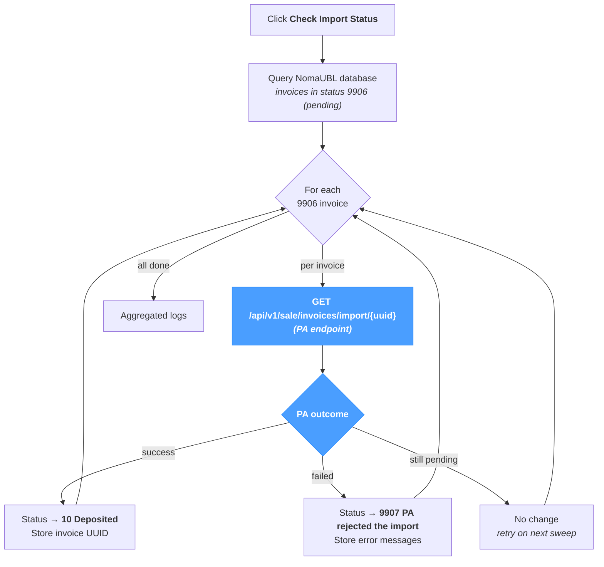

# Import

The **Import** screen confirms that invoices submitted to the Plateforme Agréée have actually been imported on the PA side. It is **not** the lifecycle / status retrieval flow (that runs separately — see *Sync → Retrieve Statuses*) but the **async import confirmation** that follows a successful PA submission.

When a PA imports invoices **asynchronously**, a successful submission only puts the invoice in a local `9906` (pending) status — the PA acknowledges receipt but defers the import itself. The Import page polls the PA for every `9906` invoice and updates the local status with the actual import outcome.

The page applies regardless of source system — JD Edwards, SAP, NetSuite or a custom ERP — since the PA's async import behaviour is independent of the upstream that produced the invoice.

---

## Pipeline at a glance

Only invoices in `9906` are checked — those already at `10` or `9907` are skipped. Clicking the button several times is therefore safe: no invoice is processed twice and no duplicates are created.

---

## Why this page exists

Some Plateformes Agréées return a synchronous outcome on submission — the invoice's status moves directly from the local pre-submission state to a final PA-side state (`10`, `9907`, etc.) at submission time. Those PAs do not need this page.

Other PAs accept the submission immediately and import asynchronously: the invoice sits in `9906` (pending) on the local side until the PA's import worker has actually processed it. **For those PAs this page is the way to confirm the import** — without it, `9906` invoices stay pending forever locally even though the PA has long since accepted or rejected them.

---

## Status outcomes

The page only ever transitions invoices from `9906` to one of the three terminal-for-this-step states:

| From | PA reports | To | Side effects |
|---|---|---|---|
| `9906` (pending) | success | `10` (Deposited) | The PA-assigned invoice UUID is stored on the local record. |
| `9906` (pending) | failed | `9907` (PA rejected the import) | Error messages returned by the PA are stored on the local record. |
| `9906` (pending) | still pending | `9906` (unchanged) | No update — the next sweep will check again. |

A `9907` is **not** a Schematron / XSD failure (those block submission before reaching the PA's import worker, and result in a different status). `9907` covers PA-side acceptance issues that the PA only surfaces at import time.

See the [Status Reference](../references/status-reference.mdx) for the meaning of each code.

---

## Run

A single section, a single button.

| Element | Description |
|---|---|
| **Check Import Status** | Triggers the sweep. Disabled while a sweep is in progress. |
| **Status line** | Inline feedback below the button — green on success, red on failure. |

The page has no parameters: every `9906` invoice is checked in the same call. There is no per-invoice selection — for that, use *Application → E-Invoicing* and trigger a re-submission via the per-row actions.

---

## Results

The **Results** section shows the structured log table — one row per invoice processed, plus pipeline-level events. The columns match the rest of NomaUBL's log tables (`Severity / Module / Submodule / Message`).

A successful sweep over a `9906` invoice typically logs at least:

- An `INFO` row noting which invoice was checked.
- A `SUCCESS` (transition to `10`), `WARNING` (transition to `9907`) or `INFO` (still pending) row carrying the PA's response.

When the PA call fails for transport reasons (network, timeout, credentials), the page logs an `ERROR` row and leaves the invoice in `9906` — a subsequent sweep will retry.

---

## Tips & best practices

- **Schedule the sweep.** The *background scheduler* in NomaUBL can run this page periodically — see the `fetchImportInterval` property of the *e-invoicing* template (a value in minutes; `0` disables the scheduler). For PAs with async import, scheduling every 5–15 minutes is a typical setup.
- **A sweep does not generate duplicate submissions.** It only reads — the PA returns the import outcome of an already-submitted invoice. Running it manually after the scheduler is safe.
- **`9907` invoices need the corrective action elsewhere.** This page only reports the rejection; resolving it (correcting the data, then re-submitting) is done from *Application → E-Invoicing → Resend* or via *Process → UBL* on the corrected file.
- **Keep this page distinct from *Retrieve Statuses*.** *Retrieve Statuses* handles the lifecycle codes (200, 201, 206, 207, 210, 213, …) emitted by the PA after the import is complete. *Import* only handles the async confirmation step (9906 → 10 / 9907). Both can run on the same scheduler with different intervals.
- **A long-pending `9906` is a flag.** If an invoice stays in `9906` for hours despite repeated sweeps, the PA has likely lost the submission or the `uuid` does not resolve on the PA side. Inspect the PA's own dashboard before assuming a NomaUBL bug.
