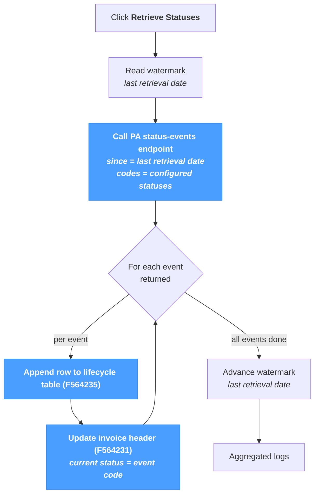

# Retrieve Statuses

The **Retrieve Statuses** screen pulls **invoice lifecycle events** from the Plateforme Agréée — the status codes defined by the French e-invoicing reform (XP Z12-012): `200` Submitted, `201` Acknowledged, `206` Partially approved, `207` Disputed, `210` Refused, `213` Rejected, and the rest of the lifecycle. Each event is appended to the local lifecycle table and the invoice's current status is updated.

This screen is **distinct from *Sync → Import***:

- *Sync → Import* handles the **async import confirmation** that follows a successful submission (`9906` → `10` / `9907`).
- *Retrieve Statuses* handles the **lifecycle codes** the PA emits *after* the import is complete (`200`, `201`, `206`, `207`, `210`, `213`, …).

Both can run on the same scheduler with independent intervals — see *Tips* below.

The page applies regardless of source system — JD Edwards, SAP, NetSuite or a custom ERP — since the lifecycle reporting is a PA-side responsibility.

---

## Pipeline at a glance

Each run reads only the events newer than the watermark and advances it after a successful sweep — the next run picks up exactly where this one stopped.

---

## How it works

Each click runs four steps:

1. **Read the watermark.** The last retrieval date is stored in the *e-invoicing* template configuration. It is used as the `since` parameter of the PA call.
2. **Call the PA status-events endpoint.** The list of status codes to subscribe to is configured in the same template (the *configured status names*). By default it matches the standard XP Z12-012 set; only the codes in the configured list are returned.
3. **Apply each event.** For every event the PA returns:
   - A new row is appended to the **lifecycle table** (`F564235`) — this builds the full audit trail of every status the invoice has been through.
   - The **invoice header** (`F564231`) is updated so the *current status* on the invoice list matches the latest event.
4. **Advance the watermark.** The `lastRetrievalDate` value in the template is updated to the timestamp of the latest event received. The next run starts from there.

The lifecycle table is **append-only**: each event adds a row, no row is ever modified or removed. Re-running the retrieval cannot create duplicates because the watermark only ever moves forward.

---

## Status codes retrieved

The lifecycle covers the **post-submission** codes from XP Z12-012 — `200` to `228`, plus `500` / `501`. The full list is documented in the [Status Reference](../references/status-reference.mdx); the set actually retrieved by each run is governed by the *configured status names* property of the *e-invoicing* template.

Common subsets:

- **All-codes** *(default)* — subscribes to every code in the standard reference list. Suitable for any deployment that needs full traceability.
- **Mandatory-only** — limits retrieval to the PPF-mandatory codes (`200`, `201`, `213` …). Reduces the volume on very high-throughput installations where intermediate statuses are not consumed downstream.

The `9906` / `9907` codes are **not** part of this retrieval — those are local NomaUBL statuses tied to the async-import confirmation flow handled by *Sync → Import*.

---

## Run

A single section, a single button.

| Element | Description |
|---|---|
| **Retrieve Statuses** | Triggers the retrieval. Disabled while a run is in progress. |
| **Status line** | Inline feedback below the button — green on success, red on failure. |

The page has no parameters: every event newer than the watermark, for every code in the configured list, is fetched in the same call. There is no per-invoice scope.

---

## Results

The **Results** section shows the structured log table — one row per event applied, plus pipeline-level events. The columns match the rest of NomaUBL's log tables (`Severity / Module / Submodule / Message`).

Typical log content for a successful run:

- An `INFO` row reporting how many events were returned by the PA.
- One `INFO` or `SUCCESS` row per event applied — invoice key + new status code.
- A final `INFO` row reporting the new watermark date.

When the PA call fails for transport reasons (network, timeout, credentials), the page logs an `ERROR` row and leaves the watermark unchanged — the next run retries from the same `since` date.

---

## Tips & best practices

- **Schedule the retrieval.** The *background scheduler* in NomaUBL can run this page periodically — see the `fetchStatusInterval` property of the *e-invoicing* template (a value in minutes; `0` disables the scheduler). Every 15 minutes to 1 hour is typical.
- **Distinct from *Sync → Import*.** *Import* handles the post-submission `9906` → `10` / `9907` async confirmation; *Retrieve Statuses* handles the lifecycle codes the PA emits afterwards. Both can run on the same scheduler with different intervals.
- **The watermark only ever moves forward.** Re-running the page has no effect on already-applied events. To replay a window (e.g. after restoring an old database backup), lower `lastRetrievalDate` manually in the *e-invoicing* template — the next run will re-pull every event since that date.
- **Trim the configured status names if volume is an issue.** The default set covers every reform code; high-throughput installations that only need the PPF-mandatory codes can shrink the list to reduce PA-side and local-side load.
- **The lifecycle is the audit trail.** The lifecycle table (`F564235`) is append-only and represents the complete history; the invoice header (`F564231`) only carries the most recent status. Use the lifecycle when investigating disputes or chasing a missing PA-side update.
