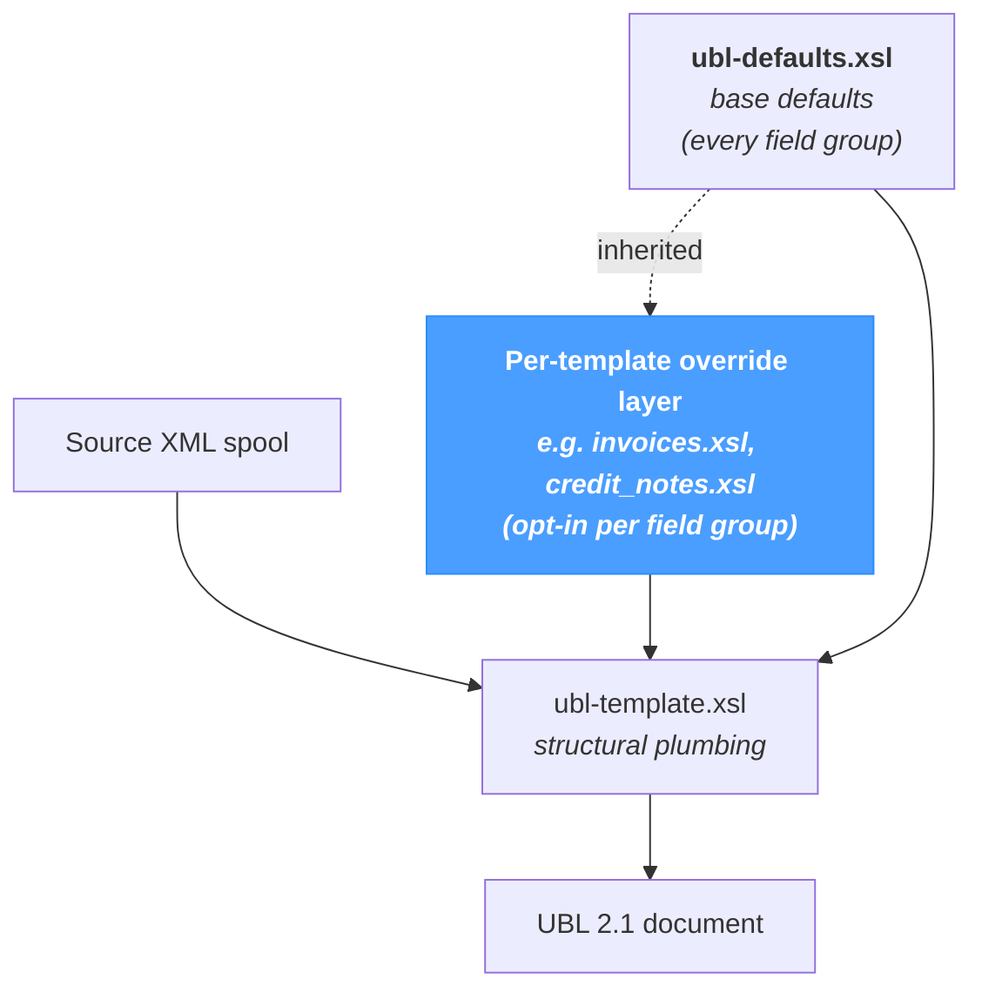

# UBL Defaults — Overview

The **UBL Defaults** screen is NomaUBL's *default-and-override* system for UBL document generation. It separates concerns:

- A **base defaults file** (`ubl-defaults.xsl`) holds the values that apply to every generated UBL document — UBL version, scheme IDs, payment code mapping, VAT categories, supplier directory, French legal notes, and so on.
- An optional **override layer** lets a specific transform (e.g. `invoices.xsl`, `credit_notes.xsl`) deviate from the defaults — field group by field group — without duplicating the entire configuration.

The page applies regardless of source system — JD Edwards, SAP, NetSuite or a custom ERP. The defaults file is part of NomaUBL's shared XSL and applies to every transform produced via the *XSL Editor*.

---

## How values resolve

For each field group (header, payment codes, VAT categories, suppliers, notes, etc.):

- If the per-template **override is disabled**, the value from `ubl-defaults.xsl` is used.
- If the per-template **override is enabled**, the override value is used and the defaults value is ignored for that group.

Override is **all-or-nothing per field group**: a tab is either fully inherited or fully overridden. There is no partial-override granularity inside a tab.

---

## Page modes

A file picker at the top of the page switches the editor between two modes:

| Selection | Mode | What gets edited |
|---|---|---|
| `Defaults file` | **Defaults mode** | `ubl-defaults.xsl` itself. Changes here propagate to every transform that does not override the field group. |
| Any other `.xsl` file | **Document mode** | The override layer for the chosen template. Each tab can be enabled or disabled independently. |

In document mode, every tab carries an **override banner**:

| Banner state | Meaning | Action button |
|---|---|---|
| `Using defaults` | The field group is inherited from `ubl-defaults.xsl`; the form fields show the defaults values (read-only context). | **Override for this document** — copies the current defaults into the document file as a starting point. |
| `Using override` | The field group has its own values in the document file; edits are persisted there. | **Remove override** — deletes the override block; the document falls back to defaults. |

Removing an override deletes the override block entirely — there is no soft "disable while keeping the values" mode. The document reverts to inheriting from `ubl-defaults.xsl`.

---

## What each tab covers

Every tab holds one independently-overridable field group. The pages that follow document each tab in detail; the table below maps tab to scope at a glance.

| Tab | UBL area | What is configured |
|---|---|---|
| [**Header**](./ubl-header-defaults.md) | Document header | UBL version, customization ID, default country, date input format. |
| [**Scheme IDs**](./scheme-ids.md) | Identifier schemes | SIREN / SIRET / GLN / endpoint / delivery scheme IDs. |
| [**Invoice Type**](./invoice-type.md) | BT-3 | Default invoice type code + rule-based selection. |
| [**Business Process Type**](./business-process-type.md) | BT-23 | Default Cadre de facturation (goods / services / mixed nature + lifecycle stage) + rule-based selection. |
| [**Payment Code Mapping**](./payment-code-mapping.md) | BT-81 | Default payment means + source → UBL code mapping. |
| [**Unit of Measure Mapping**](./unit-of-measure-mapping.md) | BT-129 | Default unit + source → UN/ECE Recommendation 20 code mapping. |
| [**Currency Code Mapping**](./currency-code-mapping.md) | BT-5 | Default currency + source → ISO 4217 code mapping. |
| [**Document Type / BAR Routing**](./document-type-bar-routing.md) | BG-25 | B2B routing code mapping. |
| [**VAT Categories**](./vat-categories.md) | BT-118 / BT-121 | Default VAT category, zero rate, category code and `VATEX-*` exemption mappings. |
| [**Suppliers / Companies**](./suppliers-companies.md) | BG-4 | Supplier company directory (default + alternates). |
| [**French Legal Notes**](./french-legal-notes.md) | BT-22 | Templates for French regulatory notes (payment delay, recovery fee, general terms…). |

---

## Save behaviour

A single **Save** button in the page header writes to the file matching the current mode:

- **Defaults mode** — writes `ubl-defaults.xsl`.
- **Document mode** — writes the selected template's `.xsl` (only the override layer is rewritten; the rest of the file is left untouched).

There is no auto-save; unsaved edits are lost on a page reload or file switch.

---

## Tips & best practices

- **Edit the defaults first, document overrides only when needed.** Most installations only require the defaults file. Document overrides are reserved for genuinely deviating cases — a template that uses a different default invoice type, a directory of alternate suppliers, etc.
- **An override is all-or-nothing per tab.** Toggling override on a tab brings the entire field group into the document file. Plan accordingly: if only one row of a mapping needs to change, the whole mapping has to be carried along.
- **Reference lists drive the dropdowns.** Many tabs (payment, units, countries, currencies, scheme IDs, invoice types, profile IDs, VAT categories) read their option lists from reference lists configured in *Configuration → Reference Lists*. Add a code there if it is missing in a dropdown.
- **The defaults file is shared across every transform.** Any change there is read by every `.xsl` that does not override the touched field group — including hand-written transforms outside the *XSL Editor*.
- **Document files are listed automatically.** Every `.xsl` file in the configured XSL directory (`e-invoicing.ublXslt`) appears in the file picker, except the three shared files (`ubl-defaults.xsl`, `ubl-common.xsl`, `ubl-template.xsl`) which are filtered out — they hold core plumbing and are not meant to be edited as overrides.
