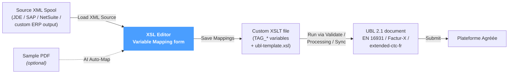
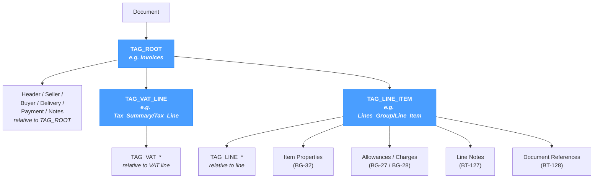

# XSL Editor

The **XSL Editor** is the cornerstone of NomaUBL's source-to-UBL mapping. It turns the daunting task of writing a UBL transformation by hand into a guided, **form-based mapping** between the fields of a source XML spool and the business terms (BT codes) of a UBL 2.1 invoice.

The page applies regardless of source system — JD Edwards, SAP, NetSuite or a custom ERP. The same editor works against any well-formed XML spool that carries invoice data.

---

## What the editor does

A NomaUBL transform is just an XSLT file that derives `TAG_*` variables from the source XML; the rest of the work — namespaces, element ordering, EN 16931 conformance, French extensions — is delegated to a shared `ubl-template.xsl` provided by NomaUBL. Customising a transform therefore boils down to **mapping XML paths to TAG_ variables**, which the editor surfaces as a form.

The editor never edits the UBL output directly — that would mean re-implementing EN 16931 every time. Instead, it edits the **mapping** that the UBL template will read; the template stays untouched.

---

## Toolbar

The page header carries a fixed toolbar:

| Element | Description |
|---|---|
| **File selector** | Drop-down listing every `.xsl` file found in the configured XSL directory (`e-invoicing.ublXslt`). Three shared NomaUBL files (`ubl-common.xsl`, `ubl-template.xsl`, `ubl-defaults.xsl`) are filtered out — they hold the core UBL plumbing and are not meant to be edited per template. |
| **Directory badge** | Displays the resolved XSL directory. Configured in *Configuration → System → e-invoicing → ublXslt*. |
| **Load** | Reads the selected file from disk into the editor (both tabs share the same buffer). |
| **New Transform** | Opens the *New Transform* modal — copies `ubl-template.xsl` to a new file name and selects it. Use this to bootstrap a per-customer or per-document-type transform. |

---

## Tabs

The editor exposes two tabs that operate on the same XSLT file. The left tab is the visual mapping form; the right tab is the raw XSLT source.

### Variable Mapping (default)

This is the form-based mapping editor — the visual replacement for hand-written XSLT.

#### Action bar

| Button | Behaviour |
|---|---|
| **Load XML Source** | Loads a sample XML file (browser-side) and extracts every element path. Paths populate the picker dropdowns next to each variable field, so values can be filled by clicking rather than typing. |
| **AI Auto-Map** ✦ | Opens the *AI Auto-Map* modal. Provide a sample XML (and optionally a rendered PDF) — the AI returns a JSON mapping of `TAG_*` variables to XML paths, scoped correctly. See [AI Auto-Map](#ai-auto-map) below. |
| **Save Mappings** | Writes the current values of all `TAG_*` variables back into the XSLT file. The dot indicator (`●`) appears when mappings have changed but are not saved. |

#### Sections

The form is organised by UBL document area. Each section appears only when at least one of its `TAG_*` variables is present in the loaded XSLT — sections are not shown if the underlying template has no slot for them.

| Section | UBL area | Notable variables |
|---|---|---|
| **Document Root** | Invoice group element name | `TAG_ROOT` — the XML element wrapping a single invoice. |
| **Invoice Header** | BT-1, BT-2, BT-3, BT-9, BT-10, BT-12, BT-13, BT-19 | Document number, dates, references. |
| **Billing References** | BT-11, BT-14 to BT-18, BT-122 to BT-124 | Project, contract, dispatch, supporting documents. |
| **Seller / Supplier** | BT-27 to BT-43 | Seller party identification, address, contact. |
| **Buyer / Customer** | BT-44 to BT-58, BT-163 | Buyer party identification, address, contact. |
| **Agent Party** | extended-ctc-fr | Optional intermediate agent party. |
| **Delivery** | BT-70 to BT-80 | Delivery date and address. |
| **Payment** | BT-20, BT-81 to BT-91 | Means, IBAN, BIC, mandate, terms. |
| **VAT** | BT-110, BT-116 to BT-121 | VAT breakdown rows — see [scoping](#scoping) below. |
| **Invoice Lines** | BT-126 to BT-161 | Line item details — see [scoping](#scoping) below. |
| **Item Properties** *(BG-32)* | BG-32 | Repeating product attributes attached to a line. |
| **Line Allowances/Charges** *(BG-27 / BG-28)* | BG-27 / BG-28 | Per-line discount or charge. |
| **Line Document References** *(BT-128)* | BT-128 | Per-line document references (with UNTDID 1153 scheme). |
| **Line Delivery** *(EXT-FR-FE-BG-10)* | French extension | Per-line delivery group. |
| **Line Notes** *(BT-127)* | BT-127 | Free-text notes attached to a line. |
| **Invoice Notes** *(BT-22)* | BT-22 | Document-level free-text notes. |
| **Loop Notes** | BT-22 | Repeating note groups at document level. |

Each variable field shows the human-readable description of the BT, the BT code as a coloured badge, the current value (an XML path or expression), and a `↓` picker that opens the [XML Browser drawer](#xml-browser-drawer) on the right.

#### Scoping

`TAG_ROOT`, `TAG_VAT_LINE` and `TAG_LINE_ITEM` are **scope contexts**: every other variable below them resolves *relative* to the path they define.

A blue scope hint banner appears below each context variable to remind which prefix is currently active. The XML Browser drawer also filters its entries to that scope so the path picker only shows what is actually addressable from the current context.

#### XML Browser drawer

When **Load XML Source** has been used, clicking the `↓` button next to any field opens an **XML Browser drawer** along the right edge of the page. The drawer lists every element path inside the current scope along with its sample value, so the right path can be picked by inspection rather than by typing. Closing the drawer leaves the editor in its previous state.

### XSL Editor

The right-hand tab opens the same file in a full **Monaco editor** (the engine VS Code uses) with XML syntax highlighting, line numbers, and a minimap. Use this tab when the form does not cover what is needed:

- Custom XPath expressions outside of TAG_ variables.
- Conditional logic via `<xsl:if>` / `<xsl:choose>`.
- Calling templates defined in `ubl-common.xsl`.
- Inspecting how the form's mappings end up serialised.

The save button shows a `●` dot when the buffer differs from the on-disk file.

---

## AI Auto-Map

The AI Auto-Map modal is a shortcut for building a fresh mapping from scratch.

| Field | Description |
|---|---|
| **Upload XML from computer** | Loads the source XML spool sample. |
| **Upload PDF** *(optional)* | Loads a rendered PDF of the same invoice. The AI uses it as a visual reference to disambiguate fields. |
| **Invoice root element** | The XML element wrapping a single invoice (e.g. `Invoices`). Pre-filled from the loaded XML's root, editable. |
| **XML content** | The XML spool body. Auto-populated by the upload, editable manually. |

Click **Auto-Map** to send the XML (and PDF if any) to the AI, along with the list of `TAG_*` variables and their BT/BG context. The AI returns a JSON mapping that respects the scoping rules (paths relative to `TAG_ROOT`, line-relative paths inside `TAG_LINE_ITEM`, etc.). The mapping is merged into the form; review and click **Save Mappings** to commit.

The AI is conservative — it omits any variable it is not confident about rather than guessing. Manual review remains necessary; the editor speeds up the work, it does not replace expertise.

---

## New Transform

The *New Transform* modal copies `ubl-template.xsl` to a new file name in the same XSL directory.

| Field | Description |
|---|---|
| **File name (without .xsl)** | The new transform's basename. The `.xsl` extension is added automatically. |

After creation, the new file becomes the selected file and is loaded into the editor — ready for mapping.

---

## Tips & best practices

- **Start with AI Auto-Map on a representative sample.** It usually covers 70–90% of the mapping in one pass; the remaining work is review and edge cases.
- **Always provide a sample XML before mapping.** With **Load XML Source** active, the picker dropdowns shrink the manual typing dramatically and prevent typos.
- **Set TAG_ROOT, TAG_VAT_LINE and TAG_LINE_ITEM first.** All other fields resolve relative to those scopes; setting them first makes every subsequent picker correctly scoped.
- **One transform per source layout.** Different source systems — or different document types from the same system — usually warrant their own `.xsl`. Use *New Transform* to bootstrap rather than copy-paste in the file system.
- **Do not edit the shared files.** `ubl-common.xsl`, `ubl-template.xsl` and `ubl-defaults.xsl` are filtered out of the file selector for a reason: changes there break every transform and may not survive a NomaUBL upgrade.
- **Use the XSL Editor tab for what the form does not cover.** Conditional logic, custom XPath, named templates — Monaco gives the full power of XSLT 1.0 / 2.0 alongside the form's mappings.
- **Validate after every mapping change.** Use *UBL Tools → Validate* with `Source = XML` to run the transformation and the Schematron rules in one pass; the log table flags any wrong path or missing variable.
