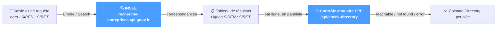

# E-Directory

L'écran **E-Directory** est l'outil de recherche utilisateur pour retrouver une société française dans le **référentiel INSEE** (`recherche-entreprises.api.gouv.fr`) et vérifier si les SIREN / SIRET correspondants sont **joignables sur l'annuaire PPF** pour la réception de factures électroniques.

Utilisations courantes :

- Récupérer le SIREN / SIRET exact d'un client avant d'émettre une facture.
- Vérifier qu'un acheteur est bien enregistré sur la Plateforme Publique de Facturation (PPF) et prêt à recevoir une facture électronique.
- Diagnostiquer un rejet d'adressage (par ex. `REJ_ADR`) en confirmant l'état dans l'annuaire pour un identifiant donné.

La page fonctionne quel que soit le système source — JD Edwards, SAP, NetSuite ou un ERP personnalisé.

Les deux recherches sous-jacentes sont indépendantes et jouent des rôles distincts :

- **Recherche INSEE** — confirme l'existence de la société et fournit raison sociale, adresse, état administratif. API publique gratuite, aucun identifiant requis.
- **Contrôle annuaire PPF** — vérifie que le SIREN / SIRET est inscrit comme destinataire sur la Plateforme Publique de Facturation. Utilise les identifiants configurés dans *Configuration → System → e-directory*.

Voir la page [Configuration → System → e-directory](../configuration/system/edirectory.md) pour le contexte global — identifiants, rôles de recherche et distinction PPF / INSEE.

---

## Déroulement d'une recherche

Les deux interrogations se succèdent : INSEE d'abord pour peupler les lignes, puis le contrôle PPF en parallèle, ligne par ligne. L'utilisateur voit le tableau se compléter en deux passes.

---

## Section de recherche

Un seul champ et un bouton en haut de la page.

| Élément | Comportement |
|---|---|
| **Champ de recherche** | Texte libre : nom de société, nom partiel, SIREN, SIRET ou toute combinaison. Validation par **Entrée** ou par le bouton **Search**. |
| **Bouton Search** | Déclenche la recherche INSEE. Désactivé pendant l'exécution et lorsque le champ est vide. |

La requête est envoyée à `recherche-entreprises.api.gouv.fr` côté serveur ; l'API retourne les sociétés correspondantes avec leurs données complètes.

---

## Tableau des résultats

Après la recherche, le tableau se peuple à raison d'une ligne par correspondance. Chaque ligne correspond soit à un SIREN (entité juridique), soit à un SIRET (établissement spécifique).

| Colonne | Description |
|---|---|
| **Type** | Badge coloré — `SIREN` (bleu, entité juridique) ou `SIRET` (gris, établissement). |
| **Identifier** | SIREN à 9 chiffres ou SIRET à 14 chiffres. |
| **Name** | Raison sociale (`nom_raison_sociale`). |
| **Address** | Adresse postale complète de l'établissement. |
| **State** | `Active` (vert) lorsque l'établissement est administrativement actif ; `C` (rouge) lorsqu'il est cessé. |
| **Directory** | Résultat du contrôle annuaire PPF — voir ci-dessous. |

### États du contrôle annuaire

La colonne Directory se peuple automatiquement dès la fin de la recherche — un appel PPF par ligne. Pendant l'exécution, les lignes affichent un spinner. Chaque ligne se résout à terme sur :

✓Reachable— Inscrit sur le PPF, prêt à recevoir des factures électroniques.

✗Not found— Absent de l'annuaire PPF ; une facture serait retournée avec une erreur de routage (REJ_ADR).

⚠Error— L'appel PPF a échoué (réseau, identifiants). Le message de l'API s'affiche à côté de l'icône.

⟳Loading— Appel PPF en cours ; la ligne se résoudra sur l'un des états ci-dessus.

---

## Compteur de résultats

Au-dessus du tableau, un petit libellé indique le nombre de résultats renvoyés par INSEE pour la requête (par ex. `12 results`).

---

## Conseils & bonnes pratiques

- **Rechercher d'abord par nom, puis affiner.** INSEE retourne l'entité juridique (SIREN) et ses établissements (SIRET) — sélectionner le bon SIRET évite l'erreur courante « bon SIREN, mauvais établissement » à l'émission d'une facture.
- **Un Not found rouge n'est pas toujours définitif.** Un acheteur peut ne pas encore être enregistré sur le PPF ; lui demander de s'inscrire avant de retenter. L'état de l'annuaire évolue chaque jour à mesure que les sociétés s'inscrivent sur le PPF.
- **Vérifier l'état actif.** Un établissement cessé ne peut pas recevoir de facture, même s'il apparaît dans l'annuaire PPF. Toujours contrôler la colonne State avant de se fier à un mapping d'adresse électronique.
- **Pour des recherches en lot, préférer l'API.** Cette page traite une requête à la fois. Pour valider un annuaire de clients en une passe, appeler directement `/api/insee-search` et `/api/check-directory` — voir *References → API Reference* pour les schémas.
- **Une erreur d'annuaire signale souvent un souci d'identifiants.** Des `Error` répétés sur des lignes qui devraient répondre proviennent typiquement d'identifiants PPF mal configurés dans *Configuration → System → e-directory* — corriger là avant de relancer la recherche.
