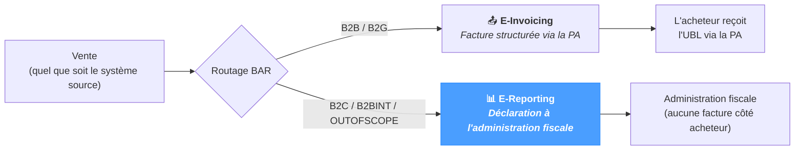

# E-Reporting

L'écran **E-Reporting** est le point d'entrée du futur **workflow d'e-reporting** de NomaUBL — les déclarations que le vendeur doit transmettre à l'administration fiscale pour les transactions situées *hors* du flux de facturation électronique :

- **Transactions B2C** — ventes à des particuliers.
- **Transactions B2B intra-UE** — ventes à un acheteur d'un autre État membre de l'UE.
- **Exports et autres opérations hors périmètre** — ventes hors UE, flux internes intra-groupe, etc.

Pour ces transactions, l'acheteur ne reçoit pas de facture structurée via la Plateforme Agréée ; le vendeur déclare néanmoins le chiffre d'affaires afin que l'administration fiscale puisse établir l'obligation de TVA. NomaUBL regroupe les transactions concernées et produit la déclaration.

La page fonctionne quel que soit le système source — JD Edwards, SAP, NetSuite ou un ERP personnalisé.

---

## Place de l'e-reporting

L'e-reporting est le volet **déclaratif** de la réforme française — le flux de facturation électronique transporte la facture B2B structurée, tandis que l'e-reporting couvre les transactions hors de ce flux mais à déclarer pour la TVA.

La règle de routage BAR définie dans *UBL Defaults → Document Type / BAR Routing* pilote l'aiguillage — la définir correctement dès maintenant prépare les données à la future page d'e-reporting.

---

## État actuel

L'écran affiche pour le moment un message d'attente — **E-Reporting functionalities coming soon**. Le workflow complet (sélection des transactions, mise en forme de la déclaration, dépôt sur le PPF, suivi du cycle de vie) est en cours d'implémentation ; cette page sera étoffée à mesure que la fonctionnalité avance.

En attendant :

- **Les transactions B2C / OUTOFSCOPE sont déjà correctement aiguillées** via la configuration de *UBL Defaults → Document Type / BAR Routing*. Positionner le BAR d'un document sur `B2C` ou `OUTOFSCOPE` l'exclut du flux de dépôt PA standard — les transactions s'accumulent en base pour la future déclaration d'e-reporting.
- **Les codes Cadre de facturation `B7` / `S7`** dans *UBL Defaults → Business Process Type* identifient les factures « avec e-reporting (TVA déjà collectée) » — schéma typique pour les factures B2C nécessitant un enregistrement textuel sans dépôt PA.
- **Les transactions de la liste E-Invoicing avec BAR = `B2C`** se filtrent via la déroulante BAR routing de *Application → E-Invoicing*. Leur cycle de vie reste consultable, mais aucun import ni récupération de statut PA ne s'applique.

---

## Conseils & bonnes pratiques

- **Configurer le routage dès maintenant, avant la livraison de la page.** Définir les règles BAR et le bon Cadre de facturation (`B7` / `S7`) sur les types de documents concernés permet d'avoir les données déjà correctement classifiées au moment où la fonctionnalité d'e-reporting sera disponible — pas de nettoyage rétroactif à prévoir.
- **Suivre les notes de version.** Le workflow d'e-reporting fait partie de la réforme française de la facturation électronique au sens large ; cette page évoluera au fur et à mesure que la réglementation précise ses exigences (calendrier prévu : septembre 2026 pour la première vague des grandes entreprises).
- **Ne pas utiliser *Set status → DB* sur les factures B2C** pour les marquer comme « déclarées ». La future déclaration d'e-reporting calculera son propre état — un statut local manuel risque d'être écrasé à la prochaine synchronisation.
