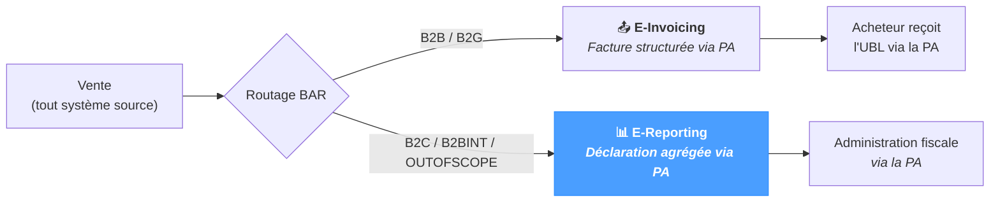

# E-Reporting

L'écran **E-Reporting** est le point d'entrée opérationnel du **workflow d'e-reporting** de NomaUBL — la voie déclarative de la *Réforme de la Facturation Électronique* (RFE). Là où *E-Invoicing* dépose une facture structurée vers la Plateforme Agréée du destinataire, *E-Reporting* dépose une **déclaration agrégée** à destination de l'administration fiscale via cette même PA — pour les transactions qui sortent du périmètre de l'e-invoicing :

- **Transactions B2C** — ventes à des particuliers.
- **Transactions B2B intra-UE** — ventes à un acheteur d'un autre État membre.
- **Exports et autres transactions hors périmètre** — ventes à des acheteurs hors UE, flux internes inter-sociétés, etc.

Pour ces transactions l'acheteur ne reçoit pas de facture structurée via la PA ; le vendeur déclare néanmoins le chiffre d'affaires pour permettre à l'administration fiscale de calculer la TVA due. NomaUBL regroupe les transactions, construit le XML correspondant, le dépose sur la PA et suit son cycle de vie.

La page fonctionne quel que soit le système source — JD Edwards, SAP, NetSuite ou un ERP personnalisé.

---

## Positionnement de l'e-reporting

L'e-reporting est la voie **déclarative** de la réforme — l'e-invoicing prend en charge la facture B2B structurée, l'e-reporting couvre tout ce qui ne passe pas par cette voie mais doit être déclaré pour la TVA.

La règle de routage BAR définie dans *UBL Defaults → Document Type / BAR Routing* pilote la répartition — la configurer correctement en amont garantit que les transactions appropriées atterrissent ici automatiquement.

---

## Deux flux, quatre types de document

La spécification française d'e-reporting définit **deux flux** sortants et **quatre types de document** qui précisent si le rapport est une soumission initiale ou une correction.

| Flux | Périmètre | Forme du contenu |
|---|---|---|
| **`10.1`** | Détail **B2C** | Un élément `<Invoice>` par facture B2C de la période. |
| **`10.3`** | **B2BINT / OUTOFSCOPE** agrégé | Blocs `<Transactions>` agrégés par *(catégorie TVA, taux, devise)*. |

| Code | Signification | Cas d'usage type |
|---|---|---|
| **`IN`** | **Initial** | Première déclaration de la période — valeur par défaut. |
| **`RE`** | **Remplacement** | Remplace une déclaration précédente sur la même période après correction. |
| **`CO`** | **Annulation** | Annule une déclaration précédente (par ex. soumise par erreur). |
| **`MO`** | **Modification** | Ajuste certaines lignes d'une déclaration précédente sans remplacement complet. |

Les rapports suivent une **fréquence** configurable — `MONTHLY` (mois calendaire, défaut), `DECADAL` (1-10, 11-20, 21-fin de mois) ou `WEEKLY` (semaine ISO, lundi → dimanche) — définie dans le template *e-reporting* de `config.json`.

---

## Barre d'outils

La barre d'outils au-dessus du tableau combine trois filtres texte avec deux raccourcis.

  

    Société
    Flux
    Statut
    ↻ Refresh
    
    Generate report
  

| Champ | Critère |
|---|---|
| **Société** | Code société (`Kco`) auquel le rapport est rattaché (par ex. `00070`). |
| **Flux** | Code de flux — `10.1` (B2C) ou `10.3` (B2BINT). |
| **Statut** | Recherche libre sur le code ou le libellé du statut courant. |
| **Refresh** | Relance la requête courante sans modifier les filtres. |
| **Generate report** | Ouvre la *modale de génération* — décrite plus bas. Masquée pour les sessions en lecture seule. |

---

## Liste des rapports

Le tableau affiche une ligne par rapport. Tri par défaut : `RGDOC` décroissant. Cliquer sur un en-tête de colonne pour trier ; cliquer sur une ligne ouvre la **modale de détail**.

  

    
ID

Flux

Société

Type

Période

    
Factures

Statut

UUID PA

Création

  

  

    
1042

10.1

00070

IN

2026-04-01 → 2026-04-30

    
142

    
200 Déposée

    
a1b2c3d4…f9e8

    
2026-05-02 09:30

  

  

    
1041

10.3

00070

IN

2026-04-01 → 2026-04-30

    
38

    
200 Déposée

    
f6a7b8c9…d4e5

    
2026-05-02 09:31

  

  

    
1040

10.1

00070

RE

2026-03-01 → 2026-03-31

    
12

    
9906 Attente PA

    
—

    
2026-04-15 14:22

  

  

    
1039

10.3

00080

IN

2026-03-01 → 2026-03-31

    
27

    
213 Rejetée

    
9d8e7f6a…2b1c

    
2026-04-02 11:15

  

### Colonnes par défaut

| Colonne | Description |
|---|---|
| **ID** | Identifiant interne du rapport (`RGDOC`). Auto-incrémenté. |
| **Flux** | `10.1` (détail B2C) ou `10.3` (B2BINT agrégé). |
| **Société** | Code société (`Kco`) auquel le rapport s'applique. |
| **Type** | Type de document — `IN` / `RE` / `CO` / `MO`. |
| **Période** | Plage déclarative — `début → fin` (ISO 8601). |
| **Factures** | Nombre de factures sources incluses dans le rapport. |
| **Statut** | Badge du statut courant — code + libellé, coloré par famille. |
| **UUID PA** | Identifiant unique renvoyé par la PA après acceptation. Tronqué à `8…8` ; valeur complète au survol. |
| **Création** | Horodatage de génération. |

Un sélecteur de taille de page en bas du tableau vaut 50 par défaut ; des valeurs jusqu'à 500 sont acceptées. Le nombre total de rapports correspondants figure à côté de la pagination.

### Export CSV

Le bouton standard `Export` de la barre d'outils exporte la vue courante (filtres compris) au format CSV sous le nom `ereporting.csv`.

---

## Modale de détail

Cliquer sur une ligne ouvre une modale comportant trois onglets en haut : **Header**, **Invoices**, **History**. Le titre de la modale affiche le triplet `Flux / Kco / Rgdoc`.

  

    
Détail rapport — 10.1 / 00070 / 1042

    

      ⬇ Download XML
      Resend to PA
      ✕
    

  

  

    
Header

    
Invoices (142)

    
History (3)

  

  
Contenu de l'onglet — varie selon l'onglet actif

### Onglet Header *(défaut)*

Grille des champs résumant l'identité du rapport et le résultat du dépôt.

| Champ | Description |
|---|---|
| **RGDOC** | Identifiant interne du rapport. |
| **FLUX** | `10.1` ou `10.3`. |
| **KCO** | Code société. |
| **Type** | `IN` / `RE` / `CO` / `MO`. |
| **Period start / end** | Dates ISO 8601 délimitant la fenêtre déclarative. |
| **Sender** | Matricule du transmetteur, schéma `0238` — typiquement l'entité enregistrée auprès de la PA. |
| **Issuer** | Identifiant de l'émetteur légal, schéma `0002` (SIREN). |
| **PA UUID** | Identifiant retourné par la PA à l'acceptation. Vide tant que le rapport n'a pas été accepté. |
| **Status** | Statut courant du cycle de vie — code + libellé. |
| **Status message** | Dernier message renvoyé par la PA — typiquement le motif de rejet pour les soumissions échouées. |
| **Invoices** | Nombre de factures sources incluses dans le rapport. |
| **Created** | Horodatage de génération. |

### Onglet Invoices

Vue tabulaire de chaque facture source incluse dans le rapport. Les colonnes correspondent à l'enregistrement e-invoicing sous-jacent, ce qui permet de croiser le rapport et ses sources.

| Colonne | Description |
|---|---|
| **Number** | Numéro de facture — `BT-1` lorsqu'il est renseigné, sinon `DOC/DCT/KCO`. |
| **Date** | Date d'émission (`BT-2`). |
| **BAR** | Code de routage BAR porté par la facture (`B2C`, `B2BINT`, `OUTOFSCOPE`, …). |
| **Customer** | Nom de la partie acheteur. |
| **HT** | Montant total hors taxes. |
| **VAT** | Montant total de la TVA. |
| **TTC** | Montant total toutes taxes comprises. |
| **CCY** | Code devise ISO 4217. |

La liste reflète l'état persisté au moment de la génération — relancer un rapport (`RE`) ne remodèle pas rétroactivement la vue de l'`IN` précédent.

### Onglet History

Le **cycle de vie** du rapport — chaque statut traversé, en ajout uniquement, dans l'ordre de soumission.

| Colonne | Description |
|---|---|
| **#** | Numéro de séquence — `1` correspond à l'état initial à la génération, les lignes suivantes sont les événements renvoyés par la PA. |
| **Status** | Code + libellé du statut (par ex. `9906 Attente import PA`, `200 Déposée`, `213 Rejetée`). |
| **Message** | Texte libre renvoyé par la PA — typiquement le motif de rejet ou la note d'acceptation. |
| **Date** | Horodatage de l'événement. |

Le cycle de vie est en lecture seule ici ; la seule action disponible est **Resend to PA** dans l'en-tête de la modale, qui ajoute un nouvel événement après un redépôt réussi.

### Actions de l'en-tête

| Bouton | Comportement |
|---|---|
| **Download XML** | Télécharge le XML formaté du rapport (motif de nom `ereporting-<flux>-<kco>-<rgdoc>.xml`). Le XML est mis en forme lorsque possible, sinon le contenu stocké brut est conservé. |
| **Resend to PA** | Redépose le XML existant sur la Plateforme Agréée. Utile après une erreur PA transitoire. Masqué pour les sessions en lecture seule. Le cycle de vie est mis à jour avec le résultat du nouveau dépôt. |
| **Fermer** *(✕)* | Ferme la modale sans modification. |

---

## Modale de génération

Ouverte via **Generate report** dans la barre d'outils. Construit et dépose un ou plusieurs rapports pour une combinaison société / flux / période choisie.

  

    
Générer un e-reporting

    ✕
  

  

    

      
Société (kco)

      
00070

      
Laisser vide pour appliquer à toutes les sociétés configurées.

    

    

      
Flux à générer

      

        10.1
        10.3
      

    

    

      
Type de document

      

        IN
        RE
        CO
        MO
      

    

    

      

        
Début de période

        
2026-04-01

      

      

        
Fin de période

        
2026-04-30

      

    

    

      📅 Calculer la période
    

  

  

    Annuler
    Générer
  

| Champ | Description |
|---|---|
| **Société (kco)** | Restreint la génération à une seule société. Laisser vide pour appliquer à **toutes** les sociétés déclarées dans le template *e-reporting*. |
| **Flux à générer** | Sélection multiple entre `10.1` et `10.3`. Les deux sont sélectionnés par défaut — un rapport est émis par flux actif. |
| **Type de document** | Une valeur parmi `IN` (initial), `RE` (remplacement), `CO` (annulation), `MO` (modification). Défaut : `IN`. |
| **Début / fin de période** | Dates ISO 8601 délimitant la fenêtre déclarative. |
| **Calculer la période** | Pré-remplit *Début* / *Fin* avec la prochaine fenêtre due selon la fréquence configurée (`MONTHLY` / `DECADAL` / `WEEKLY`). |
| **Annuler** | Ferme la modale sans générer. |
| **Générer** | Construit le XML pour chaque flux sélectionné, persiste la ligne du rapport et dépose sur la PA. La liste se rafraîchit en cas de succès. |

Après une exécution réussie, les nouveaux rapports apparaissent en tête de liste avec un statut `9906` (Attente d'import PA) qui progresse vers `200 Déposée` lorsque la PA accuse réception.

---

## Conseils & bonnes pratiques

- **Configurer le routage BAR en premier.** La liste des factures qui aboutit en flux 10.1 / 10.3 est pilotée par *UBL Defaults → Document Type / BAR Routing*. Une facture mal classée échappe aux *deux* voies — chaque type de document doit être rattaché à `B2B`, `B2G`, `B2C`, `B2BINT` ou `OUTOFSCOPE` avant la première génération.
- **Préférer *Calculer la période* à la saisie manuelle.** Cette option respecte la fréquence configurée dans le template *e-reporting*, donc la fenêtre suggérée correspond à l'échéance réglementaire (mois plein précédent pour `MONTHLY`, décade précédente pour `DECADAL`, semaine ISO précédente pour `WEEKLY`).
- **`IN` d'abord, puis `RE` pour les corrections.** Une facture arrivée tardivement ou un montant corrigé appelle un rapport `RE` couvrant la même période — ne jamais ré-émettre un `IN` sur une période déjà déclarée.
- **Réserver `CO` à l'annulation totale.** À utiliser lorsqu'une période entière a été déclarée par erreur ; les corrections partielles passent par `RE`.
- **L'UUID PA est l'accusé de réception.** Il reste vide entre la soumission et l'acceptation (statut `9906`), puis devient définitif à l'acceptation (statut `200`). C'est la preuve juridique de la déclaration en cas de contrôle.
- **Redéposer après une erreur PA transitoire, pas après un rejet Schematron.** Un statut `213` accompagné d'une erreur Schematron dans le *Status message* signale un défaut structurel — corriger les données BAR ou la facture en amont et générer un nouveau `RE`, plutôt que de redéposer à l'aveugle.
- **L'onglet Invoices est un instantané.** Il enregistre les factures sources telles qu'elles étaient au moment de la génération. Les modifications ultérieures n'altèrent pas rétroactivement le rapport déposé — elles apparaissent dans le `RE` suivant si elles sont matérielles.
