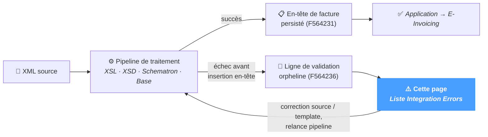

# Erreurs d'intégration

L'écran **Integration Errors** liste toutes les erreurs de validation ayant **empêché la création d'une facture**. Il s'agit d'entrées stockées dans la table de validation (`F564236`) **sans ligne correspondante dans la table d'en-tête** (`F564231`) — la transformation a échoué avant que l'en-tête puisse être persisté, le document n'est donc jamais entré dans la liste E-Invoicing.

Causes typiques d'une erreur d'intégration :

- Un XML source mal formé que la transformation XSL n'a pas pu consommer.
- Un champ UBL obligatoire absent ou illisible dans les données source.
- Un échec XSD ou Schematron suffisamment grave (`FATAL`) pour interrompre le pipeline avant l'insertion en base.

La page fonctionne quel que soit le système source — JD Edwards, SAP, NetSuite ou un ERP personnalisé.

C'est la **vue de surveillance systématique** de ces échecs. La carte compteur *Erreurs de validation non rattachées* du tableau de bord donne le coup d'œil rapide ; cette page est l'endroit où chaque ligne est instruite.

---

## Origine de ces erreurs

Une exécution réussie place la facture dans la liste *E-Invoicing* habituelle. Un échec survenu avant l'insertion de l'en-tête laisse uniquement une ligne de validation — c'est ce que cette page fait apparaître. Une fois la donnée source ou le template corrigé, la relance du pipeline crée soit l'en-tête (la ligne disparaît de cette vue), soit une nouvelle ligne orpheline (toujours listée).

---

## Barre d'outils

La barre d'outils en haut du tableau combine recherche texte et filtres de sévérité.

### Recherche

Un champ unique recherche dans les clés documentaires :

| Champ recherché |
|---|
| `DOC` (numéro de document) |
| `DCT` (type de document) |
| `KCO` (code société) |

La recherche est exécutée côté serveur et met la liste à jour à mesure que l'utilisateur saisit.

### Puces de sévérité

Une rangée de puces permet de filtrer par sévérité :

All
FATAL
ERROR
WARNING
INFO

| Puce | Signification |
|---|---|
| **All** | Pas de filtre — toutes les sévérités sont affichées. |
| **FATAL** | Erreur arrêtant le pipeline — la facture n'a pas pu être traitée du tout. |
| **ERROR** | Erreur bloquante — la facture aurait été rejetée par la PA. |
| **WARNING** | Anomalie non bloquante — informative ; la facture aurait pu être traitée avec réserves. |
| **INFO** | Événements informatifs. |

Cliquer sur une puce applique le filtre correspondant ; un nouveau clic le retire. Une seule sévérité peut être sélectionnée à la fois.

### Rafraîchir

Un bouton à flèche circulaire à droite relance la requête courante sans modifier les filtres.

---

## Liste d'erreurs

Le tableau affiche une ligne par erreur de validation. Tri par défaut : clé documentaire ascendante.

| Colonne | Description |
|---|---|
| **Doc** | Numéro de document de la source. |
| **Dct** | Type de document. |
| **Kco** | Code société. |
| **Seq** | Numéro de séquence — ordre dans lequel les règles de validation se sont déclenchées au cours du traitement défaillant. |
| **Severity** | Badge coloré — FATAL / ERROR / WARNING / INFO. |
| **Source** | Moteur de validation à l'origine de l'entrée — typiquement `XSD`, `Schematron`, ou un composant pipeline NomaUBL (`PROCESS`, `XSL`). |
| **Rule** | Identifiant de règle ou XPath ayant déclenché l'entrée (par ex. `BR-FR-12`, `cbc:CustomizationID`). |
| **Message** | Description lisible de l'échec. |

La pagination affiche 50 lignes par page par défaut ; le nombre total d'entrées correspondant aux filtres figure à côté de la pagination.

### Export

Un bouton **Export** dans la barre d'outils exporte la vue courante (filtres compris) au format CSV sous le nom `integration-errors.csv`.

---

## Comment instruire

La page est en lecture seule — l'instruction se fait en croisant les informations affichées avec le pipeline amont :

1. **Filtrer sur FATAL ou ERROR.** Ces lignes ont effectivement bloqué la facture. Les lignes WARNING / INFO sont surtout du bruit pour l'opérateur qui doit agir.
2. **Lire la règle et le message.** Une règle Schematron telle que `BR-FR-12` renvoie à une règle de l'extension française précise ; le message cite généralement l'élément en échec. Croiser avec la page [Codes motifs](../references/reason-codes.mdx).
3. **Ouvrir le XML source dans *UBL Tools → XML Viewer*** pour le triplet `DOC + DCT + KCO` — le fichier réside dans `dirInput/<template>/`. La lecture de la source confirme si l'échec relève des données (champ manquant) ou du template (bug du XSL).
4. **Relancer le pipeline une fois la source corrigée.** Utiliser *Processing → XML* avec `Mode = SINGLE` (ou `AUTO`) et le fichier corrigé. Une fois la facture persistée, elle quitte cette page pour rejoindre la liste *E-Invoicing* — et l'erreur d'intégration disparaît automatiquement de cette vue (la règle qui masque les erreurs disposant d'un en-tête correspondant s'en charge).

---

## Conseils & bonnes pratiques

- **Surveiller la puce FATAL en priorité.** Un compteur FATAL non nul signifie que le pipeline s'est interrompu — aucune facture n'a été créée. Les lignes ERROR signifient que la facture a été rejetée à la validation mais peut avoir laissé un dossier partiel.
- **Un compteur Erreurs d'intégration vert sur le tableau de bord est le signe d'un ingestion propre.** À vérifier dans le routine matinale ; une valeur non nulle avant le traitement des lots du jour est le signal canonique « à instruire en priorité ».
- **Utiliser la recherche pour cadrer par société.** Lorsqu'un pic est concentré sur un client ou un code société, rechercher par `KCO` réduit rapidement la liste. Souvent un seul changement côté source génère plusieurs lignes.
- **La colonne Severity dicte l'ordre d'instruction.** FATAL d'abord (ces lignes bloquent tout), puis ERROR (elles bloquent la facture concernée), enfin WARNING / INFO si l'opérateur souhaite nettoyer les entrées informatives.
- **Les erreurs disparaissent automatiquement après un ré-import réussi.** Relancer le fichier corrigé via *Processing → XML* ; dès que l'en-tête de facture est créé, la ligne disparaît de cette vue (l'entrée d'origine reste dans `F564236` pour l'audit, mais elle n'est plus « non rattachée »).
- **Pour des schémas systématiques, corriger le template, pas les données.** Des erreurs identiques répétées sur de nombreuses factures pointent généralement vers un bug de template / XSL. Ouvrir *UBL Tools → XSL Editor* et ajuster le mapping plutôt que de corriger chaque XML source à la main.
