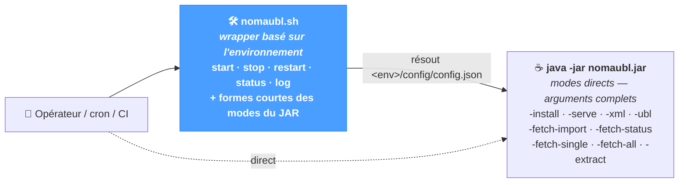

# Ligne de commande

NomaUBL fournit une **interface en ligne de commande** complète qui reproduit toutes les actions opérationnelles disponibles dans l'interface web — installer un environnement, démarrer le serveur HTTP, lancer un traitement XML ou UBL, interroger la Plateforme Agréée, extraire depuis JD Edwards. La CLI est le mode privilégié pour les **installations système**, les **intégrations cron / ordonnanceur**, les **pipelines CI** et tout **environnement headless** sans accès web.

La CLI fonctionne quel que soit le système source — JD Edwards, SAP, NetSuite ou un ERP personnalisé — à l'exception de quelques sous-commandes spécifiques à JD Edwards (`extract`, sources `bip` / `ftp` de `fetch-single` / `fetch-all`).

---

## Deux modes d'invocation

NomaUBL expose deux couches équivalentes — un **wrapper de contrôle de service** (`nomaubl.sh`) et les **modes directs du JAR** (`java -jar nomaubl.jar -…`). Le wrapper résout le fichier de configuration depuis un *nom d'environnement* court et ajoute les opérations `start` / `stop` / `restart` / `status` / `log` au-dessus du JAR.



| Couche | Quand l'utiliser |
|---|---|
| **`nomaubl.sh`** *(wrapper)* | Exploitation au quotidien sur un serveur hébergeant un ou plusieurs environnements. Gère un fichier PID par instance, prend le **nom d'environnement** au lieu du chemin de configuration complet, expose `start` / `stop` / `restart` / `status` / `log`. |
| **`java -jar nomaubl.jar`** *(direct)* | Déploiement de NomaUBL en conteneur, intégration à un pipeline CI, ou tout contexte qui gère déjà le cycle de vie du processus. Prend le **chemin absolu** vers `config.json`. |

Le wrapper résout sa configuration depuis `<script_dir>/<env>/config/config.json` — autrement dit, le JAR se trouve à côté d'un ou plusieurs répertoires d'environnement, chacun portant un `config/config.json`.

---

## Contrôle de service avec `nomaubl.sh`

Disposer le JAR et un environnement par instance de service, puis piloter chaque instance via son nom court :

<div style={{border: '1px solid rgba(255,255,255,0.1)', borderRadius: '10px', padding: '16px', margin: '20px 0', background: 'rgba(255,255,255,0.02)', fontFamily: 'monospace', fontSize: '12px', lineHeight: '1.7'}}>
  <div style={{opacity: 0.6, marginBottom: '6px'}}>/opt/nomaubl/</div>
  <div style={{paddingLeft: '14px', borderLeft: '1px solid rgba(255,255,255,0.08)', marginLeft: '6px'}}>
    <div>📦 <b>nomaubl.jar</b></div>
    <div>🛠 <b>nomaubl.sh</b></div>
    <div>📂 fonts/ &nbsp;<span style={{opacity: 0.5}}>· partagé</span></div>
    <div>📂 images/ &nbsp;<span style={{opacity: 0.5}}>· partagé</span></div>
    <div>📂 demo/ &nbsp;<span style={{opacity: 0.5, color: '#4a9eff'}}>· environnement</span></div>
    <div style={{paddingLeft: '20px', opacity: 0.85}}>📂 config/ → config.json, xdo.cfg, …</div>
    <div style={{paddingLeft: '20px', opacity: 0.85}}>📂 input/, process/, ubl/, single/, …</div>
    <div>📂 uat/ &nbsp;<span style={{opacity: 0.5, color: '#4a9eff'}}>· environnement</span></div>
    <div>📂 prod/ &nbsp;<span style={{opacity: 0.5, color: '#4a9eff'}}>· environnement</span></div>
  </div>
</div>

| Sous-commande | Effet |
|---|---|
| **`start <env> [port]`** | Lance `java -jar nomaubl.jar -serve <env>/config/config.json <port>` en tâche de fond. Port par défaut : `8090`. Le PID est stocké dans `nomaubl-<env>.pid` ; stdout / stderr sont ajoutés à `nomaubl-<env>.log`. Refuse de démarrer si le fichier PID désigne un processus actif. |
| **`stop <env>`** | Envoie `SIGTERM` au PID enregistré ; attend jusqu'à 10 s, puis `SIGKILL` si le processus tient toujours. Nettoie le fichier PID. |
| **`restart <env> [port]`** | Raccourci : `stop` puis `start`. |
| **`status [env]`** | Avec un nom d'environnement, indique `running` (avec PID) ou `not running`. Sans argument, parcourt tous les `nomaubl-*.pid` et affiche l'état de chaque instance — et purge les PID obsolètes correspondant à des processus disparus. |
| **`log <env>`** | Suivi en continu du fichier journal (`tail -f nomaubl-<env>.log`). |

Au-delà du contrôle de service, le wrapper expose des **formes courtes** des modes de traitement et de synchronisation du JAR :

| Commande wrapper | Équivalent JAR |
|---|---|
| `nomaubl.sh xml <env> <template> <fichier> [type] [options]` | `java -jar nomaubl.jar -xml <env>/config/config.json <template> <fichier> <type> [options]` |
| `nomaubl.sh ubl <env> <fichier\|rép> [options]` | `java -jar nomaubl.jar -ubl <env>/config/config.json <fichier\|rép> [options]` |
| `nomaubl.sh fetch-import <env>` | `java -jar nomaubl.jar -fetch-import <env>/config/config.json` |
| `nomaubl.sh fetch-status <env>` | `java -jar nomaubl.jar -fetch-status <env>/config/config.json` |
| `nomaubl.sh fetch-single <env> <processType> [template] <source> <args…> [type] [options]` | `java -jar nomaubl.jar -fetch-single …` |
| `nomaubl.sh fetch-all <env> <processType> [template] <source> [type] [options]` | `java -jar nomaubl.jar -fetch-all …` |
| `nomaubl.sh extract <env> <jobNumber> [options]` | `java -jar nomaubl.jar -extract <env>/config/config.json <jobNumber> [options]` |
| `nomaubl.sh install <targetDir>` | `java -jar nomaubl.jar -install <targetDir>` |

Le reste de la page détaille chacun des modes directs du JAR.

---

## `-help` — bannière d'aide

Affiche la bannière d'aide intégrée et termine. Reconnu sous `-help`, `--help` ou `-h`. Lancer le JAR sans argument produit le même résultat.

```bash
java -jar nomaubl.jar -help
```

---

## `-install <targetDir>` — installation d'un environnement

Provisionne un **environnement** NomaUBL sous `targetDir` ainsi que les **ressources partagées** (polices, images) un niveau au-dessus. Préserve les fichiers de configuration (`config.json`, `xdo.cfg`, `config-documents.json`, `config-lists.json`) lorsqu'ils existent déjà ; relancer l'installation sur un environnement existant est sans risque — seuls la structure de répertoires et le framework XSL embarqué sont rafraîchis.

| Argument | Description |
|---|---|
| **`targetDir`** | Chemin de l'environnement à créer. Le répertoire désigné **est** l'environnement (par ex. `/opt/nomaubl/demo`) ; son **parent** reçoit les répertoires partagés `fonts/` et `images/`. Créé s'il n'existe pas. |

**Arborescence produite**

```text
parent/                        ← partagé entre environnements
  fonts/                       ← polices copiées depuis le JAR
  images/                      ← laissé vide pour les visuels projet
targetDir/                     ← un environnement
  burst/    config/    input/
  process/  single/   subtmpl/
  template/ ubl/      xslt/    .versions/
```

**Fichiers de configuration installés sous `targetDir/config/`**

| Fichier | Source | Comportement |
|---|---|---|
| `config.json` | `config/config-template.json` (dans le JAR) | `appHome` résolu en chemin absolu du parent ; `envName` résolu au nom du répertoire `targetDir`. Tous les autres chemins conservent leurs jetons `%APP_HOME%` / `%ENV%`, résolus à l'exécution. |
| `xdo.cfg` | `config/xdo.cfg` (dans le JAR) | `%APP_HOME%` et `%ENV%` substitués par leurs valeurs absolues — Oracle XDO ne résout pas les jetons. |
| `config-documents.json` | `config/config-template-documents.json` | Copié tel quel. |
| `config-lists.json` | `config/config-template-lists.json` | Copié tel quel. |

**Exemple**

```bash
java -jar nomaubl.jar -install /opt/nomaubl/demo
# → crée /opt/nomaubl/demo (env) + /opt/nomaubl/{fonts,images} (partagé)
```

---

## `-serve <configFile> [port]` — serveur HTTP embarqué

Démarre le serveur HTTP embarqué (interface web + API REST) et l'**ordonnanceur de tâches** intégré. Le processus reste actif jusqu'à interruption ; les threads HttpServer étant des threads démon, `Thread.currentThread().join()` maintient la JVM en vie.

| Argument | Description |
|---|---|
| **`configFile`** | Chemin absolu vers `config.json`. |
| **`port`** | Port TCP (défaut `8080`). |

L'ordonnanceur lit les clés suivantes du template **global** de `config.json` pour piloter ses tâches périodiques :

| Clé | Effet |
|---|---|
| **`fetchImportInterval`** | Minutes entre deux passes `-fetch-import`. `0` désactive la tâche. |
| **`fetchStatusInterval`** | Minutes entre deux passes `-fetch-status`. `0` désactive la tâche. |
| **`fetchAllInterval`** | Minutes entre deux passes `-fetch-all`. `0` désactive la tâche. |
| **`fetchAllParams`** | Objet JSON portant les paramètres du traitement par lots — même structure que le corps de `POST /api/fetch-invoices/run-batch`. Clés : `processType` (`xml` \| `ubl`), `template`, `mode` (`AUTO` \| `SINGLE` \| `BURST` \| `UBL`), `source` (`directory` \| `bip`), `extractMode` (`input` \| `output` \| `both`), `replaceMode`, `validateOnly`, `sendToPA` (`Y` \| `N`), `noSend`, `language`. |

**Exemple**

```bash
java -jar nomaubl.jar -serve /opt/nomaubl/demo/config/config.json 8090
# → serveur HTTP sur :8090 + ordonnanceur piloté par les propriétés globales
```

---

## `-xml` — traitement d'une source XML

Pipeline qui traite une source XML JDE : transformation XSLT optionnelle, conversion RFT → XSL, génération PDF, génération + validation UBL, persistance base éventuelle et dépôt PA.

```text
-xml <configFile> <template> <fileName> <type> [--verbose] [--replace] [--no-send] [--no-db]
```

| Argument | Description |
|---|---|
| **`configFile`** | Chemin absolu vers `config.json`. |
| **`template`** | Nom de template défini dans la configuration (par ex. `invoices`, `credit_notes`). |
| **`fileName`** | Nom du fichier XML d'entrée **sans extension**. Le fichier est attendu sous `<dirInput>/<fileName>.xml`. |
| **`type`** | Type de traitement — voir ci-dessous. |

**Types de traitement**

| Valeur | Effet |
|---|---|
| **`AUTO`** | Résolution du type par document depuis la configuration *Document Types*. Choix par défaut pour les spools mêlant plusieurs types de document. |
| **`SINGLE`** | Un PDF par fichier source — pour les templates monodocument. |
| **`BURST`** | Découpage de la source en plusieurs sous-documents pilotés par `burstKey`, traités en parallèle (`numProc`). |
| **`UBL`** | UBL uniquement — pas de PDF, pas de template requis. |

**Options** — sans ordre imposé, peuvent suivre le type :

| Option | Effet |
|---|---|
| `--verbose` | Affiche les messages de traitement sur stdout. |
| `--replace` | Écrase l'enregistrement / la sortie existante, indépendamment du paramètre `replaceDocument` du template. |
| `--no-send` | N'envoie pas le document à la Plateforme Agréée. |
| `--no-db` | N'écrit pas en base de données. Implique `--no-send`. |

**Exemple**

```bash
java -jar nomaubl.jar -xml /opt/nomaubl/demo/config/config.json \
                      invoices INV-2026-001 AUTO --verbose --replace
```

---

## `-ubl` — traitement d'un document UBL

Valide et persiste les fichiers UBL produits en amont — fichier unique ou répertoire complet. Le nom de fichier doit respecter le format `DOC_DCT_KCO[_ubl].xml` (par ex. `12345_RI_00070.xml`).

```text
-ubl <configFile> <fichier|répertoire> [--verbose] [--replace] [--validate] [--send] [--no-send]
```

| Argument | Description |
|---|---|
| **`configFile`** | Chemin absolu vers `config.json`. |
| **`fichier \| répertoire`** | Soit un fichier UBL XML, soit un répertoire contenant des `*.xml`. Sur un répertoire, chaque fichier XML est traité par ordre alphabétique ; une ligne de synthèse `N processed: K OK, M failed` est affichée à la fin. |

**Options**

| Option | Effet |
|---|---|
| `--verbose` | Affiche les messages de traitement par fichier sur stdout. |
| `--replace` | Supprime un éventuel enregistrement en-tête / lignes / TVA existant avant insertion. |
| `--validate` | XSD + Schematron seulement — pas d'insertion DB, pas d'envoi PA (force `--no-send`). |
| `--send` | Force l'envoi à la PA, en surcharge du paramètre par défaut. |
| `--no-send` | N'envoie pas à la PA. |

**Exemple**

```bash
java -jar nomaubl.jar -ubl /opt/nomaubl/demo/config/config.json \
                      /opt/nomaubl/demo/ubl/ --verbose
```

---

## `-fetch-import` et `-fetch-status` — passes de synchronisation

Deux passes en lecture seule contre la Plateforme Agréée — typiquement programmées via `fetchImportInterval` / `fetchStatusInterval` plutôt que lancées à la main.

| Mode | Effet |
|---|---|
| **`-fetch-import <configFile>`** | Réinterroge la PA pour les factures en statut `9906 — Attente import PA`. Les factures qui ont été ingérées entre-temps voient leur cycle de vie progresser. |
| **`-fetch-status <configFile>`** | Récupère le cycle de vie de toutes les factures actives et ajoute les nouveaux événements (badges de statut, motifs de rejet, actions attendues) — même chemin de code que la page *Sync → Retrieve Statuses*. |

```bash
java -jar nomaubl.jar -fetch-import /opt/nomaubl/demo/config/config.json
java -jar nomaubl.jar -fetch-status /opt/nomaubl/demo/config/config.json
```

---

## `-fetch-single` — extraire un document, puis le traiter

Équivalent de la page *Application → Extract and Process*. Extrait un document d'un canal source, dépose le XML résultant dans `dirInput`, puis lance immédiatement le pipeline XML ou UBL dessus.

```text
-fetch-single <configFile> <processType> [<template>] <source> <sourceArgs…> [<type>] [options…]
```

| Argument | Description |
|---|---|
| **`configFile`** | Chemin absolu vers `config.json`. |
| **`processType`** | `xml` (lance le pipeline JDE-XML après extraction) ou `ubl` (lance le pipeline UBL). |
| **`template`** | Requis lorsque `processType=xml` ; **omis** lorsque `processType=ubl`. |
| **`source`** | Canal d'extraction — voir le tableau ci-dessous. |
| **`sourceArgs`** | Arguments propres au canal. |
| **`type`** | Type de traitement pour `xml` (`AUTO` \| `SINGLE` \| `BURST` \| `UBL`). Sans objet pour `ubl`. |

**Canaux d'extraction**

| Source | Arguments | Description |
|---|---|---|
| **`archive <doc> <dct> <kco>`** | Numéro de document, type de document, code société. | Récupère depuis le répertoire d'archive JDE. |
| **`ftp <report> <version> <language> <job>`** | Code rapport, version, langue, numéro de job JDE. | Téléchargement par FTP / SFTP. |
| **`bip <jobNumber>`** | Numéro de job JDE BIP. | Lecture depuis la BIP Print Queue (`F95630` / `F95631`). |

**Options**

| Option | Effet |
|---|---|
| `--verbose` `--replace` `--no-send` | Identiques à `-xml`. |
| `--validate` `--send` | Applicables uniquement si `processType=ubl`. |
| `--input` *(défaut)* `--output` `--both` | Mode d'extraction BIP — XML d'entrée, documents de sortie ou les deux. |

**Exemples**

```bash
# Extraction d'un seul XML depuis l'archive, routage AUTO
java -jar nomaubl.jar -fetch-single /opt/nomaubl/demo/config/config.json \
                      xml invoices archive 12345 RI 00070 AUTO --verbose

# Extraction d'un job BIP, pipeline UBL, validation seule
java -jar nomaubl.jar -fetch-single /opt/nomaubl/demo/config/config.json \
                      ubl bip 19 --validate
```

---

## `-fetch-all` — extraction et traitement par lots

Équivalent de la page *Application → Fetch Input*. Extrait **tous** les documents éligibles d'une source, puis les traite. Code de retour `1` si au moins un document a échoué.

```text
-fetch-all <configFile> <processType> [<template>] <source> [<type>] [options…]
```

| Argument | Description |
|---|---|
| **`source`** | `directory` — parcourt `dirInput` (xml) ou `dirInput/ubl` (ubl) à la recherche des fichiers prêts à traiter. <br/>`bip` — récupère tous les nouveaux jobs BIP dont le numéro est supérieur à `lastBipJobNumber` (persisté dans le template *global* après chaque exécution réussie). |

Pour chaque job `bip`, le wrapper résout le **template par job** depuis les filtres BIP s'ils en définissent un ; sinon, retombe sur l'argument `template` de la CLI. Après une exécution réussie, `lastBipJobNumber` dans `config.json` est mis à jour avec le plus grand numéro traité — la passe suivante ne reprend que les jobs nouveaux.

**Exemples**

```bash
# Traite chaque XML en attente dans le répertoire d'entrée
java -jar nomaubl.jar -fetch-all /opt/nomaubl/demo/config/config.json \
                      xml invoices directory AUTO --verbose

# Récupère les nouveaux jobs BIP en UBL, valide + envoie
java -jar nomaubl.jar -fetch-all /opt/nomaubl/demo/config/config.json \
                      ubl bip --send
```

---

## `-extract` — extraction brute JDE BIP

Extraction bas niveau depuis la BIP Print Queue de JD Edwards (`F9563110` en-tête, `F95630` XML d'entrée, `F95631` fichiers de sortie). Même moteur que `fetch-single … bip`, mais **sans** lancer le pipeline de traitement ensuite — utile pour déposer le contenu d'un job dans un répertoire à des fins d'inspection hors ligne.

```text
-extract <configFile> <jobNumber> [--input|--output|--both] [--type <typeSortie>] [--lang <langue>] [outputDir]
```

| Argument | Description |
|---|---|
| **`jobNumber`** | Numéro de job JDE (`RJJOBNBR`). |
| **`--input`** *(défaut)* | Extrait uniquement le XML d'entrée. |
| **`--output`** | Extrait uniquement les fichiers de sortie générés. |
| **`--both`** | Extrait l'entrée + la sortie. |
| **`--type <val>`** | Filtre les sorties par type — `XML`, `PDF`, `EXCEL`, `HTML`, `RTF`, `PPT`, `ETEXT`. |
| **`--lang <val>`** | Filtre par code langue (par ex. `FR`). |
| **`outputDir`** | Répertoire de sortie facultatif — défaut `global.dirInput`. |

**Exemple**

```bash
java -jar nomaubl.jar -extract /opt/nomaubl/demo/config/config.json 19 \
                      --both --type PDF --lang FR /tmp/jde-19/
```

---

## Référence des options

Vue consolidée des options CLI — modes acceptés, effet.

| Option | Modes | Effet |
|---|---|---|
| **`--verbose`** | `xml`, `ubl`, `fetch-single`, `fetch-all` | Affiche les messages de traitement sur stdout. |
| **`--replace`** | `xml`, `ubl`, `fetch-single`, `fetch-all` | Écrase l'enregistrement existant (suppression puis insertion pour `ubl` ; respect de la sémantique `replaceDocument` pour `xml`). |
| **`--validate`** | `ubl`, `fetch-single`, `fetch-all` | Validation seule — pas d'insertion DB, pas d'envoi PA. Implique `--no-send`. |
| **`--send`** | `ubl`, `fetch-single`, `fetch-all` | Force l'envoi à la PA, en surcharge du paramètre par défaut. |
| **`--no-send`** | `xml`, `ubl`, `fetch-single`, `fetch-all` | N'envoie pas à la PA. |
| **`--no-db`** | `xml` | N'écrit pas en base. Implique `--no-send`. |
| **`--input`** *(défaut)* | `extract`, `fetch-single` (bip), `fetch-all` (bip) | Extraction BIP — XML d'entrée seul. |
| **`--output`** | `extract`, `fetch-single` (bip), `fetch-all` (bip) | Extraction BIP — fichiers de sortie seuls. |
| **`--both`** | `extract`, `fetch-single` (bip), `fetch-all` (bip) | Extraction BIP — entrée + sortie. |
| **`--type <t>`** | `extract` | Filtre les sorties par type — XML, PDF, EXCEL, HTML, RTF, PPT, ETEXT. |
| **`--lang <l>`** | `extract` | Filtre par code langue. |

---

## Conseils & bonnes pratiques

- **Programmer les passes via l'ordonnanceur intégré à `-serve` plutôt que via cron.** Configurer `fetchImportInterval` et `fetchStatusInterval` dans le template *global* offre un point unique de paramétrage et survit aux redémarrages d'environnement ; lancer les mêmes passes via cron risque de chevaucher l'ordonnanceur en place.
- **`fetch-all` est idempotent sur la source `directory`, append-only sur `bip`.** Une relance `directory` reprend les fichiers encore présents dans `dirInput` — typiquement aucun une fois traités et retirés. Une relance `bip` ne récupère que les jobs supérieurs à `lastBipJobNumber`, donc une exécution précédente réussie n'est jamais rejouée.
- **Utiliser `--validate` lors d'une promotion d'UBL entre environnements.** Cette option exécute XSD + Schematron sans écrire en base ni contacter la PA — un test à blanc avant de basculer sur la passe réelle.
- **Centraliser `fetchAllParams` dans le template *global* plutôt que sur chaque ligne de cron.** L'ordonnanceur construit la passe depuis cet objet JSON unique, en miroir de la page *Configuration → System → Fetch Invoices*.
- **Réserver `-extract` à l'inspection ou à la reprise.** `fetch-single` et `fetch-all` extraient en interne ; le mode `-extract` autonome sert à déposer le contenu d'un job BIP sur disque pour analyse hors ligne ou rejeu.
- **Lancer `-install` sur un répertoire vierge et éditer `config/config.json` ensuite.** L'installeur n'écrase jamais un `config.json` existant ; un fichier obsolète issu d'une tentative précédente l'emportera silencieusement — partir d'un `targetDir` vide pour éviter toute ambiguïté.
