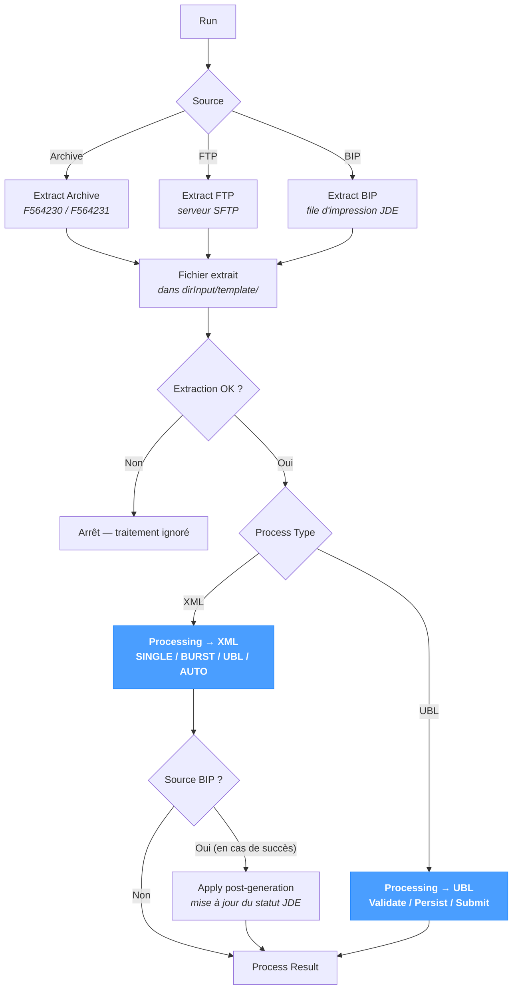

# Extraction et traitement

L'écran **Extraction et traitement** exécute une **extraction** suivie d'un **traitement** en un seul clic. C'est l'équivalent en exécution d'enchaîner l'une des pages *Extract* puis la page *Processing* correspondante, avec les mêmes paramètres regroupés sur un formulaire unique.

La partie extraction propose les trois sources documentées dans *Extract* :

- [Extraction d'archive](../extract/extract-archive.md) — récupération d'un document archivé en base NomaUBL (XML source `F564230` ou UBL généré `F564231`) par clé documentaire.
- [Extraction FTP](../extract/extract-ftp.md) — téléchargement d'un fichier depuis un serveur SFTP via la clé rapport / version / langue / job.
- [Extraction BIP](../extract/extract-bip.md) — extraction d'un job de la file d'impression BI Publisher JD Edwards (XML d'entrée, sortie rendue ou les deux).

La partie traitement propose les deux pipelines documentés dans *Processing* :

- [Processing → XML](./xml.md) — transformation d'un XML source vers UBL (ou rendu PDF), puis validation, persistance et dépôt optionnel. Modes `AUTO` / `SINGLE` / `BURST` / `UBL`.
- [Processing → UBL](./ubl.md) — validation, persistance et dépôt optionnel d'un fichier déjà au format UBL 2.1.

La page fonctionne quel que soit le système source — JD Edwards, SAP, NetSuite ou un ERP personnalisé — à l'exception de la source BIP, spécifique à JD Edwards.

---

## Vue d'ensemble du pipeline

L'enchaînement comporte deux étapes. L'extraction écrit un fichier dans `dirInput/<template>/` ; en cas de succès, le pipeline de traitement correspondant le reprend. Tout échec à l'extraction interrompt l'enchaînement — l'étape de traitement est sautée et seul le **Extraction Result** porte un message.

---

## Source

Le sélecteur **Source** en haut choisit l'un des trois canaux d'extraction. Le formulaire dessous s'adapte à la source choisie.

### Archive

Récupère un document archivé via sa clé documentaire en base.

| Champ | Description |
|---|---|
| **DOC** | Numéro de document — clé primaire de l'archive. |
| **DCT** | Code du type de document (par ex. `RI`, `RN`). |
| **KCO** | Code société (par ex. `00070`). |

Le fichier extrait est écrit dans `dirInput/<template>/` (avec `%TEMPLATE%` résolu) sous le nom `<DOC>_<DCT>_<KCO>.xml` (ou `_ubl.xml` si la source est UBL). Voir [Extraction d'archive](../extract/extract-archive.md) pour la référence complète.

### FTP

Télécharge un fichier depuis le serveur SFTP configuré.

| Champ | Description |
|---|---|
| **Report** | Nom de rapport (par ex. `R42565`). |
| **Version** | Version du rapport (par ex. `XJDE0001`). |
| **Language** | Code langue (par ex. `FR`). |
| **Job** | Numéro de job. |

Le fichier extrait est écrit dans `dirInput/<template>/<REPORT>_<VERSION>_<LANG>_<JOB>.xml`. Voir [Extraction FTP](../extract/extract-ftp.md) pour la référence complète.

### BIP

Extrait un job de la file d'impression BI Publisher JDE.

| Champ | Description |
|---|---|
| **Job Number** | Numéro de job BIP JDE (`RJJOBNBR`). |
| **Language** | Filtre optionnel sur la langue BIP. |
| **Extract Mode** | `Extract Input (XML)`, `Extract Output` ou `Extract Both`. Voir [Extraction BIP](../extract/extract-bip.md) pour la sémantique de chaque mode. |

Le nom de base du fichier extrait (`<report>_<version>_<job>`) est réutilisé comme entrée du traitement.

---

## Traitement

Sous le sélecteur de source, **Process Type** choisit entre les deux pipelines.

### Process Type = XML

Équivalent à l'exécution de la page [Processing → XML](./xml.md) sur le fichier qui vient d'être extrait.

| Champ | Description |
|---|---|
| **Template** | Template du document — obligatoire. Pilote le pipeline XSL et le jeu de règles de validation. |
| **Mode** | `AUTO`, `SINGLE`, `BURST` ou `UBL`. Voir [Processing → XML — Modes](./xml.md#modes). |
| **Replace** | `Skip` laisse intactes les factures existantes ; `Overwrite` les ré-importe. |
| **Send to PA** | `Use settings` (défaut) ou `Skip sending`. |

Lorsque la source est **BIP**, un appel **Apply post-generation** supplémentaire est réalisé après une exécution réussie — il met à jour le statut du job JDE, généralement pour le marquer comme traité.

### Process Type = UBL

Équivalent à l'exécution de la page [Processing → UBL](./ubl.md) sur le fichier qui vient d'être extrait. Le fichier extrait doit déjà être au format UBL — cas typiques :

- la source **Archive** est positionnée sur la variante UBL ;
- le système amont émet directement de l'UBL ;
- la source **BIP** est positionnée sur `Extract Output` et le rapport JDE produit du XML UBL en sortie (et non du PDF). Les fichiers UBL extraits de `F95631` sont alors repris directement par le pipeline UBL — aucune transformation XSL ne s'exécute.

| Champ | Description |
|---|---|
| **Mode** | `Process & Validate` (pipeline complet) ou `Validate only`. |
| **Replace Mode** | `Overwrite existing` (défaut) ou `Skip`. |
| **Send to PA** | `Use settings`, `Force send` ou `Skip sending`. |

Le fichier UBL doit respecter le motif `DOC_DCT_KCO.xml` ; voir [Processing → UBL](./ubl.md#convention-de-nommage).

#### Combinaisons non prises en charge

| Source | Process Type | Statut |
|---|---|---|
| BIP, *Extract Mode = Both* | UBL | Non pris en charge — l'ensemble extrait contient à la fois le XML et la sortie rendue, qui ne peut pas être traitée en UBL. |
| BIP, *Extract Mode = Both* avec plusieurs lignes de sortie | XML | Rejeté — l'extraction produit plusieurs fichiers, le pipeline XML attend un seul fichier par exécution. |

Un message d'erreur explicite apparaît dans la section **Process Result** lorsque l'une de ces combinaisons est tentée.

---

## Résultats

L'écran sépare le résultat en deux sections :

- **Extraction Result** — message renvoyé par l'API d'extraction ; renseigné en premier.
- **Process Result** — table de logs structurée du traitement (mêmes colonnes que sur les pages *XML* et *UBL* : Severity / Module / Submodule / Message) ; renseignée uniquement lorsque l'extraction a réussi et que le traitement s'est effectivement exécuté.

Si l'extraction échoue, l'étape de traitement est sautée — l'enchaînement s'interrompt au premier échec.

---

## Conseils & bonnes pratiques

- **Utiliser *Extraction et traitement* pour des exécutions ponctuelles.** La page combine deux opérations sur un seul écran : récupérer puis traiter un document tient en un clic. Pour des exécutions répétées et non assistées, préférer *Sync → Fetch Input* — il enchaîne le même pipeline en lot.
- **Adapter Process Type à la sortie d'extraction.** Le tableau des combinaisons ci-dessus liste les paires non prises en charge ; vérifier la cohérence entre le mode d'extraction BIP et le type de traitement choisi avant de cliquer sur Run.
- **Pour un workflow piloté par BIP, conserver Process Type sur XML.** Cette voie déclenche `Apply post-generation` en cas de succès, qui met à jour le statut du job JDE — sans cela, le même job sera ré-extrait au tour suivant.
- **Le résultat d'extraction conserve la sortie brute de l'API.** Lorsqu'une erreur survient côté extraction (job manquant, fichier introuvable, identifiants SFTP), le message renvoyé par l'API d'extraction reste le diagnostic canonique — à lire avant toute relance.
- **Skip sending lors de la mise au point d'un template.** Les deux pipelines exposent l'option (`No send` / `Skip sending`) — l'utiliser durant le développement d'un template évite de produire des doublons de soumission PA entre les itérations.
