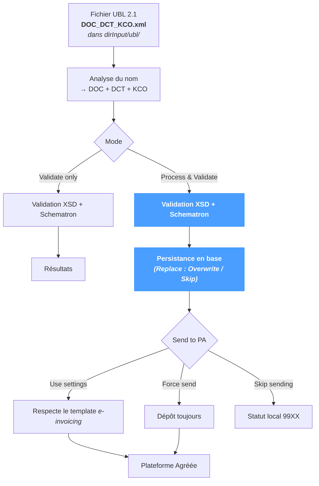

# UBL

L'écran de traitement **UBL** exécute un fichier **déjà au format UBL 2.1** dans le pipeline NomaUBL de validation, persistance et dépôt. Aucune transformation XSL n'est appliquée — le fichier est consommé tel quel. À utiliser lorsque :

- le système amont émet directement de l'UBL (aucune transformation NomaUBL nécessaire) ;
- un document UBL a été produit ailleurs (par la page *XML* lors d'une exécution précédente, par un outil externe, par un appel à l'API de traitement) et doit être persisté et / ou déposé.

La page fonctionne quel que soit le système source — JD Edwards, SAP, NetSuite ou un ERP personnalisé — dès lors que l'entrée est un document UBL 2.1 bien formé.

Pour des cas d'usage plus légers :

- *UBL Tools → Validate* exécute uniquement la validation, sans écriture en base ni dépôt.
- *UBL Tools → XML Viewer* ouvre n'importe quel XML pour inspection ou édition légère.
- *Sync → Fetch Input* exécute le même pipeline en lot sur le répertoire UBL.

---

## Vue d'ensemble du pipeline

Aucune transformation XSL ne s'exécute — le fichier est consommé tel quel. Seules les étapes de validation, de persistance et de dépôt s'enchaînent.

---

## Convention de nommage

Le nom du fichier doit respecter le motif **`DOC_DCT_KCO.xml`**, où :

| Élément | Signification |
|---|---|
| `DOC` | Numéro de document (par ex. `12345`). |
| `DCT` | Code du type de document (par ex. `RI`, `RN`). |
| `KCO` | Code société (par ex. `00070`). |

Exemple : `12345_RI_00070.xml`. Le pipeline extrait directement la clé documentaire à partir du nom du fichier — un fichier qui ne respecte pas ce motif est rejeté à l'analyse.

Le fichier réside dans le **répertoire UBL** — `dirInput/ubl/` (le chemin global `dirInput` résolu avec tous les placeholders, suivi du sous-répertoire `ubl` fixe). Aucun template n'intervient à ce niveau ; l'entrée est déjà UBL.

---

## Input

| Champ | Description |
|---|---|
| **File** | **Upload** envoie un `.xml` local vers le répertoire UBL ; **Browse** sélectionne un fichier existant côté serveur. Le chemin complet du fichier sélectionné apparaît sous **Selected**. |
| **Mode** | `Process & Validate` exécute le pipeline complet (validation + persistance + dépôt optionnel) ; `Validate only` n'exécute que la validation (sans base, sans dépôt). |
| **Replace Mode** | `Overwrite existing` (défaut sur cette page) ré-importe la facture si elle existe déjà ; `Skip` laisse l'enregistrement existant intact. |
| **Send to PA** | `Use settings` respecte les paramètres du template *e-invoicing* ; `Force send` dépose toujours, indépendamment des paramètres ; `Skip sending` ne dépose jamais. |

En mode `Validate only`, les options **Replace Mode** et **Send to PA** sont masquées — elles n'ont pas d'effet lorsque rien n'est persisté ni déposé.

Un bouton **Clear** à côté du bouton d'exécution efface la sélection courante sans lancer le pipeline.

---

## Pipeline

Lorsque `Process & Validate` est sélectionné, le pipeline enchaîne :

1. **Analyse** — lecture du document UBL et extraction de la clé documentaire (DOC + DCT + KCO) depuis le nom du fichier.
2. **Validation** — schéma XSD et règles métier Schematron.
3. **Persistance** — insertion en base NomaUBL de l'en-tête de facture, des lignes, des sous-totaux TVA, du cycle de vie et des résultats de validation (selon **Replace Mode**).
4. **Dépôt** — envoi optionnel de l'UBL à la Plateforme Agréée configurée (selon **Send to PA**).

En mode `Validate only`, seule l'étape 2 s'exécute — aucune écriture en base, aucun dépôt.

### Replace Mode

| Valeur | Comportement |
|---|---|
| **Overwrite existing** *(défaut)* | L'en-tête, les lignes, la TVA et le cycle de vie de la facture existante sont supprimés puis ré-importés. Défaut adapté à cette page : les fichiers UBL sont typiquement mis à jour sur place lors de l'itération sur un template. |
| **Skip** | La facture existante est laissée intacte ; l'exécution journalise un message de doublon ignoré. |

L'écrasement réinitialise également le cycle de vie à son état initial — l'historique côté PA se trouve désynchronisé du dossier local. Réserver `Overwrite` aux ré-imports véritables, pas aux mises à jour incrémentales après un dépôt PA.

### Send to PA

| Valeur | Comportement |
|---|---|
| **Use settings** | Respecte le paramètre **sendToPA** du template *e-invoicing*. |
| **Force send** | Dépose sur la PA, indépendamment du paramètre du template *e-invoicing*. Utile lorsque le paramètre global désactive le dépôt sur l'environnement courant mais qu'un document spécifique doit être transmis. |
| **Skip sending** | Exécute la validation et la persistance en local, sans dépôt sur la PA. La facture termine dans un statut local `99XX` — le code exact dépend du résultat de validation (succès, avertissements ou erreurs). Un **Resend** ultérieur depuis *Application → E-Invoicing* permet le dépôt par la suite. Voir la [Référence des statuts](../references/status-reference.mdx) pour le détail de chaque code. |

---

## Résultats

Une fois le traitement terminé, la section **Results** affiche :

- Une ligne d'état verte récapitulant le résultat — `<nom du fichier>: <message de statut>` en cas de succès, un message d'erreur sinon.
- Une **table de logs structurée** avec une ligne par résultat de validation. Chaque ligne contient :

| Colonne | Description |
|---|---|
| **Severity** | `FATAL`, `ERROR`, `WARNING` ou `INFO`. `FATAL` et `ERROR` bloquent le dépôt sur la PA ; `WARNING` et `INFO` sont informatifs. |
| **Module** | Moteur de validation — `XSD` (contrôle schéma), `Schematron` (règles métier) ou `PROCESS` (événements de niveau pipeline). |
| **Submodule** | Identifiant de règle spécifique ou nom du fichier. |
| **Message** | Description lisible de l'échec, de l'alerte ou de l'événement de progression. |

Une exécution sans ligne `ERROR` ni `FATAL` est considérée comme réussie même si des lignes `WARNING` sont présentes — les avertissements ne bloquent pas le dépôt.

---

## Conseils & bonnes pratiques

- **Le répertoire UBL est fixe.** Les fichiers terminent toujours dans `dirInput/ubl/`, indépendamment du template — cette page ne propose pas de sélecteur de template.
- **Respecter le motif `DOC_DCT_KCO.xml` pour les noms de fichiers.** S'en écarter casse l'analyseur de clé documentaire ; le fichier est téléversé mais ne peut pas être traité.
- **Utiliser `Validate only` pour tester un document UBL avant validation.** Aucune écriture en base, aucun dépôt PA — seuls les moteurs de validation s'exécutent. Pratique pour diagnostiquer un échec Schematron sur un UBL produit hors NomaUBL.
- **`Force send` est l'échappatoire manuelle.** Lorsque le paramètre global désactive le dépôt (par ex. en hors-production) mais qu'un document spécifique doit atteindre la PA, `Force send` reste l'option correcte — consigner la raison dans le cycle de vie.
- **Éviter `Overwrite` après un dépôt PA.** Une facture déposée porte une identité côté PA ; l'écrasement local désynchronise le dossier local de la PA. Utiliser *Application → E-Invoicing → Resend* si une nouvelle soumission est réellement nécessaire.
- **Pour un traitement UBL en lot, préférer *Sync → Fetch Input*.** Il parcourt le même répertoire `dirInput/ubl/` et applique le même pipeline par fichier.
