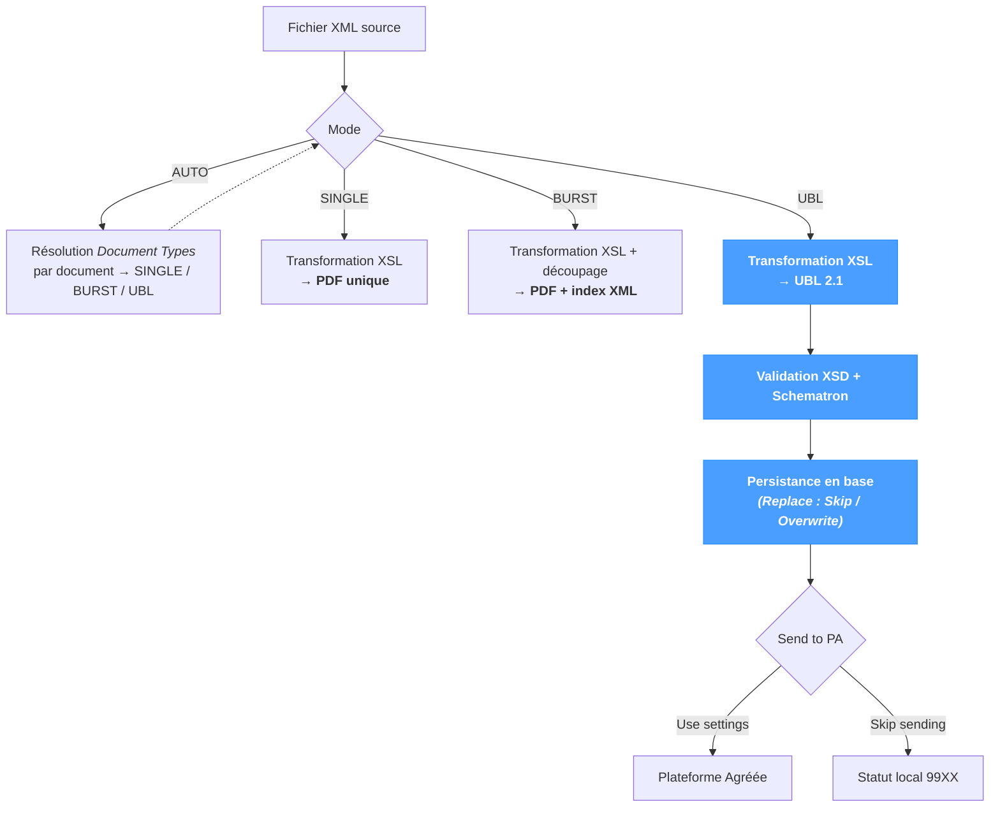

# XML

L'écran de traitement **XML** exécute un XML source dans le pipeline NomaUBL. Le mode sélectionné détermine la sortie produite :

- **Rendu PDF** (modes `SINGLE` / `BURST`) — application du XSL du template pour mettre en forme le XML source en un ou plusieurs fichiers PDF. Surtout utilisé pour des documents qui ne sont pas des factures (bons de livraison, relevés, documents internes) nécessitant simplement une mise en forme PDF.
- **Génération UBL 2.1** (mode `UBL`) — application du XSL du template pour produire une facture UBL 2.1, validation XSD + Schematron, persistance en base NomaUBL de l'en-tête / des lignes / de la TVA / du cycle de vie, et dépôt optionnel sur la Plateforme Agréée.

La page fonctionne quel que soit le système source — JD Edwards, SAP, NetSuite ou un ERP personnalisé. Le template choisi en haut détermine la transformation XSL exécutée et donc la mise en forme source supportée.

Pour des cas d'usage plus légers :

- *UBL Tools → Validate* exécute uniquement la transformation et la validation (sans écriture en base, sans dépôt).
- *UBL Tools → XSL Editor* permet d'éditer la transformation elle-même.
- *Sync → Fetch Input* exécute le même pipeline en lot sur un répertoire complet.

---

## Vue d'ensemble du pipeline

`AUTO` n'exécute pas de pipeline propre — il aiguille chaque document du XML source vers `SINGLE`, `BURST` ou `UBL` selon la configuration par type de document définie dans *Document Types*. Seule la branche `UBL` enchaîne validation, persistance et dépôt PA ; `SINGLE` et `BURST` produisent une sortie PDF et s'arrêtent là.

---

## Input Configuration

| Champ | Description |
|---|---|
| **Template** | Template du document (par ex. `invoices`, `credit_notes`, `delivery_notes`). Sélectionne le pipeline XSL appliqué au XML source. |
| **Input File** | Nom de base (sans extension) du fichier XML source (par ex. `invoice_001`). Résolu dans le répertoire `dirInput` du template. |
| **Mode** | Mode de traitement — `AUTO`, `SINGLE`, `BURST` ou `UBL`. Voir le tableau ci-dessous. |
| **Replace** | `Skip` laisse intactes les factures déjà présentes en base ; `Overwrite` les ré-importe en remplaçant la version précédente. *Pris en compte uniquement lorsque la sortie est UBL.* |
| **Send to PA** | `Use settings` respecte les paramètres de dépôt du template *e-invoicing* ; `Skip sending` exécute le pipeline complet en local sans dépôt. *Pris en compte uniquement lorsque la sortie est UBL.* |

Deux boutons accompagnent le champ **Input File** :

| Bouton | Comportement |
|---|---|
| **Browse** (icône dossier) | Ouvre un sélecteur de fichiers côté serveur pour choisir un fichier existant. |
| **Upload** (icône envoi) | Téléverse un fichier `.xml` local dans le répertoire `dirInput` du template et le sélectionne comme entrée. Un template doit être choisi au préalable. |

Cliquer sur **Generate** pour lancer le pipeline.

---

## Modes

Le mode détermine **ce qui est produit** à partir du XML source.

| Mode | Sortie | Comportement |
|---|---|---|
| **AUTO** | PDF ou UBL | Résout le mode applicable par document via *Configuration → System → Document Types*. Défaut recommandé en production — typique lorsqu'un même spool mêle des factures (résolues en `UBL`) et des documents non facture (résolus en `SINGLE` ou `BURST`). |
| **SINGLE** | PDF | Rend l'intégralité du XML source en un **PDF unique**. Surtout utilisé pour les documents qui ne sont pas des factures — l'application réalise également de la mise en forme de document au format PDF. |
| **BURST** | PDF + index XML | Découpe le PDF source sur une clé (typique d'un spool multi-documents), produit **un PDF par valeur de clé** ainsi qu'un **fichier d'index XML** décrivant l'ensemble obtenu. L'index est consommé par les applications tierces qui doivent dispatcher chaque document indépendamment. |
| **UBL** | UBL 2.1 | Génère une **facture UBL 2.1** à partir du XML source. Exécute le pipeline complet : transformation, validation XSD + Schematron, persistance en base et dépôt optionnel sur la Plateforme Agréée. |

Cas d'usage typique d'`AUTO` : un spool unique couvrant plusieurs clients et plusieurs types de documents — les factures sont résolues en `UBL` et déposées, les bons de livraison en `SINGLE` et rendus en PDF, le tout en une seule exécution.

---

## Détail du pipeline UBL

Lorsque la sortie est UBL (mode `UBL`, ou `AUTO` résolu en `UBL` pour un document donné), le pipeline enchaîne quatre étapes :

1. **Transformation** — application du pipeline XSL du template pour produire un document UBL 2.1.
2. **Validation** — schéma XSD et règles métier Schematron.
3. **Persistance** — insertion en base NomaUBL de l'en-tête de facture, des lignes, des sous-totaux TVA, du cycle de vie et des résultats de validation.
4. **Dépôt** — envoi optionnel de l'UBL à la Plateforme Agréée configurée.

Les deux options ci-dessous — **Replace** et **Send to PA** — pilotent respectivement les étapes 3 et 4. Elles n'ont pas d'effet lorsque la sortie est PDF.

### Replace

Détermine le comportement lorsque la base contient déjà une facture avec la même clé (DOC + DCT + KCO).

| Valeur | Comportement |
|---|---|
| **Skip existing** | La facture existante est laissée intacte ; l'exécution journalise un message de doublon ignoré. Défaut pour les exécutions de production. |
| **Overwrite existing** | L'en-tête, les lignes, la TVA et le cycle de vie de la facture existante sont supprimés puis ré-importés à partir de la nouvelle transformation. Utile pour rejouer un traitement après correction de template. |

L'écrasement réinitialise également le cycle de vie à son état initial — l'historique côté PA se trouve désynchronisé du dossier local. Réserver `Overwrite` aux ré-imports véritables, pas aux mises à jour incrémentales.

### Send to PA

Détermine si l'UBL produit est déposé sur la Plateforme Agréée.

| Valeur | Comportement |
|---|---|
| **Use settings** | Respecte le paramètre **sendToPA** du template *e-invoicing*. Comportement de production. |
| **Skip sending** | Exécute la transformation, la validation et la persistance en base en local, sans dépôt sur la PA. La facture termine dans un statut local `99XX` — le code exact dépend du résultat de validation (succès, avertissements ou erreurs). Un **Resend** ultérieur depuis *Application → E-Invoicing* permet le dépôt par la suite. Voir la [Référence des statuts](../references/status-reference.mdx) pour le détail de chaque code. |

Le mode sans dépôt est utile lors de la mise au point d'un template ou de la relecture d'un lot déjà soumis — le pipeline local s'exécute intégralement sans produire de doublon de soumission.

---

## Résultats

Une fois le traitement terminé, la section **Results** affiche :

- Un message vert **Document generated successfully** — ou l'erreur renvoyée par l'API en cas d'échec.
- Une **table de logs structurée** avec une ligne par étape du pipeline. Chaque ligne contient :

| Colonne | Description |
|---|---|
| **Severity** | `FATAL`, `ERROR`, `WARNING` ou `INFO`. `FATAL` et `ERROR` bloquent le dépôt sur la PA ; `WARNING` et `INFO` sont informatifs. |
| **Module** | Composant du pipeline à l'origine de l'entrée — `XSL`, `XSD`, `Schematron`, `Database`, `PA` ou `Pipeline`. |
| **Submodule** | Étape ou identifiant de règle spécifique (par ex. `BR-FR-12`, `cbc:CustomizationID`, `F564231 INSERT`). |
| **Message** | Description lisible de l'échec, de l'alerte ou de l'événement de progression. |

Une exécution réussie journalise au moins une ligne par étape effectuée ; un échec interrompt le pipeline à l'étape fautive.

---

## Conseils & bonnes pratiques

- **Utiliser `AUTO` en production.** La résolution du mode est déléguée à *Document Types*, voie supportée pour mêler factures et documents non facture dans un même spool. `SINGLE`, `BURST` et `UBL` ne s'imposent que lorsque la mise en forme du spool est connue comme uniforme.
- **Valider le template avant mise en production.** Lancer un XML représentatif avec **Send to PA = Skip sending** d'abord, puis itérer dans l'*Éditeur XSL* jusqu'à obtenir une table de logs sans ligne `ERROR` ni `FATAL`.
- **Utiliser `BURST` lorsque l'index XML est consommé en aval.** Le fichier d'index liste chaque PDF découpé avec sa valeur de clé — schéma classique : un coupling avec une application de distribution / d'archivage qui utilise les clés pour classer les PDF.
- **Éviter `Overwrite` après un dépôt PA.** Une facture déposée porte une identité côté PA ; l'écrasement local désynchronise le dossier local de la PA. Utiliser *Application → E-Invoicing → Resend* si une nouvelle soumission est réellement nécessaire.
- **Le téléversement écrit dans le `dirInput` du template.** Ce répertoire est également balayé par *Sync → Fetch Input* en mode lot — le téléversement fait donc partie du prochain traitement par défaut.
