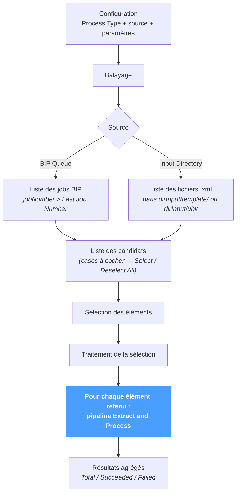

# Récupération des entrées

L'écran **Fetch Input** est l'**automatisation en lot** de [*Processing → Extract and Process*](../processing/extract-and-process.md). Il parcourt un répertoire de fichiers ou la file d'impression BIP, identifie les candidats, puis exécute le même pipeline Extract → Process sur chaque élément retenu.

La page fonctionne quel que soit le système source — JD Edwards, SAP, NetSuite ou un ERP personnalisé — à l'exception de la source BIP, spécifique à JD Edwards.

La sémantique unitaire (résolution du mode, validation, persistance, dépôt PA, post-génération BIP) est documentée dans [*Extract and Process*](../processing/extract-and-process.md). Cette page ne documente que ce qui relève du fonctionnement en lot : l'enchaînement balayage → sélection → traitement, les sources, la récupération incrémentale via **Last Job Number** et les résultats agrégés.

---

## Vue d'ensemble du pipeline

L'enchaînement est en **deux étapes** : un appel Scan recense les candidats sans déclencher de traitement ; l'utilisateur coche les éléments à conserver puis clique sur Process. L'étape de traitement parcourt la sélection en appliquant le pipeline Extract and Process par élément.

---

## Processing Options

La première section configure **comment chaque élément retenu est traité**. La sémantique correspond à [*Extract and Process — Traitement*](../processing/extract-and-process.md#traitement) ; cette page expose les mêmes options, qui s'appliquent ensuite à chaque élément retenu.

| Champ | Description |
|---|---|
| **Process As** | `XML` ou `UBL`. Sélectionne le pipeline de traitement. Voir [*Processing → XML*](../processing/xml.md) ou [*Processing → UBL*](../processing/ubl.md) pour la sémantique unitaire. |
| **Mode** *(XML uniquement)* | `AUTO`, `SINGLE`, `BURST` ou `UBL`. Voir [*Processing → XML — Modes*](../processing/xml.md#modes). |
| **Mode** *(UBL uniquement)* | `Process & Validate` ou `Validate only`. |
| **Replace** | `Skip` laisse intactes les factures existantes ; `Overwrite` les ré-importe. |
| **Send to PA** | `Use settings` (défaut), `Skip sending`, ou `Force send` (UBL uniquement). |

Ces options s'appliquent uniformément à **tous** les éléments de la sélection. Pour traiter un sous-ensemble avec des options différentes, exécuter la page deux fois — une exécution par jeu d'options.

---

## Extract Options

La seconde section choisit la **source** et ses paramètres.

| Champ | Description |
|---|---|
| **Template** | Obligatoire si *Process As = XML*. Sélectionne le pipeline XSL appliqué à chaque élément. Masqué en mode UBL (les fichiers UBL sont repris directement depuis `dirInput/ubl/`). |
| **Source** | `BIP Queue` (spécifique à JD Edwards) ou `Input Directory`. |

### Source = BIP Queue

| Champ | Description |
|---|---|
| **Language** | Filtre optionnel sur la langue BIP (par ex. `FR`). |
| **Extract Mode** | `Extract Input (XML)`, `Extract Output` ou `Extract Both`. Voir [*Extract BIP*](../extract/extract-bip.md) pour la sémantique. |
| **Last Job Number** | Pré-rempli depuis `global.lastBipJobNumber`. L'appel Scan ne retourne que les jobs dont `jobNumber > Last Job Number`. Le champ est modifiable pour rebalayer une autre plage, mais la configuration globale est mise à jour avec le plus grand numéro de job traité après chaque lot — la récupération incrémentale est le mode par défaut. |

### Source = Input Directory

Le balayage retourne tous les fichiers `.xml` présents dans :

- `dirInput/<template>/` lorsque *Process As = XML* ;
- `dirInput/ubl/` lorsque *Process As = UBL*.

Aucun paramètre supplémentaire — chaque fichier du répertoire est un candidat.

---

## Balayage et sélection

Cliquer sur **Scan** pour alimenter la **liste des candidats**. La liste affiche une ligne par candidat avec une case à cocher ; les lignes sont sélectionnées par défaut. Au-dessus de la liste :

| Élément | Description |
|---|---|
| **Compteur** | `N file(s) found in <repertoire>` (mode Directory) ou `N new job(s) after #<lastJob>` (mode BIP). |
| **Select All / Deselect All** | Bascules de masse. |

Chaque ligne porte le nom de base du fichier (mode Directory) ou le nom de base du job BIP (mode BIP). Décocher une ligne l'exclut de l'appel Process suivant, sans modifier le répertoire ni la file BIP sous-jacents.

Cliquer sur **Process (N)** pour exécuter la sélection. Le bouton se désactive durant l'exécution et durant le balayage.

---

## Résultats

À l'issue du traitement, la section affiche un récapitulatif agrégé et la liste des résultats par élément.

### Bandeau de résumé

| Métrique | Description |
|---|---|
| **Total** | Nombre d'éléments traités. |
| **Succeeded** | Éléments terminés sans ligne `ERROR` ni `FATAL`. Les lignes `WARNING` ne comptent pas comme un échec. |
| **Failed** | Éléments ayant produit au moins une ligne bloquante. |

### Lignes par élément

Chaque élément apparaît sur une ligne avec un marqueur ✓ vert (succès) ou ✗ rouge (échec). **Cliquer sur une ligne déplie** la table de logs sous-jacente (mêmes colonnes que sur les pages [*Processing → XML*](../processing/xml.md#résultats) et [*Processing → UBL*](../processing/ubl.md#résultats) : `Severity / Module / Submodule / Message`).

Lorsque la source est BIP et que le traitement réussit, l'appel **Apply post-generation** s'exécute après chaque élément — exactement comme dans [*Extract and Process*](../processing/extract-and-process.md#process-type--xml). Le `lastBipJobNumber` global est également mis à jour avec le plus grand numéro de job traité, de sorte que le prochain Scan ne retourne que les jobs plus récents.

---

## Conseils & bonnes pratiques

- **Utiliser Fetch Input pour les exécutions non assistées.** Cette page est l'équivalent en lot de *Extract and Process* ; l'étape de sélection manuelle la rend adaptée aux traitements de fin de journée ou aux exécutions planifiées.
- **Conserver `Last Job Number` comme repère.** La valeur par défaut correspond au dernier numéro de job traité avec succès — la laisser inchangée est la voie supportée pour la récupération incrémentale. Abaisser la valeur manuellement permet de relancer le traitement de jobs antérieurs.
- **Balayer d'abord, traiter ensuite.** L'enchaînement en deux étapes existe à dessein : une liste de candidats périmée, un mauvais choix de template ou une source erronée se manifeste dès la liste de candidats — avant tout effet de bord.
- **`Select All` et `Deselect All` sont des raccourcis en tête de liste.** Lorsque la liste comporte des centaines de lignes, basculer en masse puis affiner est plus rapide qu'un cochage individuel.
- **Décocher plutôt que supprimer.** Retirer le fichier sous-jacent ou le job BIP pour l'exclure est destructif ; un décochage sur cette page est réversible — la ligne réapparaît au prochain Scan si la source la conserve.
- **Pour BIP, `Apply post-generation` met à jour le repère.** Un job traité avec succès met automatiquement à jour `global.lastBipJobNumber` — aucune intervention manuelle n'est nécessaire.
