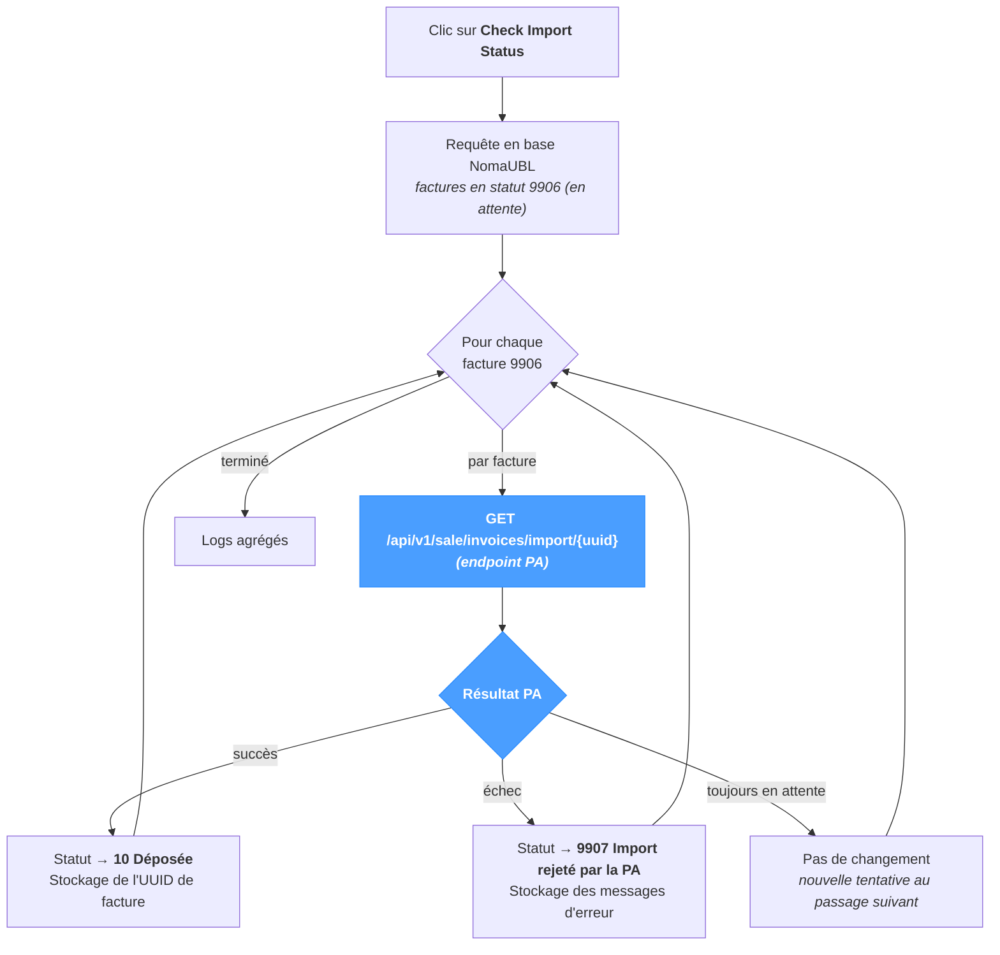

# Import

L'écran **Import** vérifie que les factures déposées sur la Plateforme Agréée ont effectivement été importées côté PA. Il ne s'agit **pas** du flux de cycle de vie / de récupération des statuts (à voir dans *Sync → Retrieve Statuses*) mais de la **confirmation d'import asynchrone** consécutive à un dépôt PA réussi.

Lorsqu'une PA importe les factures **en mode asynchrone**, un dépôt réussi ne fait que placer la facture en statut local `9906` (en attente) — la PA accuse réception sans avoir encore importé. L'écran Import interroge la PA pour chaque facture en `9906` et met à jour le statut local avec le résultat réel de l'import.

La page fonctionne quel que soit le système source — JD Edwards, SAP, NetSuite ou un ERP personnalisé — le comportement d'import asynchrone de la PA étant indépendant du système amont qui a produit la facture.

---

## Vue d'ensemble du pipeline

Seules les factures en `9906` sont vérifiées — celles déjà en `10` ou `9907` sont ignorées. Cliquer plusieurs fois sur le bouton reste donc sans risque : aucune facture n'est traitée deux fois, aucun doublon n'est créé.

---

## Pourquoi cette page existe

Certaines Plateformes Agréées renvoient un résultat synchrone à la soumission — la facture passe directement de l'état pré-dépôt local à un état terminal côté PA (`10`, `9907`, etc.) au moment du dépôt. Pour ces PA, la page n'a pas d'utilité.

D'autres PA accusent réception immédiatement et importent en mode asynchrone : la facture reste en `9906` (en attente) côté local jusqu'à ce que le worker d'import de la PA l'ait effectivement traitée. **Pour ces PA, cette page est le moyen de confirmer l'import** — sans elle, les factures en `9906` resteraient en attente indéfiniment côté local, même lorsque la PA les a depuis longtemps acceptées ou rejetées.

---

## Transitions de statut

La page ne transite jamais que de `9906` vers l'un des trois états :

| Depuis | Résultat PA | Vers | Effet de bord |
|---|---|---|---|
| `9906` (en attente) | succès | `10` (Déposée) | L'UUID de facture attribué par la PA est stocké sur l'enregistrement local. |
| `9906` (en attente) | échec | `9907` (Import rejeté par la PA) | Les messages d'erreur renvoyés par la PA sont stockés sur l'enregistrement local. |
| `9906` (en attente) | toujours en attente | `9906` (inchangé) | Pas de mise à jour — le prochain passage vérifiera de nouveau. |

Un `9907` n'est **pas** un échec Schematron ou XSD (ces échecs bloquent le dépôt avant même d'atteindre le worker d'import de la PA et produisent un autre statut). `9907` couvre les problèmes d'acceptation côté PA que la PA ne signale qu'au moment de l'import.

Voir la [Référence des statuts](../references/status-reference.mdx) pour le détail de chaque code.

---

## Exécution

Une seule section, un seul bouton.

| Élément | Description |
|---|---|
| **Check Import Status** | Déclenche le passage. Désactivé pendant l'exécution. |
| **Ligne de statut** | Retour en ligne sous le bouton — vert en cas de succès, rouge en cas d'échec. |

La page n'a aucun paramètre : toutes les factures en `9906` sont vérifiées dans le même appel. Aucune sélection par facture — pour cibler une facture en particulier, passer par *Application → E-Invoicing* et utiliser les actions par ligne.

---

## Résultats

La section **Results** affiche la table de logs structurée — une ligne par facture traitée, plus les événements de niveau pipeline. Les colonnes correspondent aux autres tables de logs NomaUBL (`Severity / Module / Submodule / Message`).

Un passage réussi sur une facture en `9906` produit typiquement au moins :

- Une ligne `INFO` indiquant la facture vérifiée.
- Une ligne `SUCCESS` (passage à `10`), `WARNING` (passage à `9907`) ou `INFO` (toujours en attente) portant la réponse de la PA.

Lorsqu'un appel à la PA échoue pour des raisons de transport (réseau, expiration, identifiants), une ligne `ERROR` est journalisée et la facture reste en `9906` — un passage ultérieur retentera l'opération.

---

## Conseils & bonnes pratiques

- **Planifier le passage.** L'*ordonnanceur en arrière-plan* de NomaUBL peut exécuter cette page périodiquement — voir la propriété `fetchImportInterval` du template *e-invoicing* (valeur en minutes ; `0` désactive l'ordonnanceur). Pour une PA à import asynchrone, une planification toutes les 5 à 15 minutes est typique.
- **Un passage ne produit pas de dépôt en double.** Il ne fait que lire — la PA renvoie le résultat d'import d'une facture déjà soumise. Lancer manuellement après l'ordonnanceur reste sans risque.
- **Les factures en `9907` se corrigent ailleurs.** Cette page signale uniquement le rejet ; le traitement correctif (correction des données, puis re-soumission) passe par *Application → E-Invoicing → Resend* ou par *Process → UBL* sur le fichier corrigé.
- **Cette page est distincte de *Retrieve Statuses*.** *Retrieve Statuses* gère les codes de cycle de vie (200, 201, 206, 207, 210, 213, …) émis par la PA après l'import. *Import* ne gère que l'étape de confirmation asynchrone (9906 → 10 / 9907). Les deux peuvent s'exécuter sur le même ordonnanceur avec des intervalles différents.
- **Une `9906` qui dure est un signal.** Si une facture reste en `9906` pendant plusieurs heures malgré les passages successifs, la PA a vraisemblablement perdu le dépôt ou l'`uuid` ne résout plus côté PA. Consulter le tableau de bord propre à la PA avant d'incriminer NomaUBL.
