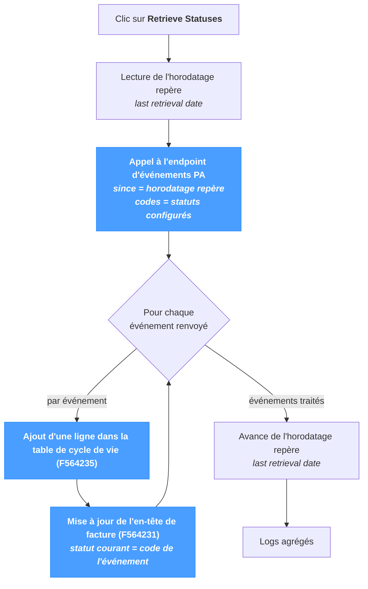

# Récupération des statuts

L'écran **Retrieve Statuses** récupère les **événements de cycle de vie** émis par la Plateforme Agréée — les codes définis par la réforme française de la facturation électronique (XP Z12-012) : `200` Déposée, `201` Mise à disposition, `206` Approuvée partiellement, `207` En litige, `210` Refusée, `213` Rejetée, et le reste du cycle. Chaque événement est ajouté à la table de cycle de vie locale et le statut courant de la facture est mis à jour.

Cet écran est **distinct de *Sync → Import*** :

- *Sync → Import* gère la **confirmation d'import asynchrone** consécutive à un dépôt réussi (`9906` → `10` / `9907`).
- *Retrieve Statuses* gère les **codes de cycle de vie** émis par la PA *après* l'import (`200`, `201`, `206`, `207`, `210`, `213`, …).

Les deux peuvent s'exécuter sur le même ordonnanceur avec des intervalles différents — voir *Conseils* ci-dessous.

La page fonctionne quel que soit le système source — JD Edwards, SAP, NetSuite ou un ERP personnalisé — la production des événements de cycle de vie relevant de la PA, indépendamment du système amont.

---

## Vue d'ensemble du pipeline

Chaque exécution ne lit que les événements postérieurs à l'horodatage repère et l'avance après un balayage réussi — l'exécution suivante reprend exactement là où la précédente s'est arrêtée.

---

## Déroulement

Chaque clic enchaîne quatre étapes :

1. **Lecture de l'horodatage repère.** La dernière date de récupération est conservée dans la configuration du template *e-invoicing*. Elle alimente le paramètre `since` de l'appel PA.
2. **Appel à l'endpoint d'événements PA.** La liste des codes de statut à interroger est configurée dans le même template (les *configured status names*). Par défaut, elle reprend l'ensemble des codes XP Z12-012 ; seuls les codes présents dans la liste sont retournés.
3. **Application de chaque événement.** Pour chaque événement renvoyé par la PA :
   - Une nouvelle ligne est ajoutée à la **table de cycle de vie** (`F564235`) — la trace complète de chaque statut traversé par la facture.
   - L'**en-tête de facture** (`F564231`) est mis à jour pour que le *statut courant* affiché dans la liste des factures corresponde au dernier événement reçu.
4. **Avance de l'horodatage repère.** La valeur `lastRetrievalDate` du template est mise à jour avec l'horodatage du dernier événement reçu. L'exécution suivante part de cet horodatage.

La table de cycle de vie est **en ajout uniquement** : chaque événement ajoute une ligne, aucune ligne n'est jamais modifiée ni supprimée. Relancer la récupération ne peut pas produire de doublon, l'horodatage repère n'avance que dans un seul sens.

---

## Statuts récupérés

Le cycle de vie couvre les codes **post-soumission** définis par XP Z12-012 — `200` à `228`, ainsi que `500` / `501`. La liste complète figure dans la [Référence des statuts](../references/status-reference.mdx) ; l'ensemble effectivement récupéré à chaque exécution est gouverné par la propriété *configured status names* du template *e-invoicing*.

Sous-ensembles courants :

- **Tous les codes** *(défaut)* — abonnement à l'ensemble de la liste de référence. Adapté à tout déploiement nécessitant une traçabilité complète.
- **Codes obligatoires uniquement** — récupération limitée aux codes obligatoires PPF (`200`, `201`, `213`, …). Réduit le volume sur les installations à très fort débit où les statuts intermédiaires ne sont pas exploités en aval.

Les codes `9906` / `9907` ne **font pas** partie de cette récupération — il s'agit de statuts locaux NomaUBL liés à la confirmation d'import asynchrone, traités par *Sync → Import*.

---

## Exécution

Une seule section, un seul bouton.

| Élément | Description |
|---|---|
| **Retrieve Statuses** | Déclenche la récupération. Désactivé pendant l'exécution. |
| **Ligne de statut** | Retour en ligne sous le bouton — vert en cas de succès, rouge en cas d'échec. |

La page n'a aucun paramètre : tous les événements postérieurs à l'horodatage repère, pour chaque code de la liste configurée, sont récupérés en un seul appel. Aucune sélection par facture.

---

## Résultats

La section **Results** affiche la table de logs structurée — une ligne par événement appliqué, plus les événements de niveau pipeline. Les colonnes correspondent aux autres tables de logs NomaUBL (`Severity / Module / Submodule / Message`).

Contenu typique d'une exécution réussie :

- Une ligne `INFO` indiquant le nombre d'événements renvoyés par la PA.
- Une ligne `INFO` ou `SUCCESS` par événement appliqué — clé de facture + nouveau code de statut.
- Une ligne `INFO` finale signalant le nouvel horodatage repère.

Lorsqu'un appel à la PA échoue pour des raisons de transport (réseau, expiration, identifiants), une ligne `ERROR` est journalisée et l'horodatage repère reste inchangé — la prochaine exécution repart du même `since`.

---

## Conseils & bonnes pratiques

- **Planifier la récupération.** L'*ordonnanceur en arrière-plan* de NomaUBL peut exécuter cette page périodiquement — voir la propriété `fetchStatusInterval` du template *e-invoicing* (valeur en minutes ; `0` désactive l'ordonnanceur). Toutes les 15 minutes à 1 heure est typique.
- **Distincte de *Sync → Import*.** *Import* gère la confirmation asynchrone post-soumission (`9906` → `10` / `9907`) ; *Retrieve Statuses* gère les codes de cycle de vie émis par la PA ensuite. Les deux peuvent s'exécuter sur le même ordonnanceur avec des intervalles différents.
- **L'horodatage repère n'avance que dans un sens.** Relancer la page n'a aucun effet sur les événements déjà appliqués. Pour rejouer une fenêtre (par ex. après restauration d'une sauvegarde de base ancienne), abaisser manuellement `lastRetrievalDate` dans le template *e-invoicing* — l'exécution suivante récupérera tous les événements depuis cette date.
- **Restreindre les codes configurés en cas de volume.** La liste par défaut couvre tous les codes de la réforme ; les installations à fort débit qui n'exploitent que les codes obligatoires PPF peuvent réduire la liste pour alléger la charge côté PA et côté local.
- **Le cycle de vie est la trace d'audit.** La table de cycle de vie (`F564235`) est en ajout uniquement et représente l'historique complet ; l'en-tête de facture (`F564231`) ne porte que le statut le plus récent. Pour instruire un litige ou retrouver une mise à jour PA manquante, c'est dans la table de cycle de vie qu'il faut chercher.
