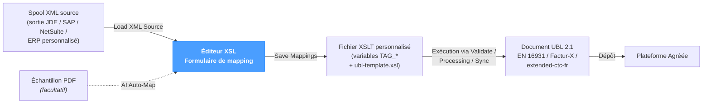
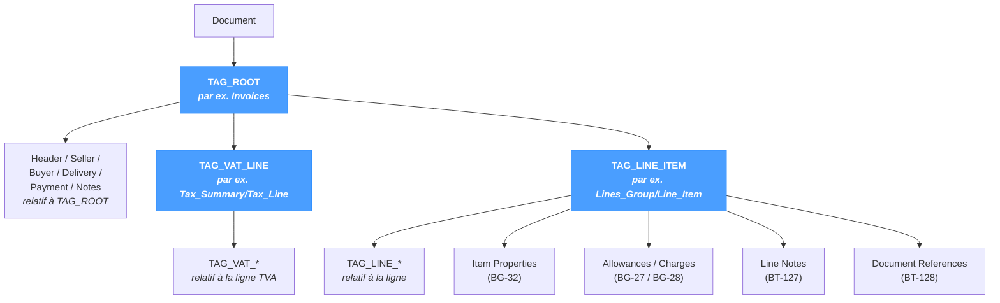

# Éditeur XSL

L'**Éditeur XSL** est la pièce maîtresse de NomaUBL pour le mapping source → UBL. Il transforme la rédaction d'une transformation UBL — un travail traditionnellement long et exigeant — en un **mapping par formulaire** entre les champs d'un spool XML source et les termes métier (codes BT) d'une facture UBL 2.1.

La page fonctionne quel que soit le système source — JD Edwards, SAP, NetSuite ou un ERP personnalisé. Le même éditeur s'applique à tout spool XML bien formé qui transporte des données de facture.

---

## Rôle de l'éditeur

Une transformation NomaUBL est un fichier XSLT qui dérive des variables `TAG_*` à partir du XML source ; tout le reste — espaces de noms, ordre des éléments, conformité EN 16931, extensions françaises — est délégué à un fichier `ubl-template.xsl` partagé fourni par NomaUBL. Personnaliser une transformation revient donc à **mapper des chemins XML vers les variables TAG_**, ce que l'éditeur expose sous forme de formulaire.

L'éditeur ne touche jamais directement à la sortie UBL — cela reviendrait à réimplémenter EN 16931 à chaque transformation. Il édite le **mapping** que le template UBL consommera ; le template, lui, reste inchangé.

---

## Barre d'outils

L'en-tête de page comporte une barre d'outils fixe :

| Élément | Description |
|---|---|
| **Sélecteur de fichier** | Liste déroulante de tous les fichiers `.xsl` présents dans le répertoire XSL configuré (`e-invoicing.ublXslt`). Trois fichiers partagés (`ubl-common.xsl`, `ubl-template.xsl`, `ubl-defaults.xsl`) sont filtrés — ils contiennent la mécanique UBL et ne se modifient pas par template. |
| **Badge de répertoire** | Affiche le répertoire XSL résolu. Configuré dans *Configuration → System → e-invoicing → ublXslt*. |
| **Load** | Lit le fichier sélectionné depuis le disque vers l'éditeur (les deux onglets partagent le même tampon). |
| **New Transform** | Ouvre la modale *New Transform* — copie `ubl-template.xsl` sous un nouveau nom et le sélectionne. Sert à initialiser une transformation par client ou par type de document. |

---

## Onglets

L'éditeur expose deux onglets travaillant sur le même fichier XSLT. L'onglet de gauche est le formulaire de mapping visuel ; celui de droite est la source XSLT brute.

### Variable Mapping (par défaut)

Le formulaire de mapping — l'alternative visuelle à la rédaction XSLT manuelle.

#### Barre d'actions

| Bouton | Comportement |
|---|---|
| **Load XML Source** | Charge un échantillon XML (côté navigateur) et en extrait tous les chemins d'éléments. Les chemins alimentent les sélecteurs en regard de chaque champ — les valeurs se renseignent par clic plutôt que par saisie. |
| **AI Auto-Map** ✦ | Ouvre la modale *AI Auto-Map*. À partir d'un échantillon XML (et d'un PDF optionnel), l'IA renvoie un mapping JSON des variables `TAG_*` vers les chemins XML, correctement scopés. Voir [AI Auto-Map](#ai-auto-map) ci-dessous. |
| **Save Mappings** | Réécrit dans le fichier XSLT les valeurs courantes de toutes les variables `TAG_*`. Le point indicateur (`●`) apparaît lorsque le mapping a changé sans avoir été enregistré. |

#### Sections

Le formulaire est organisé par zone du document UBL. Chaque section n'apparaît que si au moins une de ses variables `TAG_*` est présente dans le XSLT chargé — les sections absentes du template sous-jacent ne sont pas affichées.

| Section | Zone UBL | Variables principales |
|---|---|---|
| **Document Root** | Élément racine de la facture | `TAG_ROOT` — l'élément XML englobant une facture. |
| **Invoice Header** | BT-1, BT-2, BT-3, BT-9, BT-10, BT-12, BT-13, BT-19 | Numéro, dates, références. |
| **Billing References** | BT-11, BT-14 à BT-18, BT-122 à BT-124 | Projet, contrat, expédition, justificatifs. |
| **Seller / Supplier** | BT-27 à BT-43 | Identification, adresse et contact du vendeur. |
| **Buyer / Customer** | BT-44 à BT-58, BT-163 | Identification, adresse et contact de l'acheteur. |
| **Agent Party** | extended-ctc-fr | Tiers intermédiaire optionnel. |
| **Delivery** | BT-70 à BT-80 | Date et adresse de livraison. |
| **Payment** | BT-20, BT-81 à BT-91 | Moyen, IBAN, BIC, mandat, conditions. |
| **VAT** | BT-110, BT-116 à BT-121 | Détail TVA — voir [scoping](#scoping) ci-dessous. |
| **Invoice Lines** | BT-126 à BT-161 | Lignes de facture — voir [scoping](#scoping) ci-dessous. |
| **Item Properties** *(BG-32)* | BG-32 | Attributs produit attachés à une ligne. |
| **Line Allowances/Charges** *(BG-27 / BG-28)* | BG-27 / BG-28 | Remise ou charge par ligne. |
| **Line Document References** *(BT-128)* | BT-128 | Références de document par ligne (avec schéma UNTDID 1153). |
| **Line Delivery** *(EXT-FR-FE-BG-10)* | Extension française | Groupe livraison par ligne. |
| **Line Notes** *(BT-127)* | BT-127 | Notes libres attachées à une ligne. |
| **Invoice Notes** *(BT-22)* | BT-22 | Notes libres au niveau document. |
| **Loop Notes** | BT-22 | Groupes de notes répétés au niveau document. |

Chaque champ affiche le libellé du BT, son code BT en badge coloré, la valeur courante (chemin XML ou expression) et un sélecteur `↓` qui ouvre le [navigateur XML](#navigateur-xml) sur la droite.

#### Scoping

`TAG_ROOT`, `TAG_VAT_LINE` et `TAG_LINE_ITEM` sont des **contextes de portée** : toutes les autres variables s'y rattachent et leurs chemins se résolvent *relativement* au chemin défini par le contexte.

Une bannière de scope bleue apparaît sous chaque variable de contexte pour rappeler le préfixe actif. Le navigateur XML filtre lui aussi ses entrées sur ce scope — le sélecteur ne propose donc que les chemins effectivement adressables depuis le contexte courant.

#### Navigateur XML

Une fois **Load XML Source** activé, cliquer sur le bouton `↓` en regard d'un champ ouvre un **navigateur XML** sur le bord droit de la page. Il liste tous les chemins d'éléments du scope courant ainsi que leur valeur d'échantillon — le bon chemin se choisit par inspection plutôt que par saisie. Sa fermeture laisse l'éditeur dans son état précédent.

### XSL Editor

L'onglet de droite ouvre le même fichier dans un **éditeur Monaco** complet (le moteur utilisé par VS Code) avec coloration syntaxique XML, numéros de ligne et minimap. Cet onglet sert lorsque le formulaire ne couvre pas un besoin :

- Expressions XPath personnalisées en dehors des variables TAG_.
- Logique conditionnelle via `<xsl:if>` / `<xsl:choose>`.
- Appel de templates définis dans `ubl-common.xsl`.
- Inspection de la sérialisation finale du mapping issu du formulaire.

Le bouton de sauvegarde affiche un point `●` lorsque le tampon diverge du fichier sur disque.

---

## AI Auto-Map

La modale AI Auto-Map est un raccourci pour bâtir un mapping à partir de zéro.

| Champ | Description |
|---|---|
| **Upload XML from computer** | Charge l'échantillon XML source. |
| **Upload PDF** *(facultatif)* | Charge un PDF rendu de la même facture. L'IA s'en sert comme référence visuelle pour lever les ambiguïtés sur les champs. |
| **Invoice root element** | Élément XML englobant une facture (par ex. `Invoices`). Pré-rempli depuis la racine du XML chargé, modifiable. |
| **XML content** | Corps du spool XML. Renseigné automatiquement par le téléversement, modifiable manuellement. |

Cliquer sur **Auto-Map** transmet le XML (et le PDF s'il est fourni) à l'IA, accompagné de la liste des variables `TAG_*` et de leur contexte BT/BG. L'IA renvoie un mapping JSON respectant les règles de scoping (chemins relatifs à `TAG_ROOT`, chemins relatifs à la ligne dans `TAG_LINE_ITEM`, etc.). Le mapping est fusionné dans le formulaire ; après revue, cliquer sur **Save Mappings** pour valider.

L'IA reste prudente — elle omet toute variable dont elle n'est pas certaine plutôt que de proposer une supposition. Une revue manuelle reste nécessaire ; l'éditeur accélère le travail, il ne remplace pas l'expertise.

---

## New Transform

La modale *New Transform* copie `ubl-template.xsl` sous un nouveau nom dans le même répertoire XSL.

| Champ | Description |
|---|---|
| **File name (without .xsl)** | Nom de base de la nouvelle transformation. L'extension `.xsl` est ajoutée automatiquement. |

Après création, le nouveau fichier devient le fichier sélectionné et est chargé dans l'éditeur — prêt pour le mapping.

---

## Conseils & bonnes pratiques

- **Démarrer avec AI Auto-Map sur un échantillon représentatif.** Couvre généralement 70–90 % du mapping en une passe ; le reste relève de la revue et des cas particuliers.
- **Charger systématiquement un échantillon XML avant de mapper.** Avec **Load XML Source** actif, les sélecteurs déroulants réduisent fortement la saisie manuelle et écartent les coquilles.
- **Renseigner TAG_ROOT, TAG_VAT_LINE et TAG_LINE_ITEM en premier.** Tous les autres champs se résolvent relativement à ces scopes ; les renseigner d'abord garantit que les sélecteurs suivants ouvrent le bon contexte.
- **Une transformation par layout source.** Différents systèmes sources — ou différents types de documents pour un même système — méritent généralement leur propre `.xsl`. Préférer *New Transform* à un copier-coller dans le système de fichiers.
- **Ne pas modifier les fichiers partagés.** `ubl-common.xsl`, `ubl-template.xsl` et `ubl-defaults.xsl` sont filtrés du sélecteur pour une raison : toute modification y impacte l'ensemble des transformations et risque de ne pas survivre à une montée de version NomaUBL.
- **Utiliser l'onglet XSL Editor pour ce que le formulaire ne couvre pas.** Logique conditionnelle, XPath personnalisé, templates nommés — Monaco offre toute la puissance de XSLT 1.0 / 2.0 en complément du mapping du formulaire.
- **Valider après chaque modification de mapping.** *UBL Tools → Validate* avec `Source = XML` exécute la transformation et les règles Schematron en une passe ; la table de logs signale tout chemin erroné ou variable manquante.
